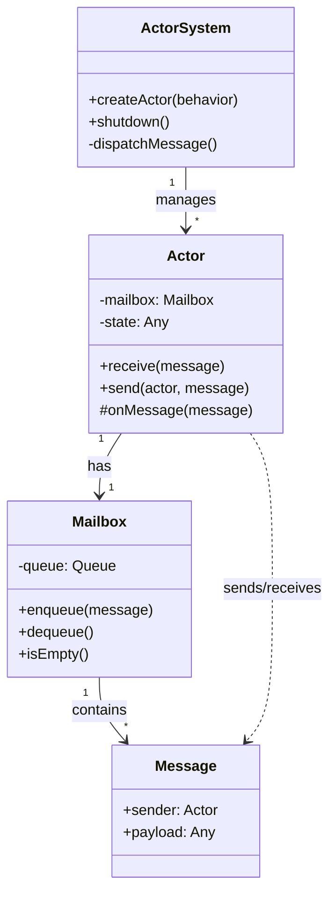

# Actor Model

## Intent
Encapsulate state and behavior in isolated actors that communicate exclusively through asynchronous message passing, eliminating shared mutable state and race conditions.

## Problem
Traditional concurrent systems with shared memory and locks lead to complex synchronization issues, deadlocks, and race conditions. As systems scale, reasoning about thread safety becomes increasingly difficult and error-prone. Direct method calls between objects create tight coupling and make it hard to distribute computation across multiple machines.

## Real-World Analogy

{: .note }
> Think of actors like office workers in separate rooms, each with their own mailbox. Workers never enter each other's rooms or share documents directly. Instead, they send memos through internal mail. Each worker processes their mail one message at a time, in the order received. A worker might send memos to other workers based on what they read, but they never wait for responses—they just keep processing their own inbox. This isolation means workers can't interfere with each other's work, and you can easily add more workers without changing how they communicate.

## When You Need It
- Building highly concurrent systems that need to scale across multiple cores or machines without complex locking
- Designing fault-tolerant applications where failures should be isolated and recoverable through supervision hierarchies
- Implementing event-driven architectures with asynchronous workflows that naturally map to message-passing semantics

## UML Class Diagram

## Participants
- **ActorSystem** — manages actor lifecycle, message dispatching, and provides supervision
- **Actor** — encapsulates state and behavior, processes messages sequentially from its mailbox
- **Mailbox** — queue that buffers incoming messages for an actor
- **Message** — immutable data structure containing the payload and optionally sender reference

## How It Works
1. The ActorSystem creates actors and assigns each a unique mailbox for receiving messages
2. When an actor wants to communicate, it sends an immutable message to another actor's mailbox without blocking
3. The ActorSystem schedules actors that have pending messages, allowing each to process one message at a time
4. Upon receiving a message, an actor executes its behavior which may update local state, send messages to other actors, or create new actors
5. If an actor fails during message processing, its supervisor can decide to restart it, resume it, or escalate the failure

## Applicability
**Use when:**
- You need to build massively concurrent systems that avoid shared mutable state and locks
- Your application requires fault tolerance with supervision hierarchies and actor restart strategies
- You're designing distributed systems where actors can be transparently located on different machines

**Don't use when:**
- Your problem domain has minimal concurrency and simple synchronous workflows suffice
- You need tight coordination with ACID transactions across multiple entities
- Low latency is critical and message-passing overhead is unacceptable

## Trade-offs
**Pros:**
- Eliminates race conditions and deadlocks by avoiding shared mutable state
- Scales naturally across cores and machines through location transparency
- Provides built-in fault tolerance through supervision and actor isolation

**Cons:**
- Debugging asynchronous message flows is harder than tracing synchronous call stacks
- Message-passing overhead can impact performance for fine-grained interactions
- Requires rethinking traditional object-oriented design patterns and control flow

## Related Patterns
- **Observer** — actors can subscribe to events, but with asynchronous message delivery instead of synchronous callbacks
- **Command** — messages in the actor model are essentially commands encapsulating requests
- **Chain of Responsibility** — supervision hierarchies form chains where failures propagate upward to supervisors
