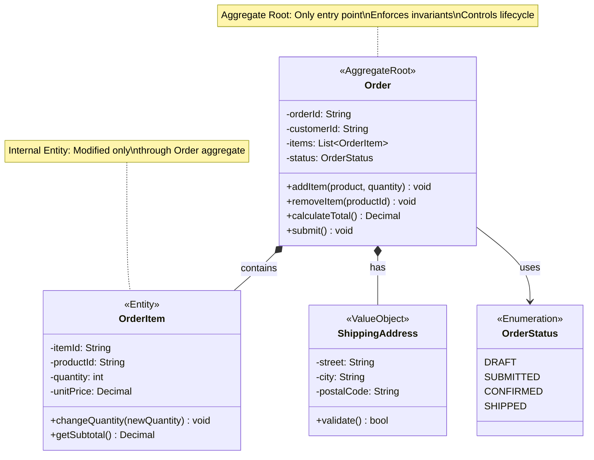
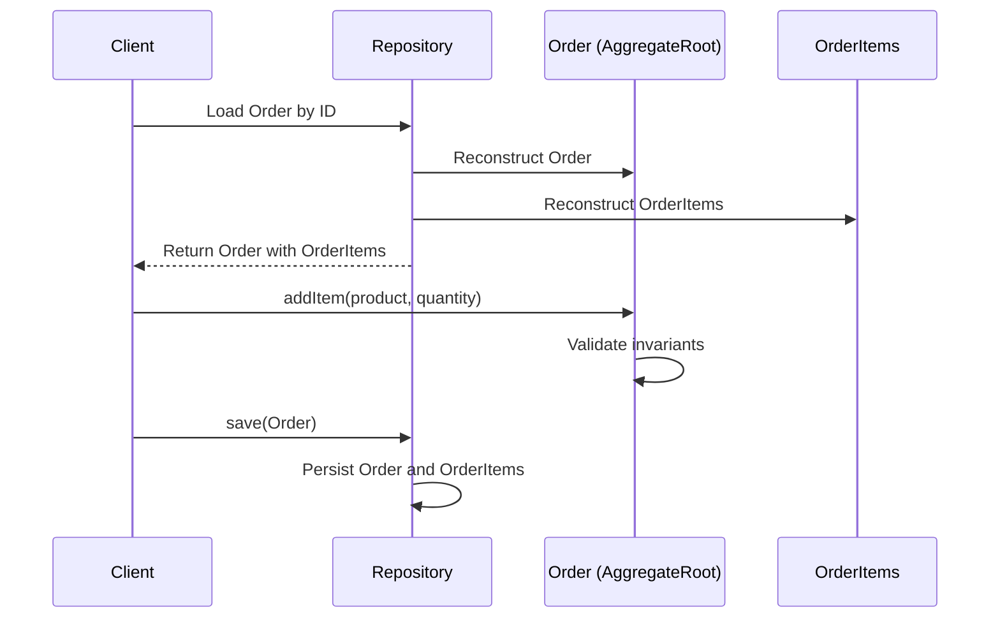

# Aggregate

## Intent
Cluster related domain objects into a unit with a defined consistency boundary, accessed through a single root entity that enforces invariants.

## Problem
Complex domain models contain many interconnected objects that must maintain consistency. Without clear boundaries, any object can modify any other, making it impossible to guarantee business rules. Transactions become unwieldy when they span too many objects. You need to group objects that must change together and protect their invariants through a single entry point.

## Real-World Analogy

{: .note }
> Think of a shopping cart in an online store. The cart contains multiple items, each with quantities and prices. You never modify cart items directly—you always go through the cart itself. The cart ensures rules like "quantity must be positive" and "total price is sum of items." If you want to change an item's quantity, you tell the cart, and it updates everything consistently. The cart is the aggregate root protecting its items.

## When You Need It
- You have clusters of objects that must be consistent with each other
- Business invariants span multiple related entities that should be modified as a unit
- You need clear transactional boundaries to ensure data integrity during concurrent access

## UML Class Diagram

## Sequence Diagram

## Participants
- **Aggregate Root** — The single entity that acts as entry point to the aggregate and enforces invariants
- **Entities** — Internal objects with identity that are part of the aggregate
- **Value Objects** — Immutable objects without identity that describe characteristics of the aggregate
- **Invariants** — Business rules that must always be true across the aggregate

## How It Works
1. Identify clusters of objects that naturally belong together and must maintain consistency.
2. Choose one entity as the aggregate root—the only object external clients can hold references to.
3. Ensure all modifications to internal entities go through the aggregate root's methods.
4. Enforce business invariants in the aggregate root before persisting changes.
5. Load and save the entire aggregate as a unit, maintaining transactional consistency within the boundary.

## Applicability
**Use when:**
- Multiple objects must be consistent with each other and have invariants that span them
- You need clear transactional boundaries in a complex domain model
- Objects have natural clusters that are loaded, modified, and saved together

**Don't use when:**
- Your domain model is simple with few relationships between objects
- Making aggregates too large would hurt performance or scalability
- Objects are truly independent and have no shared invariants

## Trade-offs
**Pros:**
- Clarifies consistency boundaries and makes invariants easier to enforce
- Simplifies concurrency control by reducing transaction scope
- Makes the domain model more maintainable by defining clear entry points

**Cons:**
- Can lead to performance issues if aggregates are too large
- May require loading more data than needed for simple operations
- Designing proper aggregate boundaries requires deep domain understanding

## Related Patterns
- **Repository** — Repositories typically work with aggregate roots, not individual entities
- **Factory** — Often used to create complex aggregates with proper initialization
- **Bounded Context** — Aggregates are defined within a bounded context and don't cross context boundaries
