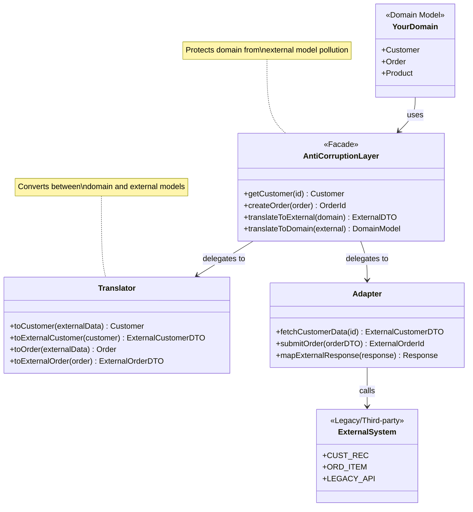

# Anti-Corruption Layer

## Intent
Isolate your domain model from external systems by creating a translation layer that converts between your clean domain concepts and the external system's model.

## Problem
When integrating with legacy systems, third-party APIs, or external services, their models often don't match your domain. Directly using their data structures pollutes your clean architecture with their assumptions, naming conventions, and constraints. Over time, your code becomes entangled with external dependencies, making changes difficult. You need a protective barrier that keeps external complexity from corrupting your domain.

## Real-World Analogy

{: .note }
> Think of an embassy in a foreign country. When citizens need to deal with foreign legal systems, they don't directly navigate complex foreign laws. Instead, the embassy acts as a translator and intermediary. It understands both the home country's legal framework and the foreign one, converting requests and documents between the two systems. The embassy protects citizens from having to understand foreign legal complexities, just as an ACL protects your domain from external system complexities.

## When You Need It
- Integrating with legacy systems that have outdated or incompatible models
- Consuming third-party APIs that don't align with your domain language
- Protecting your domain from changes in external systems you don't control

## UML Class Diagram

## Participants
- **Domain Model** — Your clean, well-designed model that reflects your business logic
- **Anti-Corruption Layer** — The protective boundary that isolates your domain from external systems
- **Translator** — Converts between domain objects and external system representations
- **Adapter** — Handles communication with the external system using its protocols
- **External System** — The legacy or third-party system with its own model

## How It Works
1. Define your domain model independently without compromise based on external system constraints.
2. Create a facade that provides domain-friendly operations, hiding all external system details.
3. Implement translators that convert between your domain objects and external data structures.
4. Build adapters that handle the technical details of communicating with external systems.
5. Route all external system interactions through the ACL, ensuring your domain code never directly touches external models.

## Applicability
**Use when:**
- Integrating with legacy systems or third-party APIs that don't match your domain model
- You need to protect your domain from changes in systems you don't control
- The external system's model would corrupt or complicate your clean architecture

**Don't use when:**
- The external system's model is already well-aligned with your domain
- The translation overhead is not justified by the benefits of isolation
- You're building a simple integration where a direct adapter would suffice

## Trade-offs
**Pros:**
- Protects your domain model from being polluted by external system constraints
- Isolates changes in external systems to a single translation layer
- Makes your domain code cleaner and easier to test without external dependencies

**Cons:**
- Adds complexity and development effort to maintain translation logic
- Can introduce performance overhead from converting between models
- Requires careful maintenance to keep translations accurate as systems evolve

## Related Patterns
- **Adapter** — ACL often uses adapters to communicate with external systems
- **Facade** — Provides a simplified interface to the anti-corruption layer
- **Bounded Context** — ACL protects a bounded context from external models
