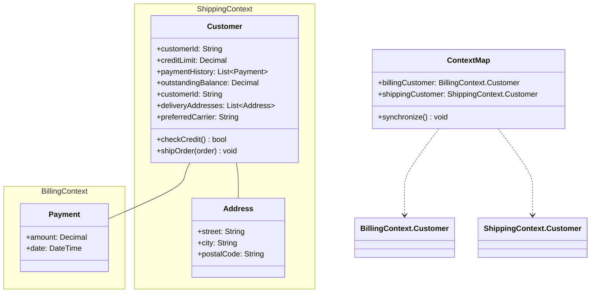
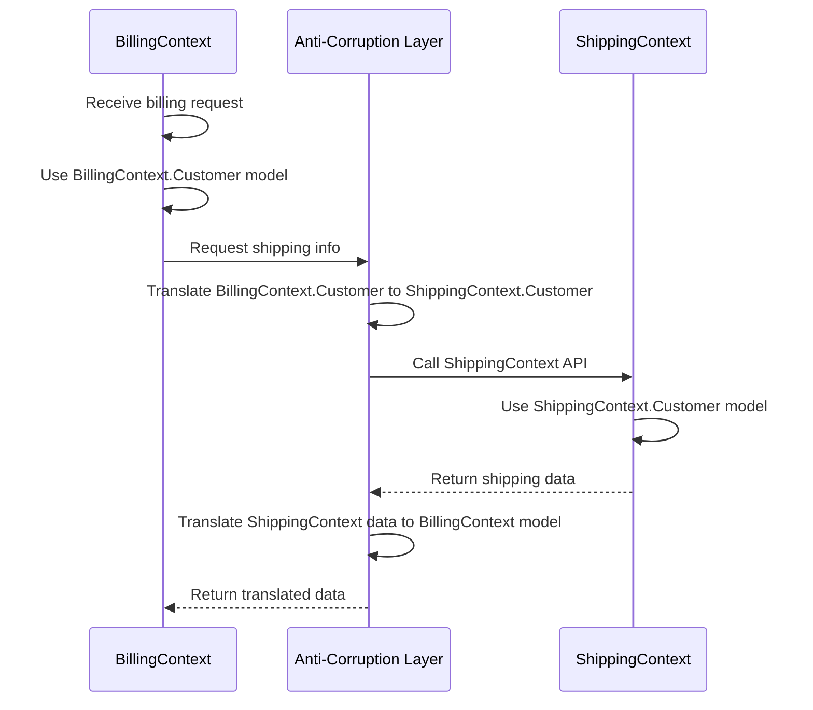

# Bounded Context

## Intent
Define explicit boundaries within which a domain model is valid, allowing the same term to have different meanings in different contexts without conflict.

## Problem
In large systems, different parts of the organization use the same words to mean different things. A "customer" in billing needs payment history and credit limits, while a "customer" in shipping needs delivery addresses and logistics preferences. Forcing a single unified model creates ambiguity and coupling. Each subdomain needs its own internally consistent model without being corrupted by others.

## Real-World Analogy

{: .note }
> Think of countries with their own legal systems and languages. The word "football" means soccer in England but American football in the United States. Within each country's borders, everyone understands what football means. When people cross borders, they need translation and adaptation. Similarly, bounded contexts are like national boundaries where each domain has its own language and rules that make sense internally.

## When You Need It
- Your application spans multiple business departments with different vocabularies and rules
- The same entity name appears in different parts of the system but with conflicting attributes or behavior
- You need to integrate with external systems or legacy applications that have their own models

## UML Class Diagram

## Sequence Diagram

## Participants
- **Bounded Context** — A boundary within which a domain model is defined and applicable
- **Ubiquitous Language** — The shared vocabulary used consistently within a context
- **Context Map** — Documentation of relationships and integration patterns between contexts
- **Integration Layer** — Translates and coordinates between different bounded contexts

## How It Works
1. Identify natural boundaries in your domain by analyzing how different teams or departments use terminology differently.
2. Define explicit boundaries for each context, establishing what models and concepts belong inside each boundary.
3. Develop a ubiquitous language within each context that is used consistently in code, conversations, and documentation.
4. Create a context map documenting how contexts relate and integrate with each other.
5. Implement translation layers at context boundaries to convert between different models when communication is needed.

## Applicability
**Use when:**
- Building large applications with multiple business domains or subdomains
- Different teams or departments have conflicting definitions of the same business concepts
- Integrating with external systems that have their own domain models

**Don't use when:**
- Your application is small and has a simple, unified domain model
- Creating unnecessary boundaries would add complexity without reducing coupling
- All stakeholders share a consistent understanding of domain concepts

## Trade-offs
**Pros:**
- Reduces coupling by isolating models that would otherwise conflict
- Allows teams to work independently within their context boundaries
- Makes integration points explicit and manageable through defined boundaries

**Cons:**
- Requires coordination and translation when data crosses context boundaries
- Can lead to data duplication across contexts
- Adds complexity in determining where boundaries should be drawn

## Related Patterns
- **Anti-Corruption Layer** — Often used to protect a bounded context from external models
- **Shared Kernel** — Alternative pattern where two contexts share a subset of the domain model
- **Repository** — Typically scoped to a single bounded context to maintain model integrity
