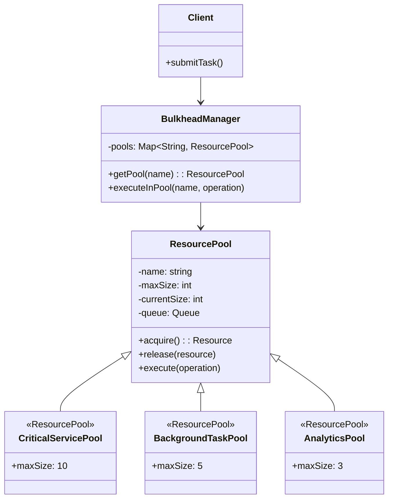

# Bulkhead

## Intent
Isolate critical resources and components into separate pools to prevent a failure in one part of the system from consuming all resources and bringing down the entire application.

## Problem
In applications that handle multiple types of operations or serve different clients, a resource-intensive or failing operation can monopolize shared resources like thread pools, database connections, or memory. This can starve other operations and cause a complete system failure even when only one component is experiencing problems.

## Real-World Analogy

{: .note }
> Imagine a ship divided into watertight compartments separated by bulkheads. If the hull is breached and one compartment floods, the bulkheads prevent water from spreading to other compartments, keeping the ship afloat. Even if several compartments flood, the ship can remain operational. Similarly, the Bulkhead pattern partitions your application's resources so that if one component exhausts its allocated resources or fails, the other components continue functioning with their protected resource pools.

## When You Need It
- Your application serves multiple clients or handles different types of operations with varying resource demands
- You need to prevent resource exhaustion in one component from affecting others
- You want to guarantee minimum resource availability for critical operations

## UML Class Diagram

## Participants
- **BulkheadManager** — manages multiple isolated resource pools
- **ResourcePool** — represents an isolated pool of resources with fixed capacity
- **CriticalServicePool** — dedicated pool for critical operations
- **BackgroundTaskPool** — isolated pool for background tasks
- **AnalyticsPool** — separate pool for analytics or reporting operations
- **Client** — submits operations to specific bulkhead pools

## How It Works
1. The system divides resources into separate pools, each with defined capacity limits
2. Different types of operations or clients are assigned to specific pools based on criticality or function
3. When an operation needs resources, it acquires them from its designated pool
4. If a pool is exhausted, only operations assigned to that pool are affected; other pools remain available
5. Resources are released back to their pool after operation completion, maintaining isolation

## Applicability
**Use when:**
- Your application has multiple resource-intensive operations that could interfere with each other
- You need to guarantee resource availability for critical operations even under heavy load
- Different parts of your system have different performance and reliability requirements

**Don't use when:**
- Your application has simple, uniform resource requirements across all operations
- The overhead of managing multiple resource pools outweighs the isolation benefits
- You have unlimited resources and contention is not a concern

## Trade-offs
**Pros:**
- Prevents one failing or resource-hungry component from affecting the entire system
- Provides predictable resource allocation for critical operations
- Improves system resilience by containing failures to specific bulkheads

**Cons:**
- Can lead to inefficient resource utilization if pools are not properly sized
- Adds complexity in managing and configuring multiple resource pools
- May waste resources when one pool is idle while another is saturated

## Related Patterns
- **Circuit Breaker** — detects failures; bulkhead contains their impact through resource isolation
- **Thread Pool** — specific implementation of resource pooling that bulkhead generalizes
- **Rate Limiter** — controls request rate; bulkhead controls resource allocation
- **Queue-Based Load Leveling** — manages load spikes; bulkhead isolates resource consumption
