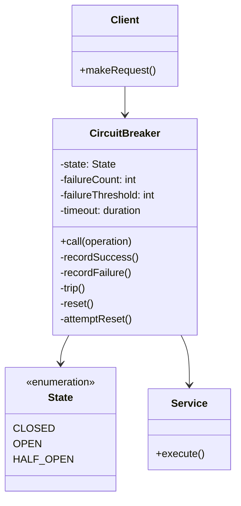
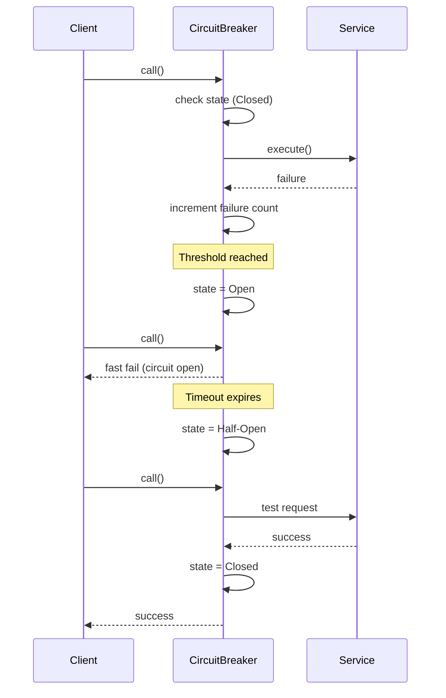

# Circuit Breaker

## Intent
Prevent cascading failures in distributed systems by automatically stopping calls to a failing service and allowing it time to recover.

## Problem
In distributed systems, when a service becomes unresponsive or slow, clients continuing to make requests can exhaust resources and cause cascading failures throughout the system. Without a mechanism to detect and halt these failing calls, the entire system can become unstable as threads pile up waiting for timeouts.

## Real-World Analogy

{: .note }
> Think of an electrical circuit breaker in your home. When too much current flows through a circuit (perhaps from a short circuit or overload), the breaker automatically trips and cuts off power to protect your wiring from overheating and causing a fire. The breaker stays open until someone manually resets it, ensuring the problem has been addressed. Similarly, a Circuit Breaker pattern monitors service calls and "trips" when failures exceed a threshold, preventing further damage to your system.

## When You Need It
- Your application depends on remote services that may fail or become temporarily unavailable
- You want to fail fast rather than waiting for timeouts when a service is known to be down
- You need to prevent resource exhaustion from repeated calls to failing services

## UML Class Diagram



## Sequence Diagram



## Participants
- **Client** — makes requests through the circuit breaker
- **CircuitBreaker** — monitors calls to the service and manages state transitions
- **State** — represents the current state (Closed, Open, or Half-Open)
- **Service** — the protected remote service being called

## How It Works
1. In the **Closed** state, the circuit breaker allows all calls through to the service while monitoring for failures
2. When failures exceed the configured threshold, the circuit breaker transitions to the **Open** state
3. In the **Open** state, all calls fail immediately without attempting to contact the service, allowing it time to recover
4. After a timeout period, the circuit breaker moves to **Half-Open** state and allows a limited number of test requests through
5. If test requests succeed, the circuit breaker resets to **Closed**; if they fail, it returns to **Open**

## Applicability
**Use when:**
- You make calls to external services that may be unreliable or have variable latency
- You want to prevent cascading failures in a microservices architecture
- You need to provide fallback behavior when services are unavailable

**Don't use when:**
- Calling local in-process operations that don't involve network or resource contention
- The service being called has its own sophisticated retry and failure handling
- You need every request to be attempted regardless of previous failures

## Trade-offs
**Pros:**
- Prevents cascading failures by failing fast when a service is known to be down
- Allows failing services time to recover without being overwhelmed by requests
- Provides visibility into service health through state monitoring

**Cons:**
- Adds complexity and latency overhead to every service call
- Requires careful tuning of thresholds and timeouts to avoid false positives
- May reject valid requests if the circuit trips due to temporary network issues

## Example Code

### C#

```csharp
using System;
using System.Threading;

// Circuit breaker implementation with three states
public class CircuitBreaker
{
    private enum State { Closed, Open, HalfOpen }

    private State _state = State.Closed;
    private int _failureCount = 0;
    private readonly int _failureThreshold;
    private readonly TimeSpan _timeout;
    private DateTime _lastFailureTime;

    public CircuitBreaker(int failureThreshold = 3, int timeoutSeconds = 5)
    {
        _failureThreshold = failureThreshold;
        _timeout = TimeSpan.FromSeconds(timeoutSeconds);
    }

    public T Execute<T>(Func<T> operation)
    {
        if (_state == State.Open)
        {
            if (DateTime.Now - _lastFailureTime >= _timeout)
            {
                _state = State.HalfOpen;
                Console.WriteLine("Circuit Half-Open - testing recovery");
            }
            else
            {
                throw new InvalidOperationException("Circuit is OPEN - fast failing");
            }
        }

        try
        {
            T result = operation();
            RecordSuccess();
            return result;
        }
        catch (Exception ex)
        {
            RecordFailure();
            throw new Exception($"Operation failed: {ex.Message}", ex);
        }
    }

    private void RecordSuccess()
    {
        _failureCount = 0;
        _state = State.Closed;
        Console.WriteLine("Success - Circuit Closed");
    }

    private void RecordFailure()
    {
        _failureCount++;
        _lastFailureTime = DateTime.Now;

        if (_failureCount >= _failureThreshold)
        {
            _state = State.Open;
            Console.WriteLine($"Threshold reached ({_failureCount}) - Circuit OPEN");
        }
    }
}

// Simulated unreliable service
class UnreliableService
{
    private int _callCount = 0;

    public string Call()
    {
        _callCount++;
        if (_callCount <= 3 || _callCount == 10)
            throw new Exception("Service unavailable");
        return "Service response OK";
    }
}

class Program
{
    static void Main()
    {
        var breaker = new CircuitBreaker(failureThreshold: 3, timeoutSeconds: 2);
        var service = new UnreliableService();

        for (int i = 1; i <= 12; i++)
        {
            try
            {
                Console.Write($"Call {i}: ");
                var result = breaker.Execute(() => service.Call());
                Console.WriteLine(result);
            }
            catch (Exception ex)
            {
                Console.WriteLine($"Failed - {ex.Message}");
            }

            if (i == 6) Thread.Sleep(2100); // Wait for timeout to expire
        }
    }
}
```

## Runnable Examples

| Language | File |
|----------|------|
| C# | [circuit-breaker.cs]({{ site.github.repository_url }}/blob/main/docs/examples/csharp/advanced/circuit-breaker.cs) |

## Related Patterns
- **Retry with Backoff** — often used together; circuit breaker prevents retries when service is known to be down
- **Bulkhead** — provides isolation to contain failures; complements circuit breaker's failure detection
- **Timeout** — circuit breaker relies on timeouts to detect slow or hanging calls
- **Fallback** — provides alternative behavior when circuit is open
