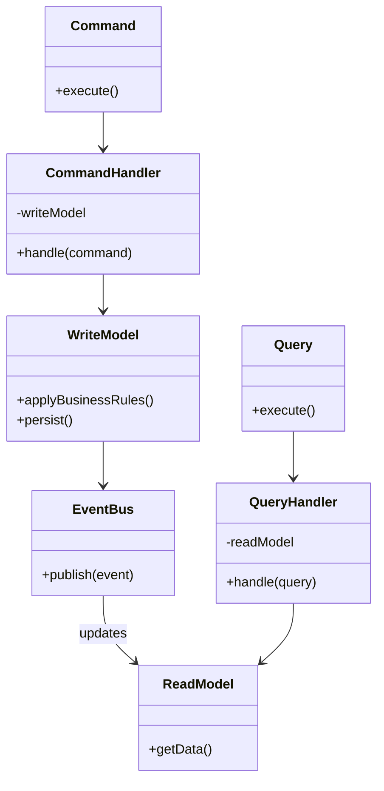

# CQRS

## Intent
Separate read and write operations into distinct models to optimize each independently for their specific responsibilities.

## Problem
Traditional CRUD systems use the same model for reading and writing data, leading to conflicts between complex query requirements and business logic validation. Performance suffers when read-heavy operations compete with write transactions, and scaling becomes difficult because both operations share the same database schema and resources.

## Real-World Analogy

{: .note }
> Think of a restaurant where the kitchen (command side) handles food preparation with complex recipes, inventory management, and quality control, while the menu display (query side) shows customers a simple, optimized view of available dishes with prices and descriptions. The kitchen doesn't need to know how menus are formatted, and customers don't need to see the cooking process. Each side is optimized for its specific purpose.

## When You Need It
- You have complex domain logic on writes but simple, fast queries needed on reads
- Read and write workloads have vastly different performance or scaling requirements
- You need to support multiple optimized read representations of the same data

## UML Class Diagram

## Participants
- **Command** — represents a write operation that changes system state
- **CommandHandler** — processes commands using the write model and business logic
- **WriteModel** — domain model optimized for enforcing business rules and handling updates
- **Query** — represents a read operation requesting data
- **QueryHandler** — retrieves data from optimized read models
- **ReadModel** — denormalized, optimized projections for fast queries
- **EventBus** — synchronizes write model changes to read models

## How It Works
1. Client sends a command to change state, which is validated and processed by the command handler
2. Command handler applies business rules through the write model and persists changes
3. Write model publishes domain events to notify subscribers of state changes
4. Event handlers update one or more read models (projections) optimized for specific queries
5. Client sends queries that are handled by query handlers reading from optimized read models

## Applicability
**Use when:**
- Read and write operations have significantly different scalability requirements
- Your domain has complex business logic that shouldn't pollute read operations
- You need multiple specialized views of the same data for different use cases

**Don't use when:**
- Your application is simple CRUD with similar read/write patterns
- The complexity of maintaining separate models outweighs the benefits
- Eventual consistency between read and write models is unacceptable

## Trade-offs
**Pros:**
- Independent scaling of read and write operations based on actual workload
- Optimized data models for each operation type improve performance
- Clear separation of concerns between business logic and data retrieval

**Cons:**
- Increased complexity in maintaining separate models and synchronization
- Eventual consistency means reads may not immediately reflect writes
- More infrastructure required for event handling and model synchronization

## Related Patterns
- **Event Sourcing** — often combined with CQRS to build read models from event streams
- **Repository** — provides abstraction for both command and query data access
- **Mediator** — can coordinate command and query handling through a unified interface
