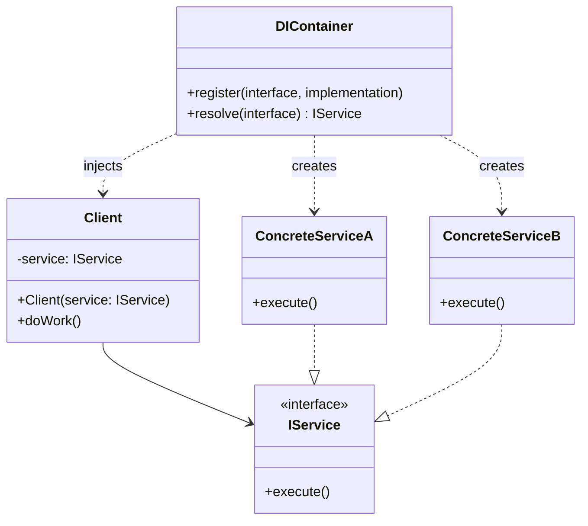

# Dependency Injection

## Intent
Supply objects with their dependencies from external sources rather than having them create dependencies internally. Invert control of dependency creation to improve testability and flexibility.

## Problem
When a class directly instantiates its dependencies, it becomes tightly coupled to concrete implementations, making it difficult to swap dependencies for testing or to support different configurations. Hard-coded dependencies reduce flexibility and violate the Dependency Inversion Principle. This tight coupling makes unit testing nearly impossible without invoking real dependencies.

## Real-World Analogy

{: .note }
> Imagine hiring a contractor to build your deck. Instead of the contractor bringing their own tools and deciding which brands to use, you provide them with the specific tools they need—a DeWalt drill, a Makita saw, and a Stanley hammer. The contractor doesn't care which brands you provide as long as they conform to the standard tool interfaces (drill bits fit, saw blades are compatible). This way, you control the quality and type of tools used, and you can easily swap in different brands without the contractor needing to change how they work.

## When You Need It
- You want to write unit tests that mock or stub dependencies without invoking real implementations
- You need to swap implementations based on environment (development, staging, production) or configuration
- You want to decouple high-level modules from low-level implementation details

## UML Class Diagram

## Participants
- **Client** — consumes services through dependency injection rather than creating them
- **IService** — interface defining the contract that dependencies must fulfill
- **ConcreteService** — concrete implementations of the service interface
- **DIContainer/Injector** — responsible for creating dependencies and injecting them into clients

## How It Works
1. Client declares dependencies as constructor parameters or settable properties, typed to interfaces
2. DIContainer registers mappings between interfaces and concrete implementations
3. When Client is requested, the container resolves all dependencies recursively
4. Container instantiates dependencies and injects them into Client via constructor or property
5. Client uses injected dependencies through their interface contracts, unaware of concrete types

## Applicability
**Use when:**
- You need to write testable code that can use mock or stub implementations
- You want to support multiple implementations that can be swapped based on configuration
- You're building applications with complex dependency graphs that benefit from automated wiring

**Don't use when:**
- Your application has trivial or no dependencies (adds unnecessary complexity)
- Dependencies are truly static and will never change (premature abstraction)
- You're working in a context where reflection or runtime type resolution is unavailable or too costly

## Trade-offs
**Pros:**
- Dramatically improves testability by allowing mock dependencies to be injected
- Decouples clients from concrete implementations, following Dependency Inversion Principle
- Centralizes dependency configuration, making it easier to change implementations globally

**Cons:**
- Adds indirection that can make code harder to navigate (jumping to interface vs implementation)
- Requires learning curve for DI containers and understanding their configuration
- Runtime errors if container is misconfigured (missing registrations, circular dependencies)

## Related Patterns
- **Service Locator** — alternative approach where clients query a registry for dependencies (more coupled)
- **Factory** — DI containers often use factories internally to create instances
- **Inversion of Control** — broader principle that DI implements (framework calls your code)
