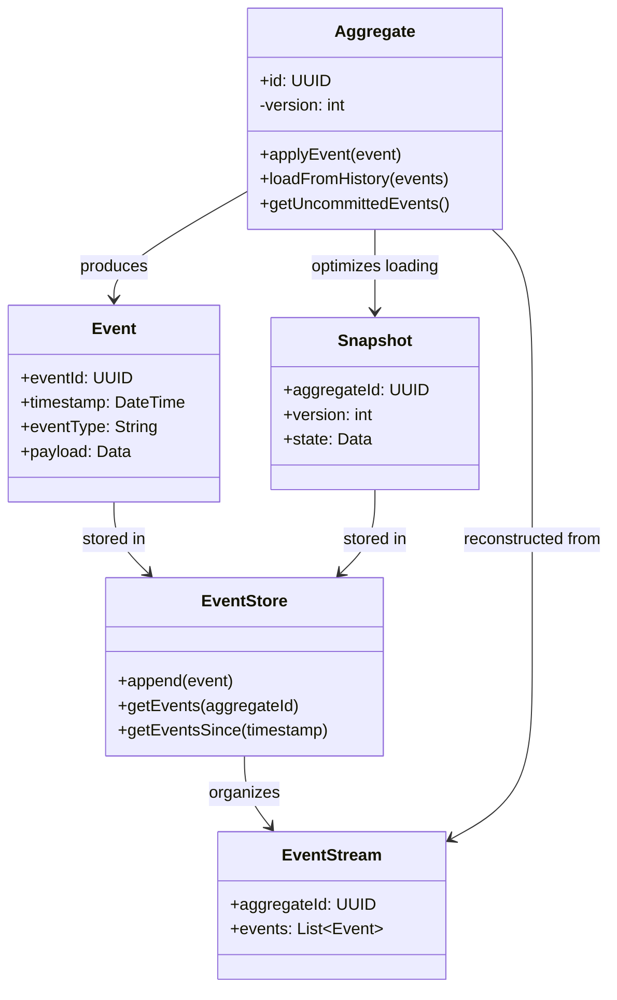

# Event Sourcing

## Intent
Persist every state change as an immutable event in an append-only log, allowing the current state to be reconstructed by replaying the event history.

## Problem
Traditional state-based persistence loses historical information by overwriting previous states, making it impossible to audit changes, debug issues, or understand how the system evolved. When multiple systems need to react to changes, polling databases for modifications is inefficient and doesn't capture the intent behind state transitions.

## Real-World Analogy

{: .note }
> Consider a bank ledger that records every transaction (deposit, withdrawal, transfer) as a permanent entry. Your current balance isn't stored directly but calculated by replaying all transactions from the beginning. This gives you a complete audit trail, lets you verify the balance at any point in history, and if there's a dispute, you can examine every transaction that led to the current state.

## When You Need It
- You need a complete audit trail of all changes for compliance or debugging
- The ability to reconstruct past states or replay events is valuable
- Multiple subsystems need to react to the same business events

## UML Class Diagram

## Participants
- **Event** — immutable record of a state change with timestamp and data
- **EventStore** — append-only storage for events, organized by aggregate
- **Aggregate** — domain entity that produces events and rebuilds state from history
- **EventStream** — ordered sequence of events for a specific aggregate
- **Snapshot** — optional optimization storing aggregate state at a point in time

## How It Works
1. Business operation creates domain events representing state changes
2. Events are appended to the event store in an immutable, ordered stream
3. To load an aggregate, retrieve all its events from the store
4. Replay events in order through the aggregate to reconstruct current state
5. Optionally create snapshots periodically to avoid replaying long event histories

## Applicability
**Use when:**
- You need complete auditability and the ability to answer "how did we get here"
- Temporal queries like "what was the state last Tuesday" are important
- Multiple systems need to process the same events independently

**Don't use when:**
- Your domain is simple and doesn't benefit from historical event tracking
- Storage costs for keeping all events forever are prohibitive
- You can't tolerate the complexity of event schema evolution

## Trade-offs
**Pros:**
- Complete audit trail and historical record of all changes
- Ability to rebuild state, replay events, or create new projections at any time
- Natural fit for event-driven architectures and reactive systems

**Cons:**
- Increased storage requirements for keeping all events indefinitely
- Complexity in handling event schema changes and versioning
- Performance overhead from replaying long event histories without snapshots

## Related Patterns
- **CQRS** — commonly paired with event sourcing to build optimized read models from events
- **Memento** — similar concept of capturing state, but event sourcing stores deltas not full snapshots
- **Observer** — events notify multiple subscribers about state changes
