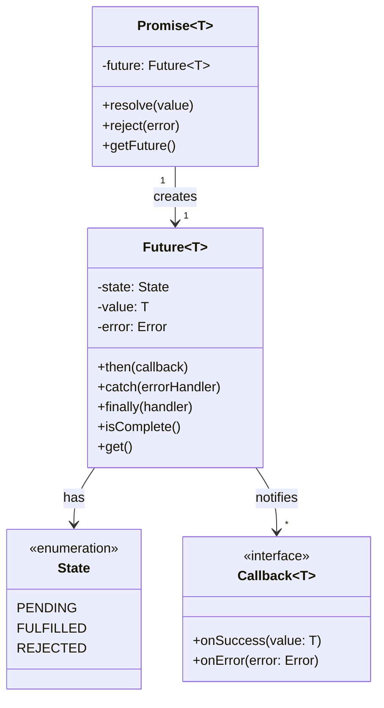
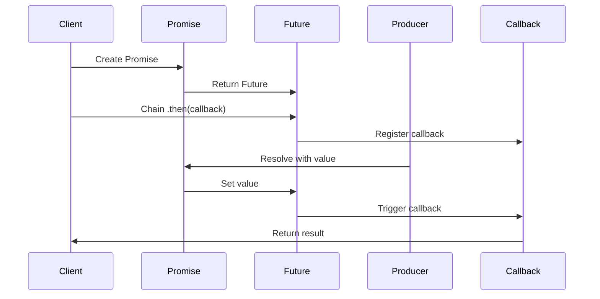

# Future/Promise

## Intent
Provide a placeholder for a value that will be available asynchronously in the future, allowing non-blocking operations with chainable transformations and error handling.

## Problem
Asynchronous operations require callbacks to handle results when they complete, leading to deeply nested "callback hell" that's difficult to read and maintain. Error handling becomes fragmented across multiple callback levels, and coordinating multiple async operations requires complex manual orchestration. Traditional blocking waits waste thread resources and harm application scalability.

## Real-World Analogy

{: .note }
> Imagine getting a restaurant buzzer when you order food. The buzzer is your "future meal"—you don't have the food yet, but you have a token representing it. While waiting, you can do other things like find a table or chat with friends. You can tell someone, "When this buzzer goes off, grab the food and bring it to table 5" (chaining). If the kitchen runs out of ingredients, the buzzer can signal an error. You can even combine multiple buzzers: "When both the pizza buzzer AND the drinks buzzer are ready, start eating." The buzzer lets you stay productive instead of standing at the counter blocking the line.

## When You Need It
- Making asynchronous API calls or I/O operations without blocking the calling thread
- Composing multiple async operations in a readable sequential or parallel flow
- Building responsive UIs that perform background work while keeping the interface interactive

## UML Class Diagram



## Sequence Diagram



## Participants
- **Future** — read-only placeholder that represents a value which will be available later, with methods to attach callbacks
- **Promise** — write-side handle that allows resolving or rejecting the associated future exactly once
- **Callback** — functions registered to be invoked when the future completes successfully or with an error
- **State** — enumeration tracking whether the future is pending, fulfilled with a value, or rejected with an error

## How It Works
1. A Promise is created to represent an asynchronous operation, and its associated Future is returned to callers
2. Callers register callbacks on the Future using methods like then() for success and catch() for errors, without blocking
3. The asynchronous operation executes in the background (on another thread, event loop, etc.)
4. When the operation completes, the Promise is resolved with a value or rejected with an error, transitioning the Future's state
5. The Future invokes all registered callbacks with the result, and any subsequently attached callbacks execute immediately with the already-available value

## Applicability
**Use when:**
- You need to perform I/O-bound or long-running operations without blocking threads
- Your code requires composing multiple asynchronous operations with transformations and error handling
- You want to avoid callback hell and write async code that reads more like synchronous flow

**Don't use when:**
- Operations complete synchronously and the overhead of future/promise machinery isn't justified
- You're working in environments without good async runtime support or where callbacks are simpler
- Memory constraints are severe and the overhead of allocating futures for every operation is prohibitive

## Trade-offs
**Pros:**
- Enables non-blocking code that's more readable than nested callbacks
- Provides composable operations for transforming and combining async results
- Centralizes error handling with catch() instead of error callbacks at every level

**Cons:**
- Adds memory overhead and complexity compared to direct callbacks
- Can still lead to "promise chains" that are hard to debug without proper tooling
- Requires understanding of asynchronous semantics and potential pitfalls like forgotten error handlers

## Example Code

### C#

```csharp
using System;
using System.Threading.Tasks;
using System.Linq;

class Program
{
    // Simulate async service calls
    static async Task<string> FetchUserData(int userId)
    {
        await Task.Delay(500); // Simulate network delay
        return $"User{userId}Data";
    }

    static async Task<string> FetchUserOrders(int userId)
    {
        await Task.Delay(300);
        return $"User{userId}Orders";
    }

    static async Task<string> FetchUserPreferences(int userId)
    {
        await Task.Delay(400);
        return $"User{userId}Preferences";
    }

    static async Task Main()
    {
        Console.WriteLine("=== Basic async/await (sequential) ===");
        var userData = await FetchUserData(1);
        Console.WriteLine($"Received: {userData}");

        Console.WriteLine("\n=== Chaining with ContinueWith ===");
        var task = FetchUserData(2)
            .ContinueWith(t =>
            {
                Console.WriteLine($"Processing: {t.Result}");
                return t.Result.ToUpper();
            })
            .ContinueWith(t =>
            {
                Console.WriteLine($"Final result: {t.Result}");
                return t.Result;
            });
        await task;

        Console.WriteLine("\n=== Parallel execution with Task.WhenAll ===");
        var startTime = DateTime.Now;

        var task1 = FetchUserData(3);
        var task2 = FetchUserOrders(3);
        var task3 = FetchUserPreferences(3);

        // Wait for all tasks to complete concurrently
        var results = await Task.WhenAll(task1, task2, task3);

        var elapsed = (DateTime.Now - startTime).TotalMilliseconds;
        Console.WriteLine($"Fetched all data in {elapsed:F0}ms (parallel):");
        foreach (var result in results)
        {
            Console.WriteLine($"  - {result}");
        }

        Console.WriteLine("\n=== Error handling with try/catch ===");
        try
        {
            await Task.Run(async () =>
            {
                await Task.Delay(100);
                throw new InvalidOperationException("Service unavailable");
            });
        }
        catch (Exception ex)
        {
            Console.WriteLine($"Caught error: {ex.Message}");
        }

        Console.WriteLine("\n=== Combining and transforming ===");
        var combinedResult = await FetchUserData(4)
            .ContinueWith(async t1 =>
            {
                var orders = await FetchUserOrders(4);
                return $"{t1.Result} + {orders}";
            })
            .Unwrap();

        Console.WriteLine($"Combined: {combinedResult}");
    }
}
```

## Runnable Examples

| Language | File |
|----------|------|
| C# | [future-promise.cs]({{ site.github.repository_url }}/blob/main/docs/examples/csharp/advanced/future-promise.cs) |

## Related Patterns
- **Observer** — futures notify callbacks when state changes, similar to event notification
- **Proxy** — futures act as proxies for values that don't exist yet
- **Command** — promises encapsulate the command to set a future's value
