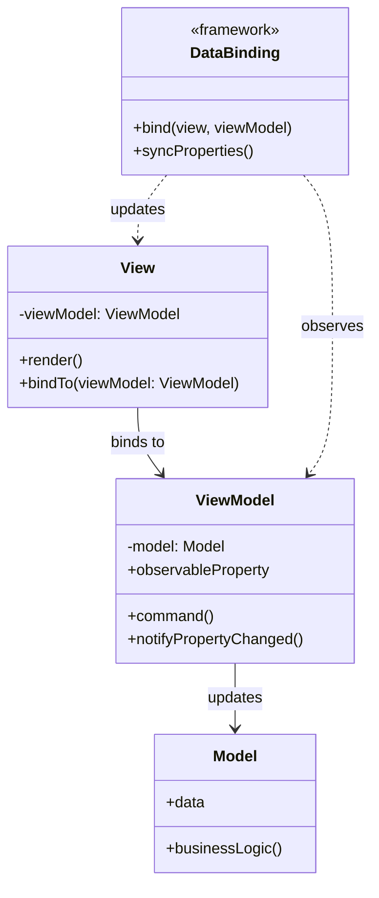
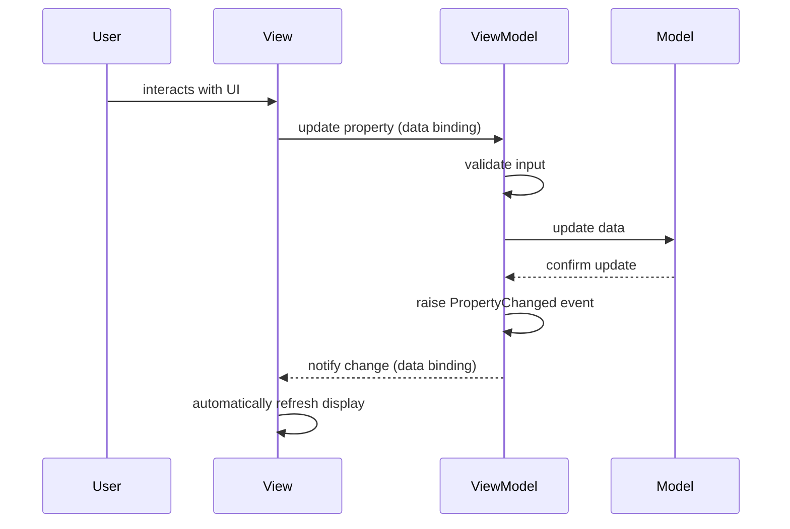

# Model-View-ViewModel (MVVM)

## Intent
Separate UI presentation from business logic by introducing a ViewModel layer that exposes data and commands for data binding. Enable declarative UI that automatically synchronizes with underlying state.

## Problem
Traditional UI code often mixes presentation logic, business logic, and state management in a single layer, making it difficult to test and maintain. Direct manipulation of UI elements from business logic creates tight coupling between view and model. Without a clear separation, unit testing UI behavior requires instantiating actual UI components, which is slow and brittle.

## Real-World Analogy

{: .note }
> Think of a stock ticker display board in a trading floor. The raw market data feed (Model) streams live prices, volumes, and trades. A display controller (ViewModel) takes that raw data and formats it — calculating percentage changes, highlighting stocks that crossed thresholds, and deciding which tickers to show. The display board (View) simply renders whatever the controller provides, with no knowledge of market data formats. When a trader taps a stock on the board to place an order, that input flows back through the controller to the trading system. The board is purely visual, the controller handles all presentation logic, and the data feed knows nothing about screens.

## When You Need It
- You're building applications with complex UI that needs to be testable without instantiating UI components
- You want to leverage data binding frameworks to automatically synchronize UI with state
- You need to separate presentation concerns from business logic for maintainability

## UML Class Diagram

## Sequence Diagram

## Participants
- **View** — renders UI elements and binds to ViewModel properties and commands via data binding
- **ViewModel** — exposes observable properties and commands, transforming Model data for display
- **Model** — contains business logic, domain data, and validation rules independent of UI
- **DataBinding** — framework mechanism that synchronizes View and ViewModel automatically

## How It Works
1. View declares bindings to ViewModel properties and commands in markup or code
2. ViewModel exposes observable properties that notify when values change
3. Data binding framework observes ViewModel properties and updates View when they change
4. User interactions trigger commands on ViewModel or update bound properties
5. ViewModel updates Model in response to commands, and Model changes propagate back to View

## Applicability
**Use when:**
- You're using UI frameworks with built-in data binding support (WPF, Angular, Vue, etc.)
- You need to unit test presentation logic without instantiating UI components
- You have complex UI state that benefits from automatic synchronization with underlying data

**Don't use when:**
- Your UI is simple and doesn't justify the overhead of ViewModel and data binding
- Your framework doesn't support data binding, making MVVM implementation cumbersome
- Performance is critical and data binding overhead is unacceptable (though rare in practice)

## Trade-offs
**Pros:**
- Enables unit testing of presentation logic by testing ViewModel without View
- Automatic UI synchronization reduces boilerplate code for updating UI elements
- Clear separation of concerns makes codebase more maintainable and understandable

**Cons:**
- Requires learning data binding framework and understanding observable patterns
- Debugging data binding issues can be difficult (binding failures often silent)
- Adds complexity for simple UIs where direct View-Model interaction would suffice

## Related Patterns
- **Model-View-Controller (MVC)** — older pattern where Controller mediates between View and Model
- **Model-View-Presenter (MVP)** — similar separation but Presenter directly manipulates View interface
- **Observer** — data binding relies on Observer pattern to propagate changes from ViewModel to View
