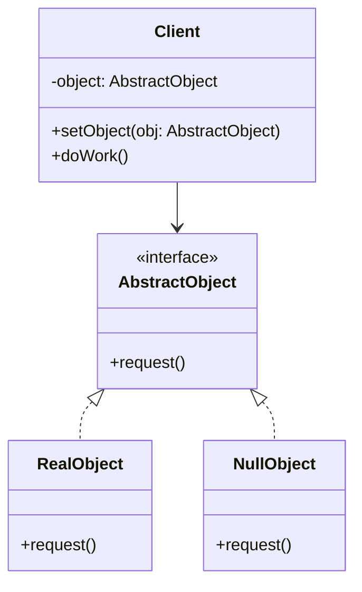

# Null Object

## Intent
Provide an object that conforms to an interface but implements do-nothing behavior, eliminating the need for null checks. Encapsulate the absence of an object as a first-class implementation.

## Problem
Code that frequently checks for null references becomes cluttered with conditional logic, reducing readability and increasing the chance of forgetting a null check. When null is used to represent the absence of an object, every consumer must defensively check before invoking methods. This scatters the responsibility of handling absence throughout the codebase rather than encapsulating it.

## Real-World Analogy

{: .note }
> Think of the Unix device `/dev/null`. When programs write output to `/dev/null`, the data simply disappears—it's silently discarded without error. This "null device" conforms to the same interface as any other output device (you can write to it), but its implementation does nothing. Programs don't need special logic to handle `/dev/null` differently; they treat it like any other output target. This is far cleaner than littering the code with "if output exists, then write to it" checks everywhere.

## When You Need It
- You find yourself writing repetitive null checks before invoking methods on potentially absent objects
- You want a default do-nothing behavior that conforms to your interface contract
- You need to simplify client code by treating presence and absence uniformly

## UML Class Diagram

## Participants
- **AbstractObject** — interface defining operations that both real and null objects must implement
- **RealObject** — concrete implementation that provides actual behavior
- **NullObject** — concrete implementation that provides do-nothing or safe default behavior
- **Client** — works with AbstractObject without needing to distinguish between real and null variants

## How It Works
1. Define an interface or abstract class that declares the operations clients need
2. Implement RealObject with meaningful behavior that fulfills the interface contract
3. Implement NullObject with do-nothing or safe default implementations of all interface methods
4. Client receives an AbstractObject reference, which may be either Real or Null
5. Client invokes methods without null checks; Null implementation safely does nothing

## Applicability
**Use when:**
- You have frequent null checks that clutter code and reduce readability
- A do-nothing or default behavior is semantically meaningful for absent objects
- You want to eliminate NullPointerException or similar runtime errors from missing objects

**Don't use when:**
- The absence of an object is an error condition that should be explicitly handled
- Silently doing nothing could mask bugs or lead to incorrect program behavior
- Returning null and checking for it makes the control flow more explicit and clearer

## Trade-offs
**Pros:**
- Eliminates repetitive null checks, simplifying client code significantly
- Encapsulates the behavior of absence in a single well-defined class
- Reduces the risk of NullPointerException and similar errors

**Cons:**
- Can hide errors when an object should be present but isn't (silent failures)
- Adds extra classes to the codebase, increasing the number of types to maintain
- May confuse developers who expect null checks and don't realize Null Object is in use

## Related Patterns
- **Strategy** — Null Object can be viewed as a special-case strategy with do-nothing behavior
- **State** — Null Object is sometimes used as a special state representing absence
- **Proxy** — Both provide surrogate objects, but Null Object has empty behavior while Proxy delegates
