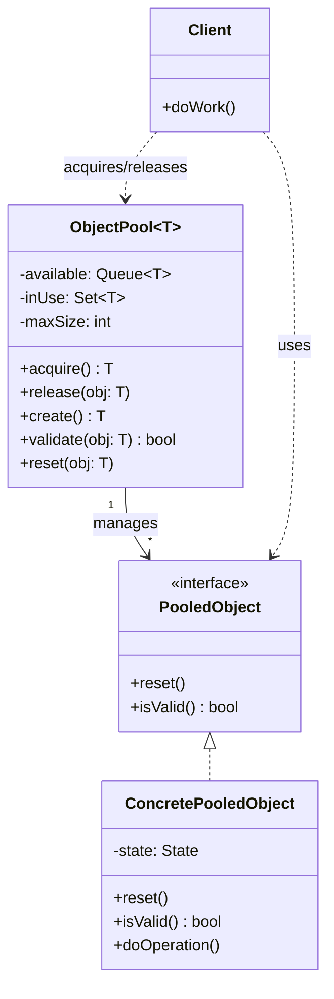
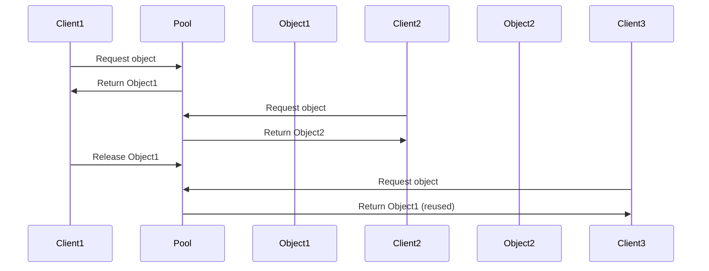

# Object Pool

## Intent
Pre-allocate and reuse a fixed set of expensive objects rather than creating and destroying them on demand, improving performance by avoiding costly initialization and garbage collection overhead.

## Problem
Creating certain objects is expensive due to resource allocation costs like database connections, thread creation, or large memory buffers. Frequently allocating and deallocating such objects causes performance degradation from initialization overhead and increased garbage collection pressure. Some resources have hard limits (connection pools, hardware handles) that prevent unlimited creation. Uncontrolled object creation can exhaust system resources.

## Real-World Analogy

{: .note }
> Think of a library that lends books. Instead of printing a new copy every time someone wants to read a book and shredding it when they're done, the library maintains a collection of books. When you want a book, you check it out from the library's shelf. If all copies are checked out, you wait or get an error. When you finish, you return the book to the shelf for others to use. This is far more efficient than printing millions of copies. The library might have 5 copies of a popular book—enough to handle normal demand without wasting resources on hundreds of copies that would sit unused.

## When You Need It
- Managing expensive resources like database connections, thread pools, or network sockets
- Optimizing performance in systems with frequent allocation/deallocation of large or costly objects
- Working with resources that have hard limits or require explicit lifecycle management

## UML Class Diagram

## Sequence Diagram

## Participants
- **ObjectPool** — manages the lifecycle of pooled objects, tracking available and in-use instances
- **PooledObject** — interface defining reset() and validation methods for objects in the pool
- **ConcretePooledObject** — the actual expensive resource being pooled (connection, buffer, etc.)
- **Client** — acquires objects from the pool, uses them, and releases them back

## How It Works
1. The ObjectPool is initialized with a set of pre-created instances or a lazy creation strategy up to maxSize
2. When a Client needs an object, it calls acquire() which removes an available object from the pool or creates a new one if under capacity
3. The Client uses the pooled object to perform work, treating it like any other instance
4. When finished, the Client calls release() to return the object to the pool rather than letting it be garbage collected
5. Before returning an object to the available queue, the pool validates it and resets its state to prevent leaking data between uses

## Applicability
**Use when:**
- Object creation/destruction is measurably expensive in terms of time or resources
- You have a predictable maximum number of concurrent object users and can set appropriate pool size
- Objects can be reset to a clean state and safely reused across different contexts

**Don't use when:**
- Objects are cheap to create and garbage collection overhead is negligible
- Resource usage is unbounded and you can't determine a reasonable pool size
- Objects cannot be safely reset or have complex state that leaks between uses

## Trade-offs
**Pros:**
- Dramatically reduces allocation overhead and garbage collection pressure for expensive objects
- Provides bounded resource usage with configurable pool size limits
- Improves predictable performance by amortizing initialization costs across many uses

**Cons:**
- Adds complexity with acquire/release lifecycle that clients must manage correctly
- Leaked objects (not released) can exhaust the pool and cause deadlocks or resource starvation
- Memory footprint is higher since objects remain allocated even when not in use

## Related Patterns
- **Singleton** — pools are often implemented as singletons to provide global access
- **Factory Method** — pools use factory methods to create new instances when needed
- **Flyweight** — both share objects for efficiency, but pools focus on expensive mutable resources while flyweights share immutable state
