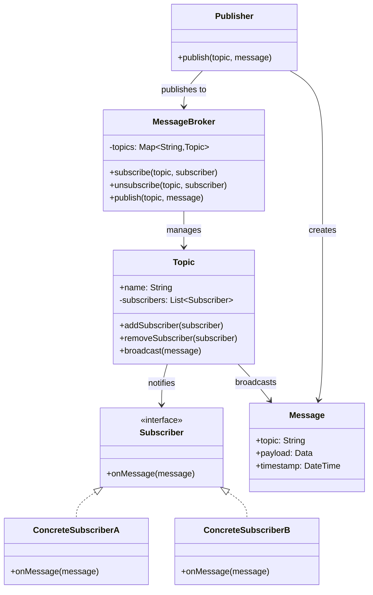

# Publish-Subscribe

## Intent
Enable broker-mediated message broadcasting where publishers send messages to topics without knowing subscribers, and subscribers receive messages from topics they're interested in without knowing publishers.

## Problem
Direct point-to-point communication creates tight coupling between message senders and receivers, making it difficult to add new consumers or scale the system. When multiple components need to react to the same events, duplicating messages or maintaining lists of recipients becomes unwieldy and fragile as the system evolves.

## Real-World Analogy

{: .note }
> A newspaper publisher doesn't know who reads their paper, and readers don't interact directly with journalists. The newspaper (broker) organizes content into sections like Sports, Business, and Entertainment (topics). Readers subscribe to sections they care about, and when journalists publish articles, they go to the appropriate section. New readers can subscribe or unsubscribe without affecting the publisher, and the newspaper handles distribution.

## When You Need It
- Multiple consumers need to react independently to the same events
- You want to add or remove event consumers without modifying publishers
- Different subsystems need to process events at their own pace

## UML Class Diagram

## Participants
- **Publisher** — creates and sends messages to topics without knowing subscribers
- **MessageBroker** — central hub that manages topics and routes messages
- **Topic** — named channel that organizes messages by category or type
- **Subscriber** — interface for components that receive messages from topics
- **Message** — data package with topic, payload, and metadata

## How It Works
1. Subscribers register interest in specific topics with the message broker
2. Publisher creates a message and sends it to a topic via the broker
3. Broker identifies all subscribers registered for that topic
4. Message is broadcast to each subscriber independently
5. Subscribers process messages asynchronously without blocking the publisher

## Applicability
**Use when:**
- You need to decouple producers and consumers of events
- Multiple independent systems need to react to the same events
- You want dynamic subscription management without changing publishers

**Don't use when:**
- You have simple point-to-point communication between two components
- Message ordering and delivery guarantees are critical (requires additional mechanisms)
- The overhead of a message broker is unjustified for your scale

## Trade-offs
**Pros:**
- Complete decoupling between publishers and subscribers
- Easy to add new subscribers without modifying existing code
- Supports dynamic, scalable event-driven architectures

**Cons:**
- Message broker becomes a potential single point of failure
- Harder to reason about system behavior due to indirect communication
- Delivery guarantees and message ordering require additional complexity

## Related Patterns
- **Observer** — similar intent but pub-sub uses a broker instead of direct subject-observer links
- **Mediator** — message broker acts as mediator between publishers and subscribers
- **Event Sourcing** — events can be published to topics for subscribers to process
