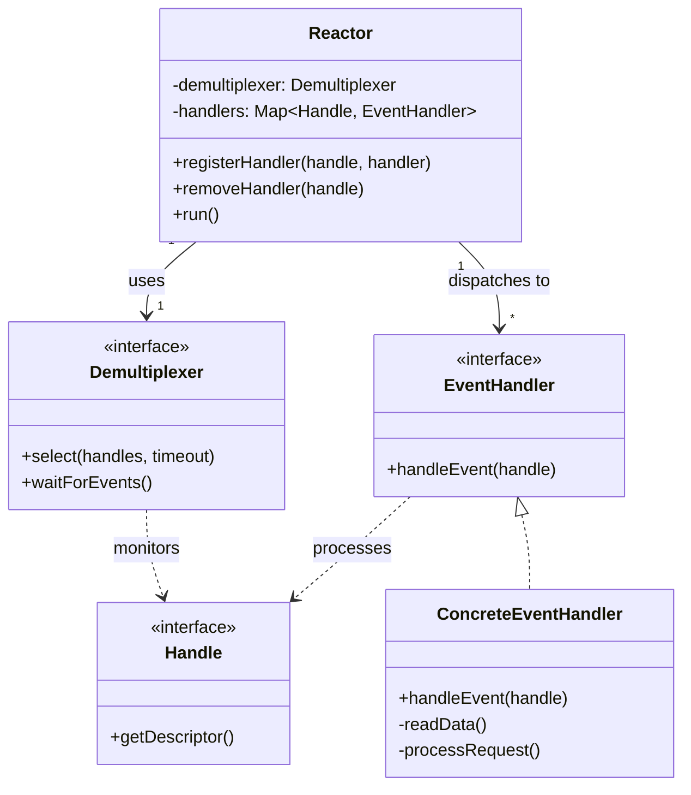
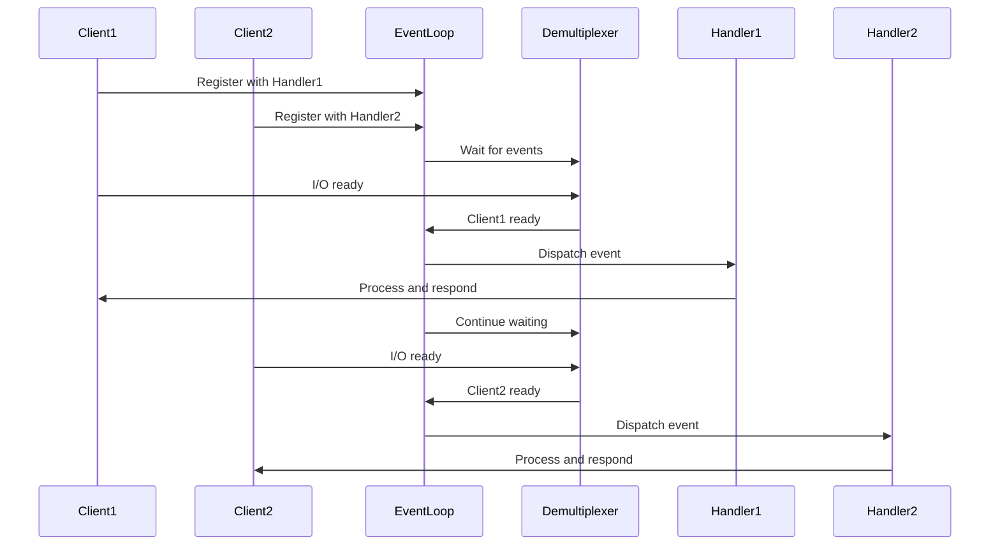

# Reactor

## Intent
Handle multiple concurrent I/O operations using a single-threaded event loop that demultiplexes events and dispatches them to appropriate handlers, avoiding the overhead of thread-per-connection models.

## Problem
Creating a thread for each network connection or I/O source doesn't scale to thousands of concurrent connections due to memory overhead and context switching costs. Blocking I/O calls waste thread resources waiting for data. Managing thread pools with manual synchronization adds complexity and is error-prone. Traditional multi-threaded servers struggle with the C10K problem (handling 10,000+ concurrent connections).

## Real-World Analogy

{: .note }
> Picture a hotel concierge at a desk monitoring multiple communication channels: a phone system with many lines, a fax machine, and a computer with email. Rather than hiring one person per phone line (thread-per-connection), the concierge watches all channels simultaneously. When a phone lights up, they answer it, handle the request quickly, and return to monitoring. When a fax arrives, they process it and go back to watching. The concierge never sits idle waiting on any single channel—they're always ready to handle whichever channel has activity. This single person efficiently manages hundreds of potential connections by responding only when events actually occur.

## When You Need It
- Building network servers that must handle thousands of concurrent connections efficiently
- Implementing event-driven systems where I/O operations dominate processing time
- Creating responsive single-threaded applications like Node.js servers or GUI event loops

## UML Class Diagram

## Sequence Diagram

## Participants
- **Reactor** — runs the event loop, registers handlers, and dispatches events to appropriate handlers
- **Demultiplexer** — OS-level mechanism (select, epoll, kqueue) that blocks waiting for events on multiple handles
- **Handle** — identifies an I/O source like a socket file descriptor or event object
- **EventHandler** — interface defining the callback invoked when events occur on a handle
- **ConcreteEventHandler** — implements specific logic for processing events like reading data or accepting connections

## How It Works
1. Applications register EventHandlers with the Reactor for specific Handles (like socket file descriptors)
2. The Reactor calls the Demultiplexer to wait for events on all registered Handles simultaneously
3. When the Demultiplexer detects activity on one or more Handles, it returns control to the Reactor
4. The Reactor dispatches events to the corresponding EventHandlers based on which Handles are ready
5. Each EventHandler processes its event non-blockingly (reading available data, accepting connections, etc.) and returns quickly to allow the event loop to continue processing other events

## Applicability
**Use when:**
- You need to handle thousands of concurrent I/O-bound connections with limited threads
- Building event-driven architectures where responsiveness is critical
- Working with platforms that provide efficient demultiplexing primitives like epoll or kqueue

**Don't use when:**
- Your workload is CPU-bound rather than I/O-bound, where multiple threads would better utilize cores
- Handlers require blocking operations or long computations that would stall the event loop
- Your system has few connections and the simplicity of thread-per-connection is sufficient

## Trade-offs
**Pros:**
- Scales to thousands of concurrent connections without thread-per-connection overhead
- Simplifies concurrency by avoiding locks and shared mutable state in single-threaded implementations
- Efficiently utilizes CPU by eliminating context switching and blocking waits

**Cons:**
- Single-threaded reactors can't utilize multiple CPU cores without additional process/thread pools
- Long-running handlers block the entire event loop, causing latency spikes for all connections
- Debugging asynchronous event-driven code is harder than following linear threaded execution

## Related Patterns
- **Observer** — handlers observe I/O events, but with a pull-based demultiplexing mechanism
- **Proactor** — variant that uses asynchronous I/O completion notifications instead of readiness events
- **Half-Sync/Half-Async** — combines Reactor's async event handling with sync processing threads
