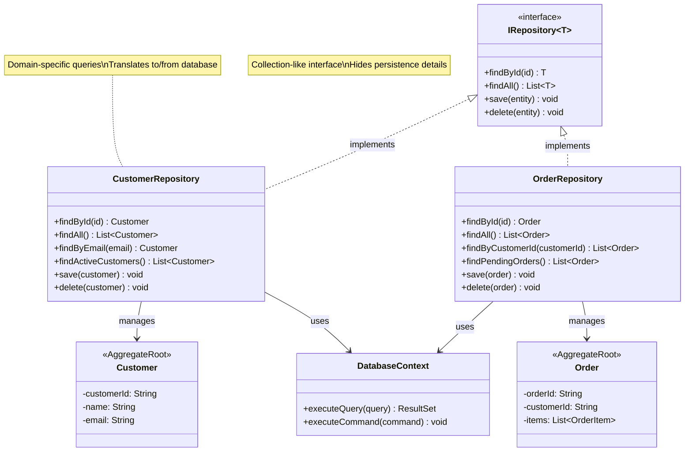
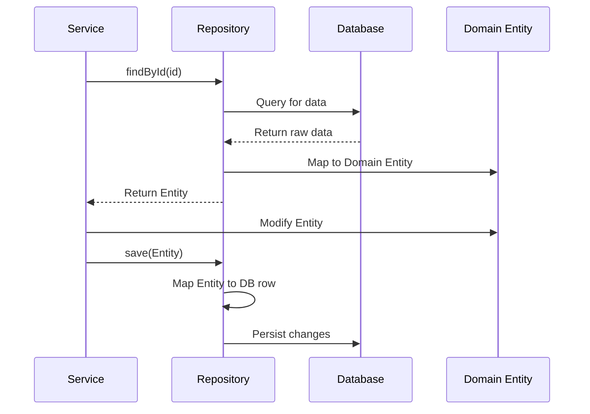

# Repository

## Intent
Provide a collection-like interface for accessing domain objects, mediating between the domain and data mapping layers to keep domain logic independent of data persistence details.

## Problem
Domain logic needs to retrieve and store objects, but directly accessing databases or data stores couples your business logic to infrastructure concerns. SQL queries, ORM code, and data access logic scatter throughout your domain, making it hard to test and maintain. You need a clean abstraction that lets domain code work with objects as if they're in memory while hiding all persistence complexity.

## Real-World Analogy

{: .note }
> Think of a library catalog system. When you want a book, you don't go into the back rooms searching shelves yourself. You use the catalog to request books by title, author, or topic. The librarian retrieves the book from wherever it's stored—maybe the main stacks, archives, or even another branch. You work with a simple interface while the library handles the complexity of storage, retrieval, and organization behind the scenes.

## When You Need It
- You want to keep domain logic independent of persistence technology
- Your application uses complex queries to retrieve domain objects
- You need to centralize data access logic and make it easier to test domain code without a database

## UML Class Diagram



## Sequence Diagram



## Participants
- **Repository Interface** — Defines collection-like operations for accessing domain objects
- **Concrete Repository** — Implements the interface with specific data access technology
- **Aggregate Root** — The domain objects managed by the repository
- **Data Mapper** — Translates between domain objects and database representations
- **Specification** — Optional pattern for encapsulating complex query criteria

## How It Works
1. Define a repository interface for each aggregate root with collection-like methods.
2. Implement the repository using your chosen persistence technology (database, ORM, file system).
3. Domain code requests objects through repository methods without knowing about persistence.
4. The repository translates domain queries into data store operations and reconstructs domain objects from stored data.
5. Changes to domain objects are saved back through the repository, which handles all persistence logic.

## Applicability
**Use when:**
- You want domain logic to remain independent of data access technology
- You need to centralize and reuse complex query logic
- Testing domain code without a real database is important

**Don't use when:**
- Your application has simple CRUD operations with no complex domain logic
- The overhead of repositories outweighs the benefits for a small application
- You're using an ORM that already provides sufficient abstraction

## Trade-offs
**Pros:**
- Decouples domain logic from persistence infrastructure
- Centralizes data access logic, making it easier to maintain and optimize
- Simplifies testing by allowing mock repositories in unit tests

**Cons:**
- Adds an abstraction layer that may be unnecessary for simple applications
- Can lead to performance issues if not designed with querying efficiency in mind
- May encourage loading entire aggregates when only partial data is needed

## Example Code

### C#

```csharp
using System;
using System.Collections.Generic;
using System.Linq;

// Generic repository interface
public interface IRepository<T> where T : class
{
    T GetById(int id);
    IEnumerable<T> GetAll();
    void Add(T entity);
    void Update(T entity);
    void Delete(int id);
}

// Entity class
public class User
{
    public int Id { get; set; }
    public string Name { get; set; }
    public string Email { get; set; }

    public override string ToString() => $"User {Id}: {Name} ({Email})";
}

// In-memory repository implementation
public class InMemoryRepository<T> : IRepository<T> where T : class
{
    private readonly Dictionary<int, T> _data = new();
    private readonly Func<T, int> _getIdFunc;
    private readonly Action<T, int> _setIdFunc;
    private int _nextId = 1;

    public InMemoryRepository(Func<T, int> getIdFunc, Action<T, int> setIdFunc)
    {
        _getIdFunc = getIdFunc;
        _setIdFunc = setIdFunc;
    }

    public T GetById(int id)
    {
        return _data.TryGetValue(id, out var entity) ? entity : null;
    }

    public IEnumerable<T> GetAll()
    {
        return _data.Values.ToList();
    }

    public void Add(T entity)
    {
        _setIdFunc(entity, _nextId);
        _data[_nextId] = entity;
        _nextId++;
    }

    public void Update(T entity)
    {
        int id = _getIdFunc(entity);
        if (!_data.ContainsKey(id))
            throw new InvalidOperationException($"Entity with ID {id} not found");
        _data[id] = entity;
    }

    public void Delete(int id)
    {
        if (!_data.Remove(id))
            throw new InvalidOperationException($"Entity with ID {id} not found");
    }
}

class Program
{
    static void Main()
    {
        // Create repository
        var userRepo = new InMemoryRepository<User>(
            u => u.Id,
            (u, id) => u.Id = id
        );

        // Create (Add)
        userRepo.Add(new User { Name = "Alice", Email = "alice@example.com" });
        userRepo.Add(new User { Name = "Bob", Email = "bob@example.com" });
        userRepo.Add(new User { Name = "Charlie", Email = "charlie@example.com" });

        // Read (GetAll)
        Console.WriteLine("All users:");
        foreach (var user in userRepo.GetAll())
            Console.WriteLine($"  {user}");

        // Read (GetById)
        var user2 = userRepo.GetById(2);
        Console.WriteLine($"\nUser with ID 2: {user2}");

        // Update
        user2.Email = "bob.updated@example.com";
        userRepo.Update(user2);
        Console.WriteLine($"Updated: {userRepo.GetById(2)}");

        // Delete
        userRepo.Delete(1);
        Console.WriteLine($"\nAfter deleting user 1, total users: {userRepo.GetAll().Count()}");
    }
}
```

## Runnable Examples

| Language | File |
|----------|------|
| C# | [repository.cs]({{ site.github.repository_url }}/blob/main/docs/examples/csharp/advanced/repository.cs) |

## Related Patterns
- **Aggregate** — Repositories typically manage aggregate roots, not individual entities
- **Factory** — Often works with repositories to create complex domain objects
- **Specification** — Encapsulates query criteria to keep repositories clean and flexible
