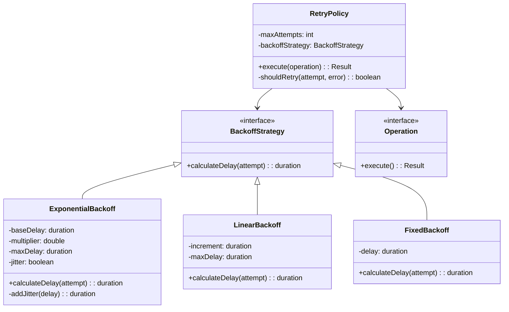

# Retry with Backoff

## Intent
Handle transient failures in distributed systems by automatically retrying failed operations with progressively increasing delays, improving reliability without overwhelming the failing service.

## Problem
Network calls and remote service invocations can fail temporarily due to transient issues like network hiccups, brief service overloads, or momentary resource unavailability. Simply retrying immediately can worsen the problem by hammering an already struggling service, while giving up after the first failure means lost opportunities to complete valid operations once the transient issue resolves.

## Real-World Analogy

{: .note }
> Imagine trying to call a friend whose phone line is busy. If you immediately redial over and over, you're just going to keep getting the busy signal and might even annoy them if they have call waiting. Instead, you wait a minute and try again. If it's still busy, you wait a bit longer—maybe 5 minutes. Still busy? You wait 15 minutes. By spacing out your attempts with increasing delays, you give the line time to clear while still eventually getting through. Adding a bit of randomness (jitter) to your wait times is like varying when you call so everyone doesn't try again at exactly the same moment.

## When You Need It
- Your application depends on remote services that may experience temporary failures
- You want to improve reliability by automatically recovering from transient errors
- You need to avoid overwhelming a struggling service with rapid-fire retry attempts

## UML Class Diagram

## Participants
- **RetryPolicy** — orchestrates retry attempts and applies backoff strategy
- **BackoffStrategy** — defines the interface for calculating retry delays
- **ExponentialBackoff** — implements exponential increase in delay with optional jitter
- **LinearBackoff** — implements fixed increment increases in delay
- **FixedBackoff** — implements constant delay between retries
- **Operation** — the operation being retried

## How It Works
1. The client invokes an operation through the retry policy wrapper
2. If the operation fails with a retryable error, the policy checks if max attempts have been reached
3. The backoff strategy calculates an appropriate delay based on the attempt number
4. The system waits for the calculated delay (optionally with added jitter to prevent thundering herd)
5. The operation is retried, repeating the process until success or max attempts exhausted

## Applicability
**Use when:**
- You're dealing with transient failures that are likely to resolve themselves quickly
- You need to improve reliability without requiring manual intervention
- You want to be a good citizen by not overwhelming struggling downstream services

**Don't use when:**
- Failures are permanent (like authentication errors or invalid input) rather than transient
- Operations have strict latency requirements that can't tolerate retry delays
- The operation has side effects that make it unsafe to retry without idempotency guarantees

## Trade-offs
**Pros:**
- Significantly improves reliability by automatically recovering from transient failures
- Exponential backoff with jitter prevents overwhelming recovering services
- Provides tunable behavior through configurable retry counts and delay strategies

**Cons:**
- Increases overall operation latency when retries are needed
- Can hide underlying problems if failures are not properly logged and monitored
- Requires careful tuning to balance quick recovery with avoiding service overload

## Related Patterns
- **Circuit Breaker** — works together; circuit breaker stops retries when service is known to be down
- **Timeout** — essential companion; prevents retries from waiting indefinitely
- **Idempotency** — ensures retries are safe by making operations repeatable without side effects
- **Bulkhead** — isolates retry attempts to prevent them from consuming all resources
