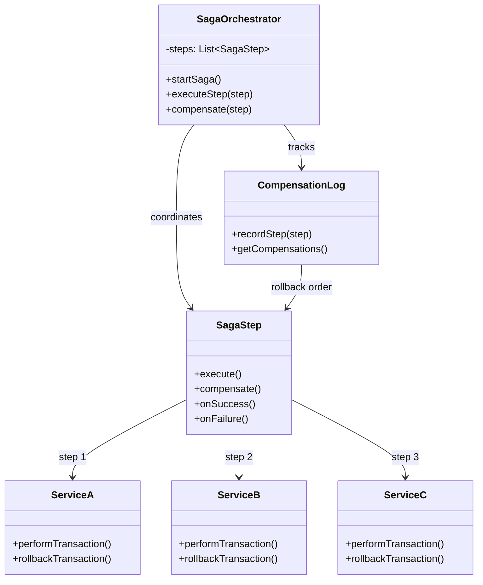
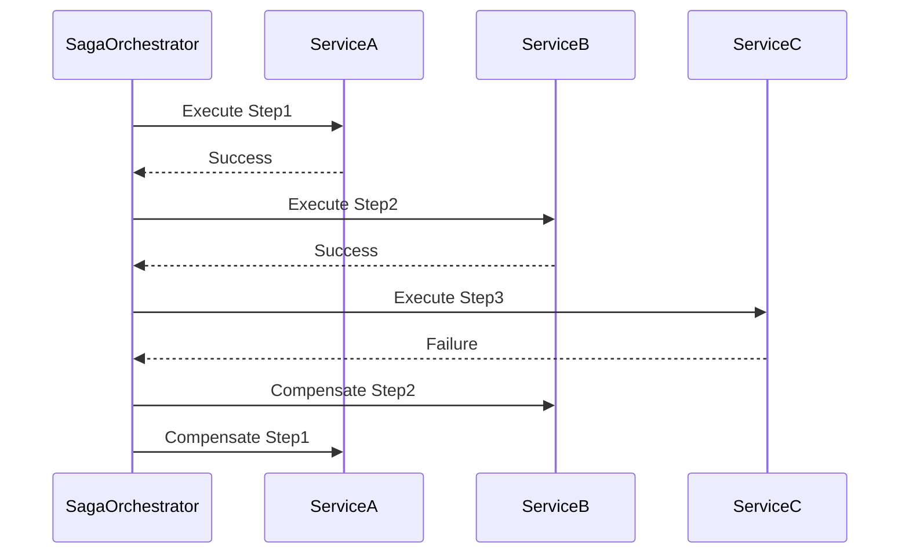

# Saga

## Intent
Manage distributed transactions across multiple services by coordinating a sequence of local transactions, each with a compensating action to undo changes if the overall transaction fails.

## Problem
Traditional ACID transactions don't scale across distributed microservices because locking resources across service boundaries creates tight coupling and reduces availability. When a business operation spans multiple services, you need to maintain consistency without distributed locks, but partial failures can leave the system in an inconsistent state if some services succeed while others fail.

## Real-World Analogy

{: .note }
> Booking a vacation involves reserving a flight, hotel, and rental car. Each booking is a separate transaction with different companies. If the hotel reservation fails after you've booked the flight, you need to cancel the flight to avoid paying for a trip you can't take. Each step has a rollback procedure, and the travel agent coordinates the sequence, canceling previous steps if any later step fails.

## When You Need It
- Business transactions span multiple microservices that can't share a database
- You need to maintain consistency across services without distributed locks
- Long-running processes require compensation logic for partial failures

## UML Class Diagram

## Sequence Diagram

## Participants
- **SagaOrchestrator** — coordinates the execution of saga steps and handles compensation
- **SagaStep** — represents a local transaction with its compensating action
- **Service** — individual microservice that executes local transactions
- **CompensationLog** — tracks completed steps to enable rollback in reverse order

## How It Works
1. Orchestrator initiates the saga by executing the first step's local transaction
2. Each successful step is recorded in the compensation log
3. The next step in the sequence is executed on its respective service
4. If any step fails, the orchestrator triggers compensating transactions in reverse order
5. Compensating actions undo the effects of previously completed steps to restore consistency

## Applicability
**Use when:**
- You have microservices that need to coordinate without sharing a database
- Business processes require multiple steps across service boundaries
- You can define compensating actions that semantically undo each step

**Don't use when:**
- Your services can share a database and use traditional ACID transactions
- Compensating actions are impossible or too complex to implement reliably
- Strong consistency is absolutely required and eventual consistency is unacceptable

## Trade-offs
**Pros:**
- Enables distributed transactions without coupling services through shared databases
- Maintains high availability by avoiding distributed locks
- Clear compensation logic makes failure handling explicit and testable

**Cons:**
- Complexity in designing and implementing compensating transactions
- System temporarily in inconsistent state during saga execution
- Compensating actions may not perfectly undo side effects (semantic vs strict rollback)

## Related Patterns
- **Command** — saga steps can be implemented as commands with undo operations
- **Memento** — can store state before each step to enable accurate compensation
- **Chain of Responsibility** — saga steps form a chain of coordinated operations
