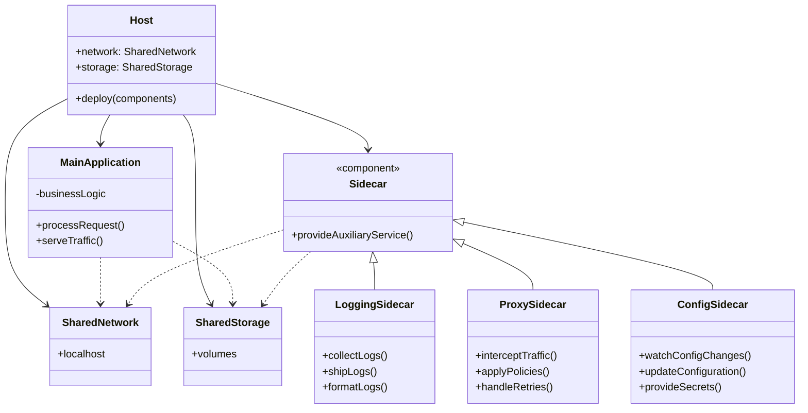
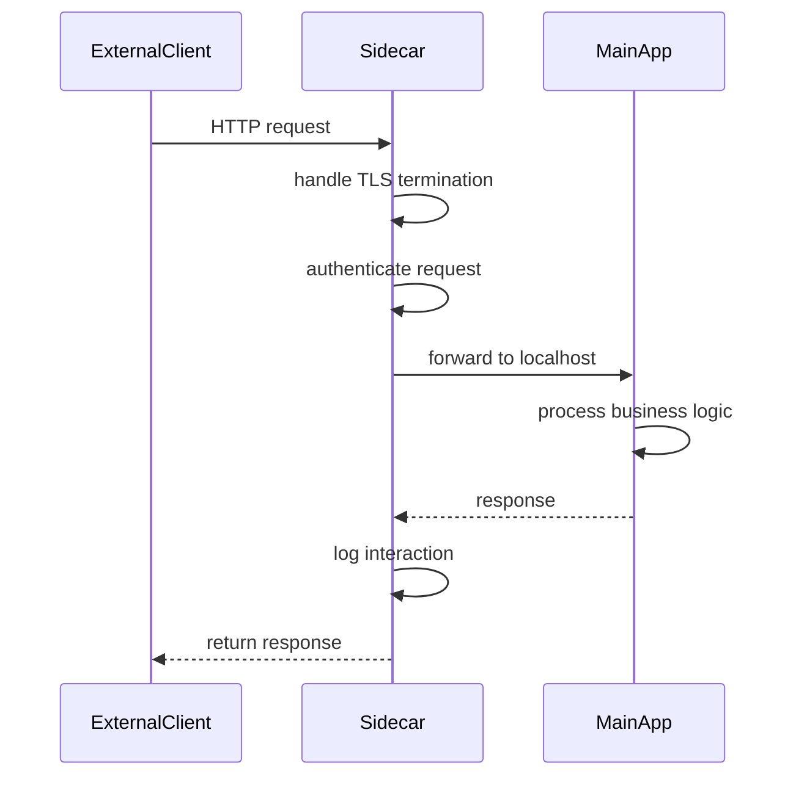

# Sidecar

## Intent
Deploy auxiliary functionality alongside a main application in a separate process or container, allowing cross-cutting concerns to be managed independently while sharing the same lifecycle and resources.

## Problem
Modern applications often need common auxiliary services like logging, monitoring, configuration management, or network proxying. Implementing these concerns directly in each application creates code duplication, increases complexity, and makes it difficult to update shared functionality across multiple services. Additionally, different applications may be written in different languages, making shared libraries impractical.

## Real-World Analogy

{: .note }
> Think of a motorcycle with a sidecar attached. The motorcycle is the main vehicle that provides the core transportation function, while the sidecar adds additional capacity and functionality without modifying the motorcycle itself. The sidecar travels alongside the motorcycle, sharing the same journey and road, but serves a distinct purpose. They're deployed together, share resources like fuel stops and parking spaces, but can be attached or detached independently. Similarly, a sidecar container deploys with your application, shares its network and storage, but handles auxiliary concerns separately.

## When You Need It
- You need to add cross-cutting functionality to applications without modifying their code
- You want to deploy auxiliary services that share the same lifecycle as the main application
- You have polyglot microservices that need consistent auxiliary functionality regardless of implementation language

## UML Class Diagram

## Sequence Diagram

## Participants
- **Host** — the deployment unit (pod, VM, or container group) that holds both components
- **MainApplication** — the primary application providing core business functionality
- **Sidecar** — auxiliary component providing cross-cutting concerns
- **LoggingSidecar** — specific sidecar implementation for log collection and shipping
- **ProxySidecar** — handles network traffic interception and service mesh functionality
- **ConfigSidecar** — manages configuration and secrets injection
- **SharedNetwork** — network namespace shared between main app and sidecar
- **SharedStorage** — storage volumes accessible to both components

## How It Works
1. The main application and sidecar are deployed together as a single unit on the same host
2. Both components share the same network namespace, allowing localhost communication
3. They share storage volumes for exchanging data or accessing common resources
4. The sidecar intercepts, augments, or monitors the main application's operations
5. Both components have synchronized lifecycles, starting and stopping together

## Applicability
**Use when:**
- You need to extend application functionality without changing application code
- You want to standardize cross-cutting concerns across polyglot microservices
- You need auxiliary functionality to share the same network and storage as the main application

**Don't use when:**
- The auxiliary functionality is tightly coupled to application logic and requires direct integration
- Resource overhead of running separate processes is unacceptable
- You have a monolithic application where shared libraries are more appropriate

## Trade-offs
**Pros:**
- Separates concerns cleanly, allowing independent development and updates of auxiliary functionality
- Enables polyglot systems to share common infrastructure components
- Simplifies main application by offloading cross-cutting concerns

**Cons:**
- Increases resource consumption by running additional processes or containers
- Adds operational complexity with more components to deploy and monitor
- Can introduce latency if communication between main app and sidecar is frequent

## Related Patterns
- **Ambassador** — similar pattern but specifically for proxying external service calls
- **Adapter** — sidecar can act as an adapter to standardize interfaces across services
- **Proxy** — sidecar often implements proxy functionality for traffic management
- **Service Mesh** — architectural pattern that relies heavily on sidecar proxies for inter-service communication
