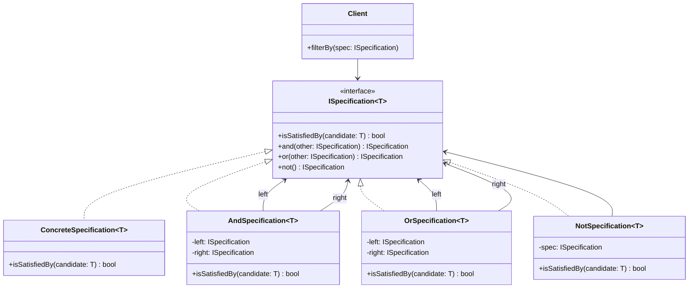

# Specification

## Intent
Encapsulate business rules as composable predicate objects that can be combined using boolean logic. Separate the logic for selecting or validating objects from the objects themselves.

## Problem
Business rules for selecting or validating objects often become scattered across queries, conditional statements, and validation logic throughout the codebase. Hardcoding these rules directly into queries or conditionals makes them difficult to reuse, test, or modify. When rules need to be combined or reused in different contexts, code duplication proliferates.

## Real-World Analogy

{: .note }
> Think of a job posting with requirements like "Bachelor's degree OR 5 years experience" AND "Java certification" AND NOT "currently employed by competitor". Each requirement is a separate specification that returns true or false for a candidate. You can compose these specifications using AND, OR, and NOT operators to build complex eligibility rules. Different job postings can reuse the same atomic specifications (degree check, experience check) and combine them differently. Recruiters can test each specification independently before combining them into the final filter.

## When You Need It
- You have complex business rules that need to be reused across queries, validation, and filtering
- You want to compose rules dynamically based on runtime conditions or user input
- You need to test business rules independently of the data access or domain objects they operate on

## UML Class Diagram

## Participants
- **ISpecification** — interface defining isSatisfiedBy method and composition operations (and, or, not)
- **ConcreteSpecification** — implements specific business rule by evaluating a candidate object
- **AndSpecification** — composite specification that combines two specs with logical AND
- **OrSpecification** — composite specification that combines two specs with logical OR
- **NotSpecification** — composite specification that negates another spec
- **Client** — uses specifications to filter, validate, or query objects

## How It Works
1. Define atomic specifications that each encapsulate a single business rule
2. Implement isSatisfiedBy to evaluate whether a candidate object meets the rule
3. Compose specifications using and, or, and not methods to build complex criteria
4. Client applies composed specification to filter collections or validate objects
5. Specifications can be reused across different contexts (queries, validation, UI filters)

## Applicability
**Use when:**
- You have complex business rules that are reused across multiple contexts (queries, validation, UI)
- You need to compose rules dynamically at runtime based on user input or configuration
- You want to unit test business rules independently from data access or domain logic

**Don't use when:**
- Your rules are simple and rarely change (specification adds unnecessary abstraction)
- Performance is critical and evaluating composed specifications introduces unacceptable overhead
- Your language has powerful built-in predicate composition (lambdas, LINQ) that suffices

## Trade-offs
**Pros:**
- Encapsulates business rules in testable, reusable objects that can be composed flexibly
- Separates selection logic from domain objects, following Single Responsibility Principle
- Enables dynamic rule composition based on runtime conditions without code changes

**Cons:**
- Adds abstraction overhead for simple rules that could be expressed as inline predicates
- Can lead to proliferation of small specification classes if not managed carefully
- May introduce performance overhead compared to optimized database queries or inline conditionals

## Related Patterns
- **Strategy** — Specification can be viewed as a special-case strategy for encapsulating predicates
- **Composite** — AndSpecification, OrSpecification, NotSpecification use Composite to build rule trees
- **Repository** — Specifications are often passed to repositories to encapsulate query criteria
