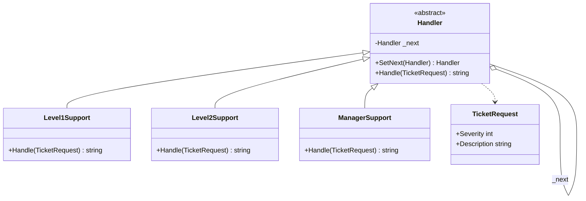
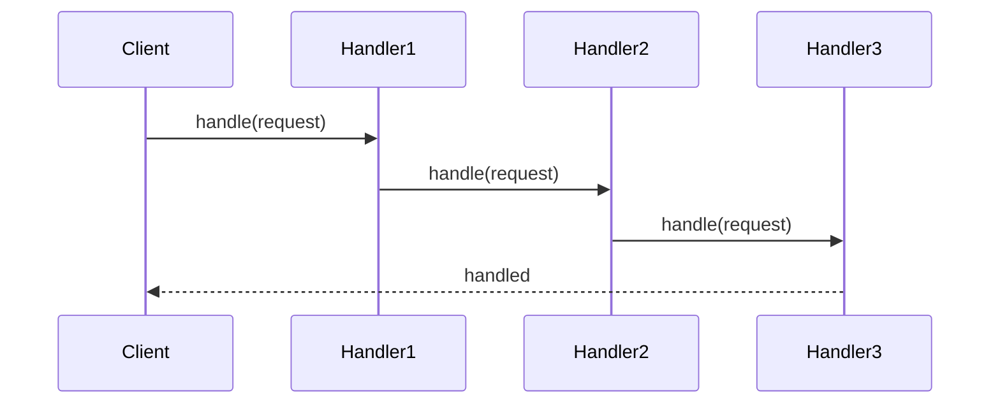

# Chain of Responsibility

## Intent

Avoid coupling the sender of a request to its receiver by giving more than one object a chance to handle the request. Chain the receiving objects and pass the request along the chain until an object handles it.

## Problem

A support system receives tickets of varying severity. Simple issues should be resolved by Level 1 support, more complex issues by Level 2, and critical escalations by a Manager. Hard-wiring the routing logic into the client creates tight coupling and makes it difficult to add or reorder handlers.

## UML Class Diagram



## Sequence Diagram



## Participants

| Participant | Role |
|---|---|
| **Handler** | Declares the interface for handling requests and holds a reference to the next handler in the chain. |
| **Level1Support** | Handles low-severity tickets; forwards the rest. |
| **Level2Support** | Handles medium-severity tickets; forwards the rest. |
| **ManagerSupport** | Handles high-severity or unhandled tickets as the final link. |
| **TicketRequest** | Carries the data describing the support ticket. |

## How It Works

1. The client creates a chain of handlers (Level1 -> Level2 -> Manager).
2. A `TicketRequest` is passed to the first handler.
3. Each handler inspects the request. If it can handle the severity, it processes the ticket and returns a result. Otherwise it delegates to the next handler.
4. If no handler processes the request, a default response is returned.

## Applicability

- More than one object may handle a request, and the handler is not known in advance.
- You want to issue a request to one of several objects without specifying the receiver explicitly.
- The set of handlers or their order should be configurable at runtime.

## Example Code

### C\#

```csharp
public class TicketRequest
{
    public int Severity { get; }
    public string Description { get; }
    public TicketRequest(int severity, string description)
    {
        Severity = severity;
        Description = description;
    }
}

public abstract class Handler
{
    private Handler _next;

    public Handler SetNext(Handler next)
    {
        _next = next;
        return next;
    }

    public virtual string Handle(TicketRequest request)
    {
        if (_next != null)
            return _next.Handle(request);
        return "No handler available.";
    }
}

public class Level1Support : Handler
{
    public override string Handle(TicketRequest request)
    {
        if (request.Severity <= 1)
            return $"Level1 handled: {request.Description}";
        return base.Handle(request);
    }
}

public class Level2Support : Handler
{
    public override string Handle(TicketRequest request)
    {
        if (request.Severity <= 2)
            return $"Level2 handled: {request.Description}";
        return base.Handle(request);
    }
}

public class ManagerSupport : Handler
{
    public override string Handle(TicketRequest request)
    {
        return $"Manager handled: {request.Description}";
    }
}

// Usage
var level1 = new Level1Support();
var level2 = new Level2Support();
var manager = new ManagerSupport();
level1.SetNext(level2).SetNext(manager);

Console.WriteLine(level1.Handle(new TicketRequest(1, "Password reset")));
Console.WriteLine(level1.Handle(new TicketRequest(3, "Server outage")));
```

### Delphi

```pascal
type
  TTicketRequest = record
    Severity: Integer;
    Description: string;
  end;

  THandler = class
  private
    FNext: THandler;
  public
    function SetNext(ANext: THandler): THandler;
    function Handle(const ARequest: TTicketRequest): string; virtual;
  end;

  TLevel1Support = class(THandler)
  public
    function Handle(const ARequest: TTicketRequest): string; override;
  end;

  TLevel2Support = class(THandler)
  public
    function Handle(const ARequest: TTicketRequest): string; override;
  end;

  TManagerSupport = class(THandler)
  public
    function Handle(const ARequest: TTicketRequest): string; override;
  end;

function THandler.SetNext(ANext: THandler): THandler;
begin
  FNext := ANext;
  Result := ANext;
end;

function THandler.Handle(const ARequest: TTicketRequest): string;
begin
  if Assigned(FNext) then
    Result := FNext.Handle(ARequest)
  else
    Result := 'No handler available.';
end;

function TLevel1Support.Handle(const ARequest: TTicketRequest): string;
begin
  if ARequest.Severity <= 1 then
    Result := 'Level1 handled: ' + ARequest.Description
  else
    Result := inherited Handle(ARequest);
end;

function TLevel2Support.Handle(const ARequest: TTicketRequest): string;
begin
  if ARequest.Severity <= 2 then
    Result := 'Level2 handled: ' + ARequest.Description
  else
    Result := inherited Handle(ARequest);
end;

function TManagerSupport.Handle(const ARequest: TTicketRequest): string;
begin
  Result := 'Manager handled: ' + ARequest.Description;
end;

// Usage
var
  Level1, Level2, Manager: THandler;
  Ticket: TTicketRequest;
begin
  Level1 := TLevel1Support.Create;
  Level2 := TLevel2Support.Create;
  Manager := TManagerSupport.Create;
  Level1.SetNext(Level2).SetNext(Manager);

  Ticket.Severity := 1;
  Ticket.Description := 'Password reset';
  WriteLn(Level1.Handle(Ticket));

  Ticket.Severity := 3;
  Ticket.Description := 'Server outage';
  WriteLn(Level1.Handle(Ticket));
end;
```

### C++

```cpp
#include <iostream>
#include <memory>
#include <string>

struct TicketRequest {
    int severity;
    std::string description;
};

class Handler {
protected:
    std::shared_ptr<Handler> next_;
public:
    virtual ~Handler() = default;

    std::shared_ptr<Handler> SetNext(std::shared_ptr<Handler> next) {
        next_ = next;
        return next;
    }

    virtual std::string Handle(const TicketRequest& req) {
        if (next_)
            return next_->Handle(req);
        return "No handler available.";
    }
};

class Level1Support : public Handler {
public:
    std::string Handle(const TicketRequest& req) override {
        if (req.severity <= 1)
            return "Level1 handled: " + req.description;
        return Handler::Handle(req);
    }
};

class Level2Support : public Handler {
public:
    std::string Handle(const TicketRequest& req) override {
        if (req.severity <= 2)
            return "Level2 handled: " + req.description;
        return Handler::Handle(req);
    }
};

class ManagerSupport : public Handler {
public:
    std::string Handle(const TicketRequest& req) override {
        return "Manager handled: " + req.description;
    }
};

int main() {
    auto level1 = std::make_shared<Level1Support>();
    auto level2 = std::make_shared<Level2Support>();
    auto manager = std::make_shared<ManagerSupport>();
    level1->SetNext(level2)->SetNext(manager);

    TicketRequest t1{1, "Password reset"};
    TicketRequest t2{3, "Server outage"};
    std::cout << level1->Handle(t1) << "\n";
    std::cout << level1->Handle(t2) << "\n";
    return 0;
}
```

## Related Patterns

- [**Composite**]() — The chain often follows a composite structure where parent components act as successors.
- [**Command**]() — Commands can be passed along a chain of handlers for processing.
