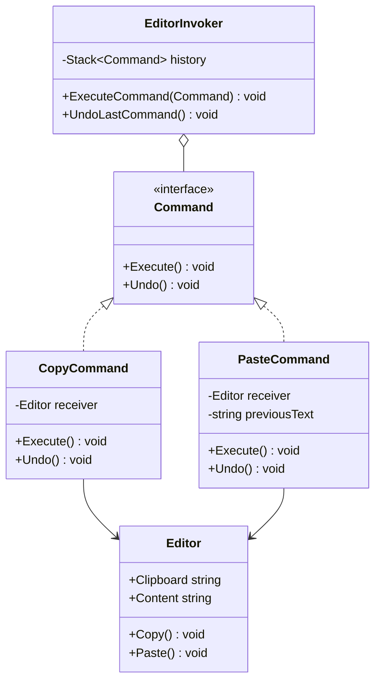
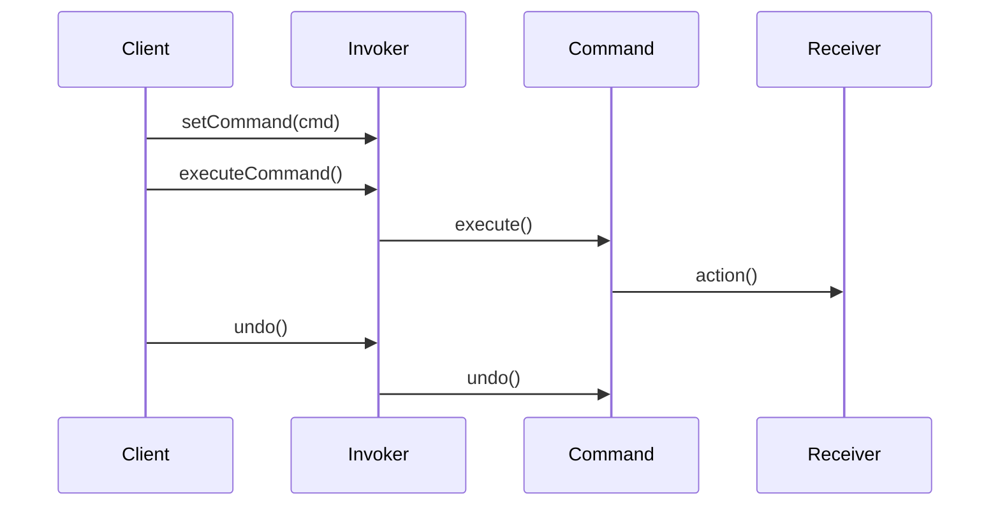

# Command

## Intent

Encapsulate a request as an object, thereby letting you parameterize clients with different requests, queue or log requests, and support undoable operations.

## Problem

A text editor needs to support copy and paste operations with undo capability. Hard-coding these operations into UI buttons creates tight coupling between the UI and business logic, and makes undo/redo difficult to implement uniformly.

## UML Class Diagram



## Sequence Diagram



## Participants

| Participant | Role |
|---|---|
| **Command** | Declares the interface for executing and undoing an operation. |
| **CopyCommand** | Copies selected text to the clipboard. |
| **PasteCommand** | Pastes clipboard content into the editor, saving previous state for undo. |
| **Editor** | The receiver that performs the actual text operations. |
| **EditorInvoker** | Stores and executes commands, maintaining a history for undo. |

## How It Works

1. The client creates concrete command objects, injecting the `Editor` receiver.
2. Commands are passed to the `EditorInvoker`, which calls `Execute()` and pushes the command onto a history stack.
3. To undo, the invoker pops the most recent command and calls `Undo()`.

## Applicability

- You need to parameterize objects with operations.
- You need to queue, schedule, or log operations.
- You need reversible operations (undo/redo).

## Example Code

### C\#

```csharp
public interface ICommand
{
    void Execute();
    void Undo();
}

public class Editor
{
    public string Clipboard { get; set; } = "";
    public string Content { get; set; } = "";

    public void Copy() => Clipboard = Content;
    public void Paste() => Content += Clipboard;
}

public class CopyCommand : ICommand
{
    private readonly Editor _editor;
    public CopyCommand(Editor editor) => _editor = editor;
    public void Execute() => _editor.Copy();
    public void Undo() { /* Copy is non-destructive */ }
}

public class PasteCommand : ICommand
{
    private readonly Editor _editor;
    private string _previousContent;

    public PasteCommand(Editor editor) => _editor = editor;

    public void Execute()
    {
        _previousContent = _editor.Content;
        _editor.Paste();
    }

    public void Undo() => _editor.Content = _previousContent;
}

public class EditorInvoker
{
    private readonly Stack<ICommand> _history = new();

    public void ExecuteCommand(ICommand cmd)
    {
        cmd.Execute();
        _history.Push(cmd);
    }

    public void UndoLastCommand()
    {
        if (_history.Count > 0)
            _history.Pop().Undo();
    }
}

// Usage
var editor = new Editor { Content = "Hello" };
var invoker = new EditorInvoker();
invoker.ExecuteCommand(new CopyCommand(editor));
invoker.ExecuteCommand(new PasteCommand(editor));
Console.WriteLine(editor.Content); // "HelloHello"
invoker.UndoLastCommand();
Console.WriteLine(editor.Content); // "Hello"
```

### Delphi

```pascal
type
  ICommand = interface
    procedure Execute;
    procedure Undo;
  end;

  TEditor = class
  public
    Clipboard: string;
    Content: string;
    procedure Copy;
    procedure Paste;
  end;

  TCopyCommand = class(TInterfacedObject, ICommand)
  private
    FEditor: TEditor;
  public
    constructor Create(AEditor: TEditor);
    procedure Execute;
    procedure Undo;
  end;

  TPasteCommand = class(TInterfacedObject, ICommand)
  private
    FEditor: TEditor;
    FPreviousContent: string;
  public
    constructor Create(AEditor: TEditor);
    procedure Execute;
    procedure Undo;
  end;

procedure TEditor.Copy;
begin
  Clipboard := Content;
end;

procedure TEditor.Paste;
begin
  Content := Content + Clipboard;
end;

constructor TCopyCommand.Create(AEditor: TEditor);
begin
  FEditor := AEditor;
end;

procedure TCopyCommand.Execute;
begin
  FEditor.Copy;
end;

procedure TCopyCommand.Undo;
begin
  { Copy is non-destructive }
end;

constructor TPasteCommand.Create(AEditor: TEditor);
begin
  FEditor := AEditor;
end;

procedure TPasteCommand.Execute;
begin
  FPreviousContent := FEditor.Content;
  FEditor.Paste;
end;

procedure TPasteCommand.Undo;
begin
  FEditor.Content := FPreviousContent;
end;

// Usage
var
  Editor: TEditor;
  Cmd: ICommand;
begin
  Editor := TEditor.Create;
  Editor.Content := 'Hello';

  Cmd := TCopyCommand.Create(Editor);
  Cmd.Execute;

  Cmd := TPasteCommand.Create(Editor);
  Cmd.Execute;
  WriteLn(Editor.Content); // 'HelloHello'

  Cmd.Undo;
  WriteLn(Editor.Content); // 'Hello'
end;
```

### C++

```cpp
#include <iostream>
#include <memory>
#include <stack>
#include <string>

class Editor {
public:
    std::string clipboard;
    std::string content;

    void Copy() { clipboard = content; }
    void Paste() { content += clipboard; }
};

class Command {
public:
    virtual ~Command() = default;
    virtual void Execute() = 0;
    virtual void Undo() = 0;
};

class CopyCommand : public Command {
    Editor& editor_;
public:
    explicit CopyCommand(Editor& e) : editor_(e) {}
    void Execute() override { editor_.Copy(); }
    void Undo() override { /* non-destructive */ }
};

class PasteCommand : public Command {
    Editor& editor_;
    std::string prev_;
public:
    explicit PasteCommand(Editor& e) : editor_(e) {}
    void Execute() override {
        prev_ = editor_.content;
        editor_.Paste();
    }
    void Undo() override { editor_.content = prev_; }
};

class EditorInvoker {
    std::stack<std::shared_ptr<Command>> history_;
public:
    void ExecuteCommand(std::shared_ptr<Command> cmd) {
        cmd->Execute();
        history_.push(cmd);
    }
    void UndoLastCommand() {
        if (!history_.empty()) {
            history_.top()->Undo();
            history_.pop();
        }
    }
};

int main() {
    Editor editor;
    editor.content = "Hello";
    EditorInvoker invoker;

    invoker.ExecuteCommand(std::make_shared<CopyCommand>(editor));
    invoker.ExecuteCommand(std::make_shared<PasteCommand>(editor));
    std::cout << editor.content << "\n"; // HelloHello

    invoker.UndoLastCommand();
    std::cout << editor.content << "\n"; // Hello
    return 0;
}
```

### Runnable Examples

| Language | Source |
|----------|--------|
| C# | [`Command.cs`]({{ site.github.repository_url }}/blob/main/examples/csharp/Patterns/Command.cs) |
| C++ | [`command.cpp`]({{ site.github.repository_url }}/blob/main/examples/cpp/command.cpp) |
| Delphi | [`command.pas`]({{ site.github.repository_url }}/blob/main/examples/delphi/command.pas) |

## Related Patterns

- [**Composite**]() — Macro-commands can be composed using the Composite pattern.
- [**Memento**]() — Can be used to maintain state for undoable commands.
- [**Prototype**]() — Commands that need to be copied before being placed on a history list can use Prototype.
