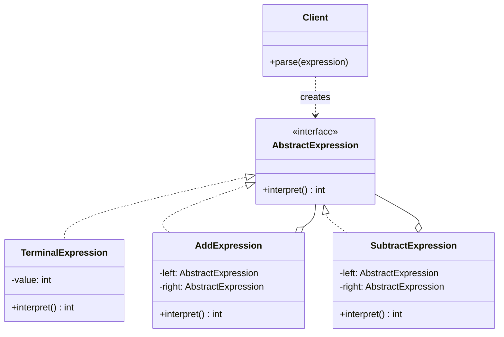
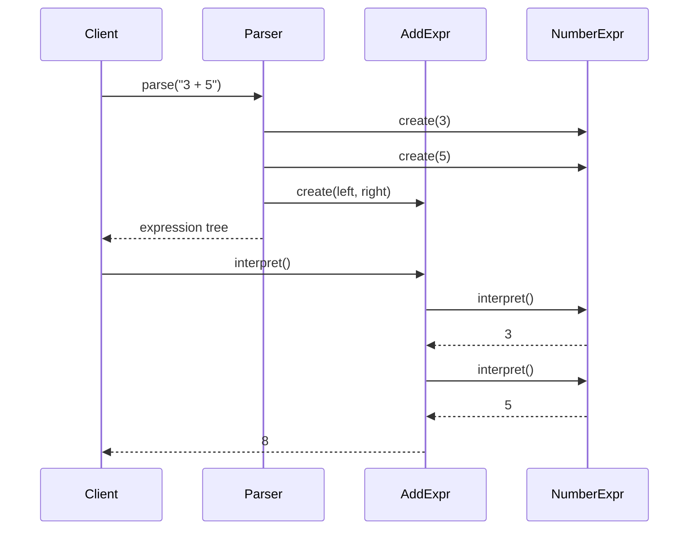

# Interpreter

## Intent

Given a language, define a representation for its grammar along with an interpreter that uses the representation to interpret sentences in the language.

## Problem

You need to evaluate expressions or statements written in a simple language or notation. Writing a monolithic parser quickly becomes unmanageable. You want a structured, extensible way to represent grammar rules and evaluate them.

## Real-World Analogy

{: .note }
> Think of reading sheet music. A musician sees symbols on a page — a whole note, a half note, a rest, a sharp — and each symbol knows how to "interpret" itself into sound or silence. A whole note means "play for four beats," a rest means "stay silent," and a sharp means "raise the pitch." Complex passages combine these symbols into measures, phrases, and movements — forming a tree-like structure that the musician evaluates from individual notes up to the full piece. The sheet music is the language, and the musician is the interpreter who gives it meaning.

## When You Need It

- You're building a configuration system that evaluates simple rules like `"age > 18 AND country = 'US'"` to decide user access
- You're creating a template engine that parses expressions like `{{user.name | uppercase}}` embedded in text
- You're implementing a simple query language or DSL (domain-specific language) for filtering data

## UML Class Diagram



## Sequence Diagram



## Participants

| Participant | Role |
|-------------|------|
| AbstractExpression | Declares an `interpret()` operation common to all nodes in the abstract syntax tree |
| TerminalExpression | Implements interpret for terminal symbols (e.g., numbers, variables) |
| NonterminalExpression | Implements interpret for grammar rules (e.g., add, subtract) by combining child expressions |
| Client | Builds (or parses) the abstract syntax tree and invokes interpret |

## How It Works

1. The **grammar** is represented as a class hierarchy — one class per rule.
2. **Terminal expressions** represent the simplest elements (literals, variables).
3. **Nonterminal expressions** combine other expressions according to grammar rules.
4. The **Client** parses input into an expression tree, then calls `interpret()` on the root.
5. Each node evaluates itself recursively, producing the final result.

## Applicability

**Use when:**
- The grammar is simple and the language is well-defined
- Efficiency is not a primary concern (the pattern is suited for simple, infrequent interpretation)
- You want an extensible way to add new grammar rules

**Don't use when:**
- The grammar is complex — use a proper parser generator (ANTLR, yacc) instead
- Performance is critical — the recursive tree evaluation is not efficient for large expressions
- The language changes frequently in fundamental ways

{: .warning }
> Interpreter is rarely used directly in modern applications. For anything beyond trivial grammars, consider dedicated parsing libraries. It remains useful for understanding how expression trees and recursive evaluation work.

## Trade-offs

**Pros:**
- Easy to implement and extend for simple grammars — adding a new rule means adding one class
- Each grammar rule is isolated in its own class, following the single responsibility principle
- The expression tree can be manipulated, optimized, or serialized before evaluation

**Cons:**
- Becomes unwieldy for complex grammars — dozens of classes for dozens of rules
- Recursive interpretation is slow compared to compiled or bytecode-based evaluation
- Requires building a parser to construct the expression tree from text input

## Example Code

### C#

```csharp
public interface IExpression
{
    int Interpret();
}

public class NumberExpression : IExpression
{
    private readonly int _value;
    public NumberExpression(int value) => _value = value;
    public int Interpret() => _value;
}

public class AddExpression : IExpression
{
    private readonly IExpression _left, _right;
    public AddExpression(IExpression left, IExpression right)
    { _left = left; _right = right; }
    public int Interpret() => _left.Interpret() + _right.Interpret();
}

public class SubtractExpression : IExpression
{
    private readonly IExpression _left, _right;
    public SubtractExpression(IExpression left, IExpression right)
    { _left = left; _right = right; }
    public int Interpret() => _left.Interpret() - _right.Interpret();
}

// Usage: parse "3 + 5 - 2" into tree, call Interpret() → 6
```

### Delphi

```pascal
type
  IExpression = interface
    function Interpret: Integer;
  end;

  TNumberExpr = class(TInterfacedObject, IExpression)
  private
    FValue: Integer;
  public
    constructor Create(AValue: Integer);
    function Interpret: Integer;
  end;

  TAddExpr = class(TInterfacedObject, IExpression)
  private
    FLeft, FRight: IExpression;
  public
    constructor Create(ALeft, ARight: IExpression);
    function Interpret: Integer;
  end;

  TSubtractExpr = class(TInterfacedObject, IExpression)
  private
    FLeft, FRight: IExpression;
  public
    constructor Create(ALeft, ARight: IExpression);
    function Interpret: Integer;
  end;

constructor TNumberExpr.Create(AValue: Integer);
begin FValue := AValue; end;

function TNumberExpr.Interpret: Integer;
begin Result := FValue; end;

constructor TAddExpr.Create(ALeft, ARight: IExpression);
begin FLeft := ALeft; FRight := ARight; end;

function TAddExpr.Interpret: Integer;
begin Result := FLeft.Interpret + FRight.Interpret; end;

constructor TSubtractExpr.Create(ALeft, ARight: IExpression);
begin FLeft := ALeft; FRight := ARight; end;

function TSubtractExpr.Interpret: Integer;
begin Result := FLeft.Interpret - FRight.Interpret; end;

// Usage: build tree for "3 + 5 - 2", call Interpret → 6
```

### C++

```cpp
#include <iostream>
#include <memory>
#include <string>
#include <sstream>
#include <vector>

class IExpression {
public:
    virtual ~IExpression() = default;
    virtual int interpret() const = 0;
};

class NumberExpr : public IExpression {
    int value_;
public:
    NumberExpr(int v) : value_(v) {}
    int interpret() const override { return value_; }
};

class AddExpr : public IExpression {
    std::unique_ptr<IExpression> left_, right_;
public:
    AddExpr(std::unique_ptr<IExpression> l, std::unique_ptr<IExpression> r)
        : left_(std::move(l)), right_(std::move(r)) {}
    int interpret() const override {
        return left_->interpret() + right_->interpret();
    }
};

class SubtractExpr : public IExpression {
    std::unique_ptr<IExpression> left_, right_;
public:
    SubtractExpr(std::unique_ptr<IExpression> l, std::unique_ptr<IExpression> r)
        : left_(std::move(l)), right_(std::move(r)) {}
    int interpret() const override {
        return left_->interpret() - right_->interpret();
    }
};

// Usage: parse "3 + 5 - 2" into tree, call interpret() → 6
```

### Runnable Examples

| Language | Source |
|----------|--------|
| C# | [`Interpreter.cs`]({{ site.github.repository_url }}/blob/main/examples/csharp/Patterns/Interpreter.cs) |
| C++ | [`interpreter.cpp`]({{ site.github.repository_url }}/blob/main/examples/cpp/interpreter.cpp) |
| Delphi | [`interpreter.pas`]({{ site.github.repository_url }}/blob/main/examples/delphi/interpreter.pas) |

## Related Patterns

- [Composite]() — the abstract syntax tree is a Composite
- [Flyweight]() — terminal symbols can be shared as flyweights
- [Iterator]() — can be used to traverse the expression tree
- [Visitor]() — can be used to maintain behavior in each node of the tree
