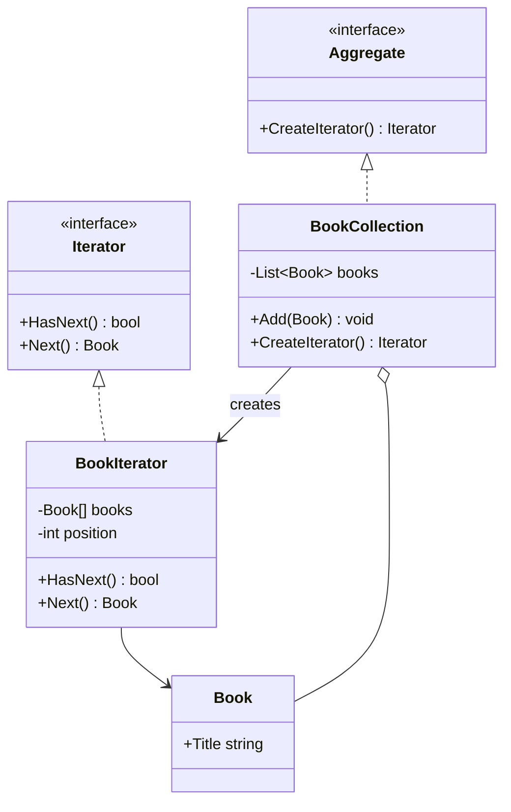
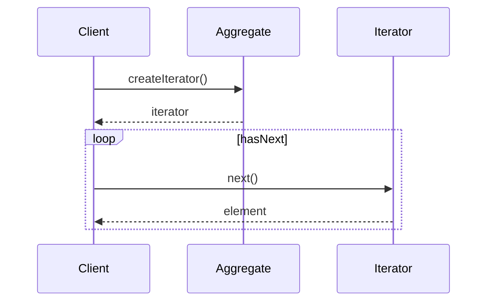

# Iterator

## Intent

Provide a way to access the elements of an aggregate object sequentially without exposing its underlying representation.

## Problem

A library system manages a collection of books stored internally as an array. Client code should be able to traverse the collection without depending on the array implementation, and multiple traversal strategies may be needed in the future.

## Real-World Analogy

{: .note }
> Think of a playlist on your music app. You press "next" to hear the next song without knowing how songs are stored — it could be an array, a linked list, or streamed from the cloud. The playlist gives you a simple way to go through songs one by one. You can also have different iterators: shuffle mode, repeat mode, or sorted by artist — all over the same collection.

## When You Need It

- You're building a social media feed that loads posts lazily — the iterator fetches the next batch from the server as the user scrolls, hiding the pagination logic
- You have a complex data structure (tree, graph, or composite) and need to walk through its elements without exposing the internal structure
- You want to provide multiple ways to traverse a collection — alphabetical, by date, by priority — without changing the collection itself

## UML Class Diagram



## Sequence Diagram



## Participants

| Participant | Role |
|---|---|
| **Iterator** | Defines the interface for accessing and traversing elements. |
| **BookIterator** | Implements the Iterator interface, tracking the current position. |
| **Aggregate** | Defines the interface for creating an Iterator. |
| **BookCollection** | Stores books and returns a `BookIterator`. |
| **Book** | The element being iterated over. |

## How It Works

1. `BookCollection` stores books and implements `CreateIterator()` to return a `BookIterator`.
2. The `BookIterator` maintains a cursor position over the internal array.
3. Clients use `HasNext()` and `Next()` to traverse without knowing the storage details.

## Applicability

- You need to access an aggregate object's contents without exposing its internal representation.
- You want to support multiple simultaneous traversals of the same aggregate.
- You want a uniform interface for traversing different aggregate structures.

## Trade-offs

**Pros:**
- Provides a uniform way to traverse different collection types
- Hides the internal structure of the collection from client code
- Multiple iterators can traverse the same collection simultaneously

**Cons:**
- Less efficient than direct access for simple arrays or lists
- Adding a custom iterator to a new collection requires implementing the full interface
- External iterators can become invalid if the collection is modified during traversal

## Example Code

### C\#

```csharp
public class Book
{
    public string Title { get; }
    public Book(string title) => Title = title;
}

public interface IIterator
{
    bool HasNext();
    Book Next();
}

public interface IAggregate
{
    IIterator CreateIterator();
}

public class BookIterator : IIterator
{
    private readonly List<Book> _books;
    private int _position;

    public BookIterator(List<Book> books) => _books = books;
    public bool HasNext() => _position < _books.Count;
    public Book Next() => _books[_position++];
}

public class BookCollection : IAggregate
{
    private readonly List<Book> _books = new();

    public void Add(Book book) => _books.Add(book);
    public IIterator CreateIterator() => new BookIterator(_books);
}

// Usage
var collection = new BookCollection();
collection.Add(new Book("Design Patterns"));
collection.Add(new Book("Clean Code"));

var iterator = collection.CreateIterator();
while (iterator.HasNext())
    Console.WriteLine(iterator.Next().Title);
```

### Delphi

```pascal
type
  TBook = class
  public
    Title: string;
    constructor Create(const ATitle: string);
  end;

  IBookIterator = interface
    function HasNext: Boolean;
    function Next: TBook;
  end;

  TBookCollection = class;

  TBookIterator = class(TInterfacedObject, IBookIterator)
  private
    FBooks: TList<TBook>;
    FPosition: Integer;
  public
    constructor Create(ABooks: TList<TBook>);
    function HasNext: Boolean;
    function Next: TBook;
  end;

  TBookCollection = class
  private
    FBooks: TList<TBook>;
  public
    constructor Create;
    destructor Destroy; override;
    procedure Add(ABook: TBook);
    function CreateIterator: IBookIterator;
  end;

constructor TBook.Create(const ATitle: string);
begin
  Title := ATitle;
end;

constructor TBookIterator.Create(ABooks: TList<TBook>);
begin
  FBooks := ABooks;
  FPosition := 0;
end;

function TBookIterator.HasNext: Boolean;
begin
  Result := FPosition < FBooks.Count;
end;

function TBookIterator.Next: TBook;
begin
  Result := FBooks[FPosition];
  Inc(FPosition);
end;

constructor TBookCollection.Create;
begin
  FBooks := TList<TBook>.Create;
end;

destructor TBookCollection.Destroy;
begin
  FBooks.Free;
  inherited;
end;

procedure TBookCollection.Add(ABook: TBook);
begin
  FBooks.Add(ABook);
end;

function TBookCollection.CreateIterator: IBookIterator;
begin
  Result := TBookIterator.Create(FBooks);
end;

// Usage
var
  Collection: TBookCollection;
  Iter: IBookIterator;
begin
  Collection := TBookCollection.Create;
  Collection.Add(TBook.Create('Design Patterns'));
  Collection.Add(TBook.Create('Clean Code'));

  Iter := Collection.CreateIterator;
  while Iter.HasNext do
    WriteLn(Iter.Next.Title);
end;
```

### C++

```cpp
#include <iostream>
#include <memory>
#include <string>
#include <vector>

struct Book {
    std::string title;
};

class BookIterator {
    const std::vector<Book>& books_;
    size_t pos_ = 0;
public:
    explicit BookIterator(const std::vector<Book>& books) : books_(books) {}
    bool HasNext() const { return pos_ < books_.size(); }
    const Book& Next() { return books_[pos_++]; }
};

class BookCollection {
    std::vector<Book> books_;
public:
    void Add(const Book& book) { books_.push_back(book); }
    std::unique_ptr<BookIterator> CreateIterator() const {
        return std::make_unique<BookIterator>(books_);
    }
};

int main() {
    BookCollection collection;
    collection.Add({"Design Patterns"});
    collection.Add({"Clean Code"});

    auto it = collection.CreateIterator();
    while (it->HasNext())
        std::cout << it->Next().title << "\n";
    return 0;
}
```

### Runnable Examples

| Language | Source |
|----------|--------|
| C# | [`Iterator.cs`]({{ site.github.repository_url }}/blob/main/examples/csharp/Patterns/Iterator.cs) |
| C++ | [`iterator.cpp`]({{ site.github.repository_url }}/blob/main/examples/cpp/iterator.cpp) |
| Delphi | [`iterator.pas`]({{ site.github.repository_url }}/blob/main/examples/delphi/iterator.pas) |

## Related Patterns

- [**Composite**]() — Iterators are often used to traverse Composite structures.
- [**Factory Method**]() — Polymorphic iterators use Factory Method to instantiate the appropriate iterator subclass.
- [**Memento**]() — An iterator can use a Memento to capture the state of an iteration and roll back if needed.
