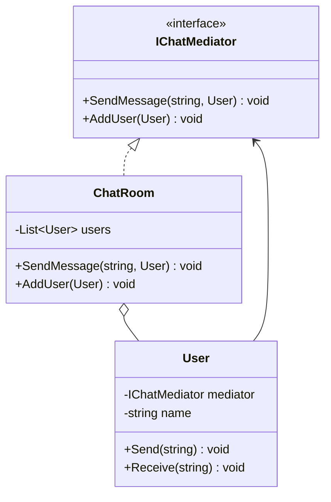
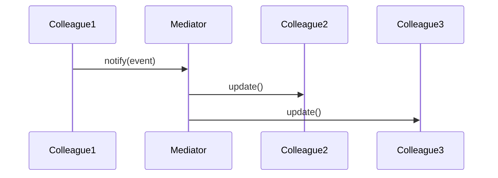

# Mediator

## Intent

Define an object that encapsulates how a set of objects interact. Mediator promotes loose coupling by keeping objects from referring to each other explicitly, and it lets you vary their interaction independently.

## Problem

In a chat application, users need to send messages to each other. If each user holds direct references to every other user, adding or removing participants becomes complex and the system becomes tightly coupled. A central chat room can mediate all communication.

## UML Class Diagram



## Sequence Diagram



## Participants

| Participant | Role |
|---|---|
| **IChatMediator** | Defines the interface for communication between users. |
| **ChatRoom** | Concrete mediator that coordinates message delivery between users. |
| **User** | Colleague that sends and receives messages through the mediator. |

## How It Works

1. Users register with the `ChatRoom` mediator.
2. When a user calls `Send()`, the mediator broadcasts the message to all other registered users.
3. Users never communicate directly; the mediator handles all routing.

## Applicability

- A set of objects communicate in well-defined but complex ways.
- Reusing an object is difficult because it refers to and communicates with many other objects.
- You want to customize behavior distributed between several classes without creating many subclasses.

## Example Code

### C\#

```csharp
public interface IChatMediator
{
    void SendMessage(string message, User sender);
    void AddUser(User user);
}

public class User
{
    private readonly IChatMediator _mediator;
    public string Name { get; }

    public User(string name, IChatMediator mediator)
    {
        Name = name;
        _mediator = mediator;
    }

    public void Send(string message) => _mediator.SendMessage(message, this);

    public void Receive(string message) =>
        Console.WriteLine($"{Name} received: {message}");
}

public class ChatRoom : IChatMediator
{
    private readonly List<User> _users = new();

    public void AddUser(User user) => _users.Add(user);

    public void SendMessage(string message, User sender)
    {
        foreach (var user in _users)
            if (user != sender)
                user.Receive(message);
    }
}

// Usage
var chatRoom = new ChatRoom();
var alice = new User("Alice", chatRoom);
var bob = new User("Bob", chatRoom);
chatRoom.AddUser(alice);
chatRoom.AddUser(bob);

alice.Send("Hi Bob!");
```

### Delphi

```pascal
type
  TUser = class;

  IChatMediator = interface
    procedure SendMessage(const AMessage: string; ASender: TUser);
    procedure AddUser(AUser: TUser);
  end;

  TUser = class
  private
    FMediator: IChatMediator;
    FName: string;
  public
    constructor Create(const AName: string; AMediator: IChatMediator);
    procedure Send(const AMessage: string);
    procedure Receive(const AMessage: string);
    property Name: string read FName;
  end;

  TChatRoom = class(TInterfacedObject, IChatMediator)
  private
    FUsers: TList<TUser>;
  public
    constructor Create;
    destructor Destroy; override;
    procedure SendMessage(const AMessage: string; ASender: TUser);
    procedure AddUser(AUser: TUser);
  end;

constructor TUser.Create(const AName: string; AMediator: IChatMediator);
begin
  FName := AName;
  FMediator := AMediator;
end;

procedure TUser.Send(const AMessage: string);
begin
  FMediator.SendMessage(AMessage, Self);
end;

procedure TUser.Receive(const AMessage: string);
begin
  WriteLn(FName + ' received: ' + AMessage);
end;

constructor TChatRoom.Create;
begin
  FUsers := TList<TUser>.Create;
end;

destructor TChatRoom.Destroy;
begin
  FUsers.Free;
  inherited;
end;

procedure TChatRoom.AddUser(AUser: TUser);
begin
  FUsers.Add(AUser);
end;

procedure TChatRoom.SendMessage(const AMessage: string; ASender: TUser);
var
  User: TUser;
begin
  for User in FUsers do
    if User <> ASender then
      User.Receive(AMessage);
end;

// Usage
var
  ChatRoom: IChatMediator;
  Alice, Bob: TUser;
begin
  ChatRoom := TChatRoom.Create;
  Alice := TUser.Create('Alice', ChatRoom);
  Bob := TUser.Create('Bob', ChatRoom);
  ChatRoom.AddUser(Alice);
  ChatRoom.AddUser(Bob);

  Alice.Send('Hi Bob!');
end;
```

### C++

```cpp
#include <iostream>
#include <memory>
#include <string>
#include <vector>

class User;

class IChatMediator {
public:
    virtual ~IChatMediator() = default;
    virtual void SendMessage(const std::string& msg, User* sender) = 0;
    virtual void AddUser(User* user) = 0;
};

class User {
    IChatMediator* mediator_;
    std::string name_;
public:
    User(const std::string& name, IChatMediator* mediator)
        : name_(name), mediator_(mediator) {}

    const std::string& Name() const { return name_; }
    void Send(const std::string& msg) { mediator_->SendMessage(msg, this); }
    void Receive(const std::string& msg) {
        std::cout << name_ << " received: " << msg << "\n";
    }
};

class ChatRoom : public IChatMediator {
    std::vector<User*> users_;
public:
    void AddUser(User* user) override { users_.push_back(user); }

    void SendMessage(const std::string& msg, User* sender) override {
        for (auto* user : users_)
            if (user != sender)
                user->Receive(msg);
    }
};

int main() {
    ChatRoom chatRoom;
    User alice("Alice", &chatRoom);
    User bob("Bob", &chatRoom);
    chatRoom.AddUser(&alice);
    chatRoom.AddUser(&bob);

    alice.Send("Hi Bob!");
    return 0;
}
```

## Related Patterns

- [**Facade**]() — Facade abstracts a subsystem of objects to provide a simpler interface, whereas Mediator centralizes communication between colleague objects.
- [**Observer**]() — Colleagues can communicate with the mediator using the Observer pattern.
