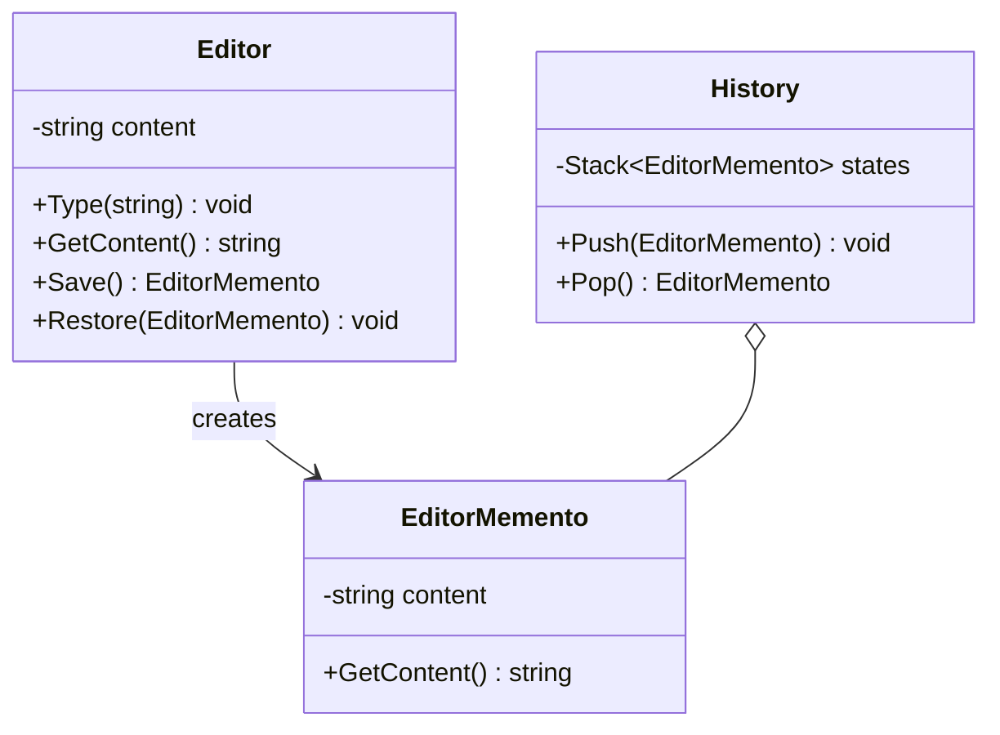
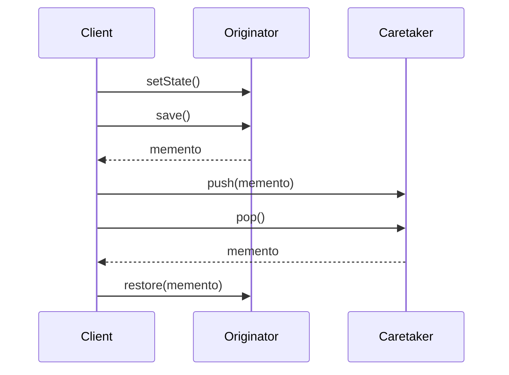

# Memento

## Intent

Without violating encapsulation, capture and externalize an object's internal state so that the object can be restored to this state later.

## Problem

A text editor needs to support undo. The editor's internal state (content, cursor position) must be saved at various points so that previous states can be restored. Exposing internal fields to achieve this would break encapsulation.

## Real-World Analogy

{: .note }
> Think of saving your progress in a video game. Before you fight the boss, you save the game. If you lose, you reload from that save point — your health, inventory, and position are exactly as they were. The save file is the memento: a snapshot of your state at a specific moment, stored externally so you can go back to it anytime.

## When You Need It

- You're building a document editor with an undo history — each edit saves a snapshot so users can step back through previous versions
- You're creating a wizard or multi-step form where users can go back to previous steps without losing their input
- You're implementing a transaction system where you need to roll back to a previous state if something fails midway

## UML Class Diagram



## Sequence Diagram



## Participants

| Participant | Role |
|---|---|
| **Editor** | Originator that creates mementos capturing its internal state and restores state from them. |
| **EditorMemento** | Stores the internal state of the Editor. Opaque to other objects. |
| **History** | Caretaker that manages a stack of mementos without examining their contents. |

## How It Works

1. Before a change, the `Editor` creates an `EditorMemento` containing a snapshot of its state.
2. The `History` caretaker pushes the memento onto its stack.
3. To undo, the caretaker pops the most recent memento and passes it back to the editor's `Restore()` method.

## Applicability

- You need to save and restore an object's state (e.g., undo/redo, checkpoints).
- Direct access to the object's internal state would violate encapsulation.

## Example Code

### C\#

```csharp
public class EditorMemento
{
    public string Content { get; }
    public EditorMemento(string content) => Content = content;
}

public class Editor
{
    private string _content = "";

    public void Type(string text) => _content += text;
    public string GetContent() => _content;

    public EditorMemento Save() => new EditorMemento(_content);
    public void Restore(EditorMemento memento) => _content = memento.Content;
}

public class History
{
    private readonly Stack<EditorMemento> _states = new();
    public void Push(EditorMemento m) => _states.Push(m);
    public EditorMemento Pop() => _states.Pop();
}

// Usage
var editor = new Editor();
var history = new History();

history.Push(editor.Save());
editor.Type("Hello ");
history.Push(editor.Save());
editor.Type("World");
Console.WriteLine(editor.GetContent()); // "Hello World"

editor.Restore(history.Pop());
Console.WriteLine(editor.GetContent()); // "Hello "
```

### Delphi

```pascal
type
  TEditorMemento = class
  private
    FContent: string;
  public
    constructor Create(const AContent: string);
    property Content: string read FContent;
  end;

  TEditor = class
  private
    FContent: string;
  public
    procedure TypeText(const AText: string);
    function GetContent: string;
    function Save: TEditorMemento;
    procedure Restore(AMemento: TEditorMemento);
  end;

  THistory = class
  private
    FStates: TStack<TEditorMemento>;
  public
    constructor Create;
    destructor Destroy; override;
    procedure Push(AMemento: TEditorMemento);
    function Pop: TEditorMemento;
  end;

constructor TEditorMemento.Create(const AContent: string);
begin
  FContent := AContent;
end;

procedure TEditor.TypeText(const AText: string);
begin
  FContent := FContent + AText;
end;

function TEditor.GetContent: string;
begin
  Result := FContent;
end;

function TEditor.Save: TEditorMemento;
begin
  Result := TEditorMemento.Create(FContent);
end;

procedure TEditor.Restore(AMemento: TEditorMemento);
begin
  FContent := AMemento.Content;
end;

constructor THistory.Create;
begin
  FStates := TStack<TEditorMemento>.Create;
end;

destructor THistory.Destroy;
begin
  FStates.Free;
  inherited;
end;

procedure THistory.Push(AMemento: TEditorMemento);
begin
  FStates.Push(AMemento);
end;

function THistory.Pop: TEditorMemento;
begin
  Result := FStates.Pop;
end;

// Usage
var
  Editor: TEditor;
  History: THistory;
begin
  Editor := TEditor.Create;
  History := THistory.Create;

  History.Push(Editor.Save);
  Editor.TypeText('Hello ');
  History.Push(Editor.Save);
  Editor.TypeText('World');
  WriteLn(Editor.GetContent); // 'Hello World'

  Editor.Restore(History.Pop);
  WriteLn(Editor.GetContent); // 'Hello '
end;
```

### C++

```cpp
#include <iostream>
#include <memory>
#include <stack>
#include <string>

class EditorMemento {
    std::string content_;
public:
    explicit EditorMemento(const std::string& content) : content_(content) {}
    const std::string& GetContent() const { return content_; }
};

class Editor {
    std::string content_;
public:
    void Type(const std::string& text) { content_ += text; }
    std::string GetContent() const { return content_; }

    std::shared_ptr<EditorMemento> Save() const {
        return std::make_shared<EditorMemento>(content_);
    }
    void Restore(const std::shared_ptr<EditorMemento>& m) {
        content_ = m->GetContent();
    }
};

class History {
    std::stack<std::shared_ptr<EditorMemento>> states_;
public:
    void Push(std::shared_ptr<EditorMemento> m) { states_.push(m); }
    std::shared_ptr<EditorMemento> Pop() {
        auto top = states_.top();
        states_.pop();
        return top;
    }
};

int main() {
    Editor editor;
    History history;

    history.Push(editor.Save());
    editor.Type("Hello ");
    history.Push(editor.Save());
    editor.Type("World");
    std::cout << editor.GetContent() << "\n"; // Hello World

    editor.Restore(history.Pop());
    std::cout << editor.GetContent() << "\n"; // Hello
    return 0;
}
```

### Runnable Examples

| Language | Source |
|----------|--------|
| C# | [`Memento.cs`]({{ site.github.repository_url }}/blob/main/examples/csharp/Patterns/Memento.cs) |
| C++ | [`memento.cpp`]({{ site.github.repository_url }}/blob/main/examples/cpp/memento.cpp) |
| Delphi | [`memento.pas`]({{ site.github.repository_url }}/blob/main/examples/delphi/memento.pas) |

## Related Patterns

- [**Command**]() — Commands can use mementos to store state for undoable operations.
- [**Iterator**]() — Mementos can capture the state of an iteration.
