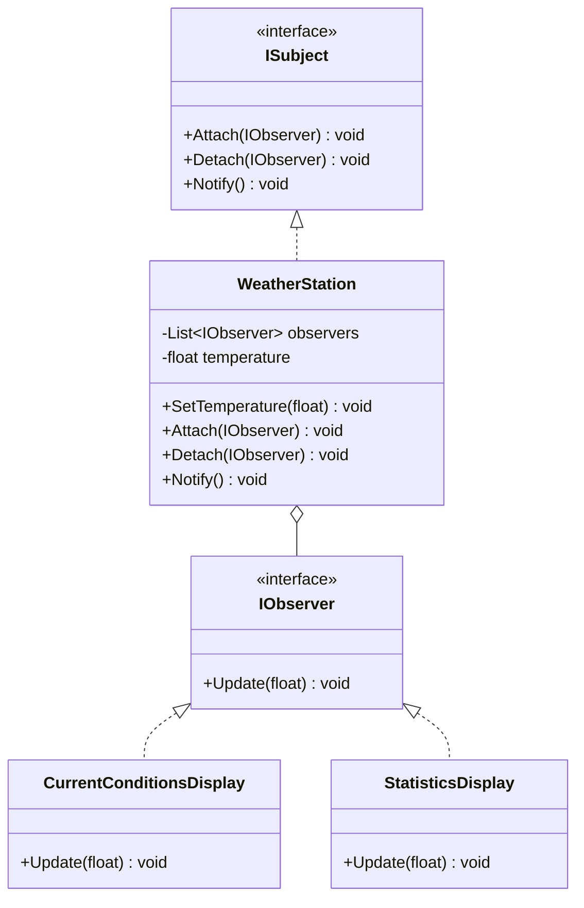
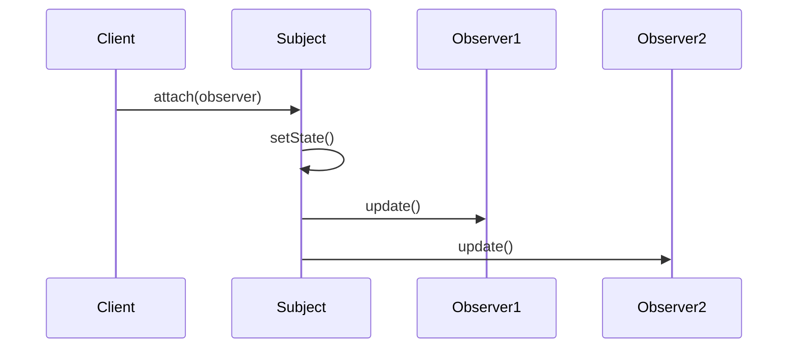

# Observer

## Intent

Define a one-to-many dependency between objects so that when one object changes state, all its dependents are notified and updated automatically.

## Problem

A weather station collects temperature data and needs to broadcast updates to multiple display units (current conditions, statistics, forecast). Tightly coupling the station to each display makes it impossible to add new displays without modifying the station.

## Real-World Analogy

{: .note }
> Think of subscribing to a YouTube channel. You don't check the channel every hour for new videos — you hit "subscribe" and YouTube notifies you when a new video drops. If you lose interest, you unsubscribe and stop getting notifications. The channel doesn't know or care who's watching; it just broadcasts to whoever signed up. That's the Observer pattern.

## When You Need It

- You're building a stock trading app where the price ticker updates and all open charts, alerts, and portfolio views need to refresh automatically
- You're creating an event system where multiple components react to user actions (like "item added to cart" triggers inventory check, analytics tracking, and UI update)
- You're building a real-time dashboard that displays live data from sensors — when a sensor value changes, all widgets showing that data update instantly

## UML Class Diagram



## Sequence Diagram



## Participants

| Participant | Role |
|---|---|
| **ISubject** | Interface for attaching, detaching, and notifying observers. |
| **WeatherStation** | Concrete subject that stores temperature and notifies observers on change. |
| **IObserver** | Interface that defines the `Update` method observers must implement. |
| **CurrentConditionsDisplay** | Displays the current temperature when notified. |
| **StatisticsDisplay** | Tracks and displays temperature statistics when notified. |

## How It Works

1. Display objects register with the `WeatherStation` via `Attach()`.
2. When the temperature changes, the station calls `Notify()`, which iterates through all registered observers and calls `Update()`.
3. Each display processes the new data independently.

## Applicability

- A change to one object requires changing others, and you do not know how many objects need to change.
- An object should be able to notify other objects without knowing who they are.

## Trade-offs

**Pros:**
- Loose coupling — the subject doesn't need to know the concrete observer classes
- New observers can be added at runtime without modifying the subject
- Supports broadcast communication — one event, many listeners

**Cons:**
- Unexpected update cascades ("notify storms") when observers trigger further changes
- Observers have no control over the order they're notified
- Memory leaks can occur if observers forget to unsubscribe

## Example Code

### C\#

```csharp
public interface IObserver
{
    void Update(float temperature);
}

public interface ISubject
{
    void Attach(IObserver observer);
    void Detach(IObserver observer);
    void Notify();
}

public class WeatherStation : ISubject
{
    private readonly List<IObserver> _observers = new();
    private float _temperature;

    public void SetTemperature(float temp)
    {
        _temperature = temp;
        Notify();
    }

    public void Attach(IObserver observer) => _observers.Add(observer);
    public void Detach(IObserver observer) => _observers.Remove(observer);
    public void Notify()
    {
        foreach (var observer in _observers)
            observer.Update(_temperature);
    }
}

public class CurrentConditionsDisplay : IObserver
{
    public void Update(float temperature) =>
        Console.WriteLine($"Current conditions: {temperature}°C");
}

public class StatisticsDisplay : IObserver
{
    private readonly List<float> _readings = new();

    public void Update(float temperature)
    {
        _readings.Add(temperature);
        Console.WriteLine($"Avg temperature: {_readings.Average()}°C");
    }
}

// Usage
var station = new WeatherStation();
station.Attach(new CurrentConditionsDisplay());
station.Attach(new StatisticsDisplay());
station.SetTemperature(25.0f);
station.SetTemperature(30.0f);
```

### Delphi

```pascal
type
  IObserver = interface
    procedure Update(ATemperature: Single);
  end;

  TWeatherStation = class
  private
    FObservers: TList<IObserver>;
    FTemperature: Single;
  public
    constructor Create;
    destructor Destroy; override;
    procedure Attach(AObserver: IObserver);
    procedure Detach(AObserver: IObserver);
    procedure Notify;
    procedure SetTemperature(ATemp: Single);
  end;

  TCurrentConditionsDisplay = class(TInterfacedObject, IObserver)
  public
    procedure Update(ATemperature: Single);
  end;

  TStatisticsDisplay = class(TInterfacedObject, IObserver)
  private
    FSum: Single;
    FCount: Integer;
  public
    procedure Update(ATemperature: Single);
  end;

constructor TWeatherStation.Create;
begin
  FObservers := TList<IObserver>.Create;
end;

destructor TWeatherStation.Destroy;
begin
  FObservers.Free;
  inherited;
end;

procedure TWeatherStation.Attach(AObserver: IObserver);
begin
  FObservers.Add(AObserver);
end;

procedure TWeatherStation.Detach(AObserver: IObserver);
begin
  FObservers.Remove(AObserver);
end;

procedure TWeatherStation.Notify;
var
  Observer: IObserver;
begin
  for Observer in FObservers do
    Observer.Update(FTemperature);
end;

procedure TWeatherStation.SetTemperature(ATemp: Single);
begin
  FTemperature := ATemp;
  Notify;
end;

procedure TCurrentConditionsDisplay.Update(ATemperature: Single);
begin
  WriteLn(Format('Current conditions: %.1f°C', [ATemperature]));
end;

procedure TStatisticsDisplay.Update(ATemperature: Single);
begin
  FSum := FSum + ATemperature;
  Inc(FCount);
  WriteLn(Format('Avg temperature: %.1f°C', [FSum / FCount]));
end;

// Usage
var
  Station: TWeatherStation;
begin
  Station := TWeatherStation.Create;
  Station.Attach(TCurrentConditionsDisplay.Create);
  Station.Attach(TStatisticsDisplay.Create);
  Station.SetTemperature(25.0);
  Station.SetTemperature(30.0);
end;
```

### C++

```cpp
#include <algorithm>
#include <iostream>
#include <memory>
#include <numeric>
#include <vector>

class IObserver {
public:
    virtual ~IObserver() = default;
    virtual void Update(float temperature) = 0;
};

class WeatherStation {
    std::vector<std::shared_ptr<IObserver>> observers_;
    float temperature_ = 0;
public:
    void Attach(std::shared_ptr<IObserver> obs) { observers_.push_back(obs); }
    void Detach(std::shared_ptr<IObserver> obs) {
        observers_.erase(
            std::remove(observers_.begin(), observers_.end(), obs),
            observers_.end());
    }
    void Notify() {
        for (auto& obs : observers_)
            obs->Update(temperature_);
    }
    void SetTemperature(float temp) {
        temperature_ = temp;
        Notify();
    }
};

class CurrentConditionsDisplay : public IObserver {
public:
    void Update(float temperature) override {
        std::cout << "Current conditions: " << temperature << "°C\n";
    }
};

class StatisticsDisplay : public IObserver {
    std::vector<float> readings_;
public:
    void Update(float temperature) override {
        readings_.push_back(temperature);
        float avg = std::accumulate(readings_.begin(), readings_.end(), 0.0f)
                    / readings_.size();
        std::cout << "Avg temperature: " << avg << "°C\n";
    }
};

int main() {
    WeatherStation station;
    station.Attach(std::make_shared<CurrentConditionsDisplay>());
    station.Attach(std::make_shared<StatisticsDisplay>());
    station.SetTemperature(25.0f);
    station.SetTemperature(30.0f);
    return 0;
}
```

### Runnable Examples

| Language | Source |
|----------|--------|
| C# | [`Observer.cs`]({{ site.github.repository_url }}/blob/main/examples/csharp/Patterns/Observer.cs) |
| C++ | [`observer.cpp`]({{ site.github.repository_url }}/blob/main/examples/cpp/observer.cpp) |
| Delphi | [`observer.pas`]({{ site.github.repository_url }}/blob/main/examples/delphi/observer.pas) |

## Related Patterns

- [**Mediator**]() — Mediator encapsulates communication between objects, often using Observer internally.
- [**Singleton**]() — The subject is sometimes implemented as a Singleton to provide a global notification point.
