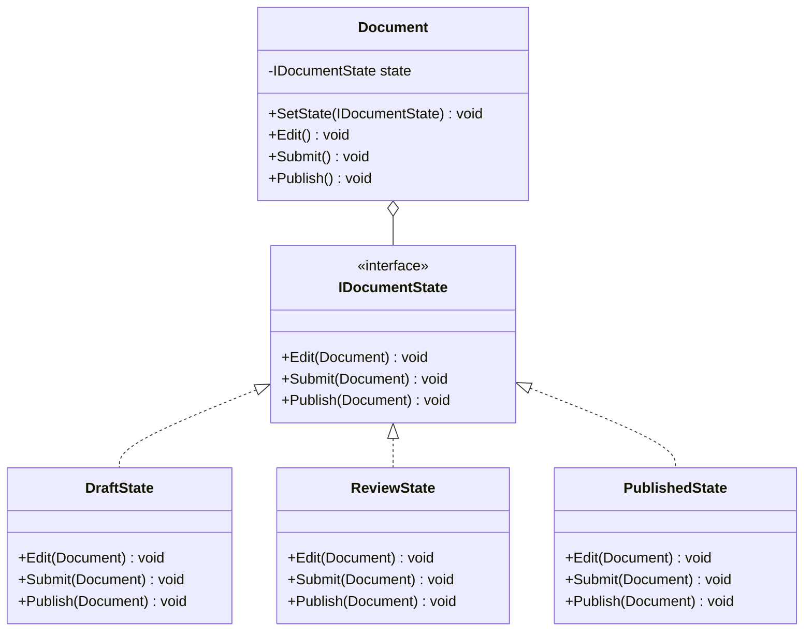
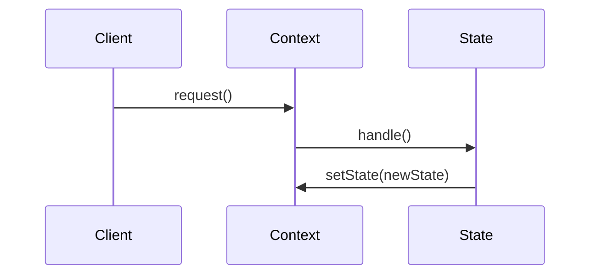

# State

## Intent

Allow an object to alter its behavior when its internal state changes. The object will appear to change its class.

## Problem

A document in a workflow system can be in Draft, Review, or Published state. Each state dictates which operations are allowed (edit, submit for review, publish). Using conditionals to check the current state throughout the code leads to complex, hard-to-maintain logic.

## UML Class Diagram



## Sequence Diagram



## Participants

| Participant | Role |
|---|---|
| **Document** | Context that maintains a reference to the current state and delegates behavior to it. |
| **IDocumentState** | Interface declaring state-specific behavior. |
| **DraftState** | Allows editing and submission. |
| **ReviewState** | Allows publishing; rejects edits. |
| **PublishedState** | Final state; no further transitions. |

## How It Works

1. The `Document` starts in `DraftState`.
2. Operations are delegated to the current state object.
3. Each state handles the operation and may transition the document to a new state by calling `SetState()`.

## Applicability

- An object's behavior depends on its state, and it must change behavior at runtime.
- Operations contain large conditional statements that depend on state.

## Example Code

### C\#

```csharp
public interface IDocumentState
{
    void Edit(Document doc);
    void Submit(Document doc);
    void Publish(Document doc);
}

public class Document
{
    public IDocumentState State { get; set; }
    public Document() => State = new DraftState();
    public void Edit() => State.Edit(this);
    public void Submit() => State.Submit(this);
    public void Publish() => State.Publish(this);
}

public class DraftState : IDocumentState
{
    public void Edit(Document doc) => Console.WriteLine("Editing draft.");
    public void Submit(Document doc)
    {
        Console.WriteLine("Submitting for review.");
        doc.State = new ReviewState();
    }
    public void Publish(Document doc) => Console.WriteLine("Cannot publish a draft.");
}

public class ReviewState : IDocumentState
{
    public void Edit(Document doc) => Console.WriteLine("Cannot edit during review.");
    public void Submit(Document doc) => Console.WriteLine("Already in review.");
    public void Publish(Document doc)
    {
        Console.WriteLine("Publishing document.");
        doc.State = new PublishedState();
    }
}

public class PublishedState : IDocumentState
{
    public void Edit(Document doc) => Console.WriteLine("Cannot edit published document.");
    public void Submit(Document doc) => Console.WriteLine("Already published.");
    public void Publish(Document doc) => Console.WriteLine("Already published.");
}

// Usage
var doc = new Document();
doc.Edit();    // Editing draft.
doc.Submit();  // Submitting for review.
doc.Publish(); // Publishing document.
doc.Edit();    // Cannot edit published document.
```

### Delphi

```pascal
type
  TDocument = class;

  IDocumentState = interface
    procedure Edit(ADoc: TDocument);
    procedure Submit(ADoc: TDocument);
    procedure Publish(ADoc: TDocument);
  end;

  TDocument = class
  public
    State: IDocumentState;
    constructor Create;
    procedure Edit;
    procedure Submit;
    procedure Publish;
  end;

  TDraftState = class(TInterfacedObject, IDocumentState)
  public
    procedure Edit(ADoc: TDocument);
    procedure Submit(ADoc: TDocument);
    procedure Publish(ADoc: TDocument);
  end;

  TReviewState = class(TInterfacedObject, IDocumentState)
  public
    procedure Edit(ADoc: TDocument);
    procedure Submit(ADoc: TDocument);
    procedure Publish(ADoc: TDocument);
  end;

  TPublishedState = class(TInterfacedObject, IDocumentState)
  public
    procedure Edit(ADoc: TDocument);
    procedure Submit(ADoc: TDocument);
    procedure Publish(ADoc: TDocument);
  end;

constructor TDocument.Create;
begin
  State := TDraftState.Create;
end;

procedure TDocument.Edit;
begin
  State.Edit(Self);
end;

procedure TDocument.Submit;
begin
  State.Submit(Self);
end;

procedure TDocument.Publish;
begin
  State.Publish(Self);
end;

procedure TDraftState.Edit(ADoc: TDocument);
begin
  WriteLn('Editing draft.');
end;

procedure TDraftState.Submit(ADoc: TDocument);
begin
  WriteLn('Submitting for review.');
  ADoc.State := TReviewState.Create;
end;

procedure TDraftState.Publish(ADoc: TDocument);
begin
  WriteLn('Cannot publish a draft.');
end;

procedure TReviewState.Edit(ADoc: TDocument);
begin
  WriteLn('Cannot edit during review.');
end;

procedure TReviewState.Submit(ADoc: TDocument);
begin
  WriteLn('Already in review.');
end;

procedure TReviewState.Publish(ADoc: TDocument);
begin
  WriteLn('Publishing document.');
  ADoc.State := TPublishedState.Create;
end;

procedure TPublishedState.Edit(ADoc: TDocument);
begin
  WriteLn('Cannot edit published document.');
end;

procedure TPublishedState.Submit(ADoc: TDocument);
begin
  WriteLn('Already published.');
end;

procedure TPublishedState.Publish(ADoc: TDocument);
begin
  WriteLn('Already published.');
end;

// Usage
var
  Doc: TDocument;
begin
  Doc := TDocument.Create;
  Doc.Edit;    // Editing draft.
  Doc.Submit;  // Submitting for review.
  Doc.Publish; // Publishing document.
  Doc.Edit;    // Cannot edit published document.
end;
```

### C++

```cpp
#include <iostream>
#include <memory>

class Document;

class IDocumentState {
public:
    virtual ~IDocumentState() = default;
    virtual void Edit(Document& doc) = 0;
    virtual void Submit(Document& doc) = 0;
    virtual void Publish(Document& doc) = 0;
};

class Document {
public:
    std::shared_ptr<IDocumentState> state;
    Document();
    void Edit() { state->Edit(*this); }
    void Submit() { state->Submit(*this); }
    void Publish() { state->Publish(*this); }
};

class PublishedState : public IDocumentState {
public:
    void Edit(Document&) override { std::cout << "Cannot edit published document.\n"; }
    void Submit(Document&) override { std::cout << "Already published.\n"; }
    void Publish(Document&) override { std::cout << "Already published.\n"; }
};

class ReviewState : public IDocumentState {
public:
    void Edit(Document&) override { std::cout << "Cannot edit during review.\n"; }
    void Submit(Document&) override { std::cout << "Already in review.\n"; }
    void Publish(Document& doc) override {
        std::cout << "Publishing document.\n";
        doc.state = std::make_shared<PublishedState>();
    }
};

class DraftState : public IDocumentState {
public:
    void Edit(Document&) override { std::cout << "Editing draft.\n"; }
    void Submit(Document& doc) override {
        std::cout << "Submitting for review.\n";
        doc.state = std::make_shared<ReviewState>();
    }
    void Publish(Document&) override { std::cout << "Cannot publish a draft.\n"; }
};

Document::Document() : state(std::make_shared<DraftState>()) {}

int main() {
    Document doc;
    doc.Edit();    // Editing draft.
    doc.Submit();  // Submitting for review.
    doc.Publish(); // Publishing document.
    doc.Edit();    // Cannot edit published document.
    return 0;
}
```

### Runnable Examples

| Language | Source |
|----------|--------|
| C# | [`State.cs`]({{ site.github.repository_url }}/blob/main/examples/csharp/Patterns/State.cs) |
| C++ | [`state.cpp`]({{ site.github.repository_url }}/blob/main/examples/cpp/state.cpp) |
| Delphi | [`state.pas`]({{ site.github.repository_url }}/blob/main/examples/delphi/state.pas) |

## Related Patterns

- [**Flyweight**]() — State objects with no instance variables can be shared as Flyweights.
- [**Singleton**]() — State objects are often Singletons.
- [**Strategy**]() — Both patterns use composition to change behavior, but State transitions are typically automatic while Strategy is chosen by the client.
