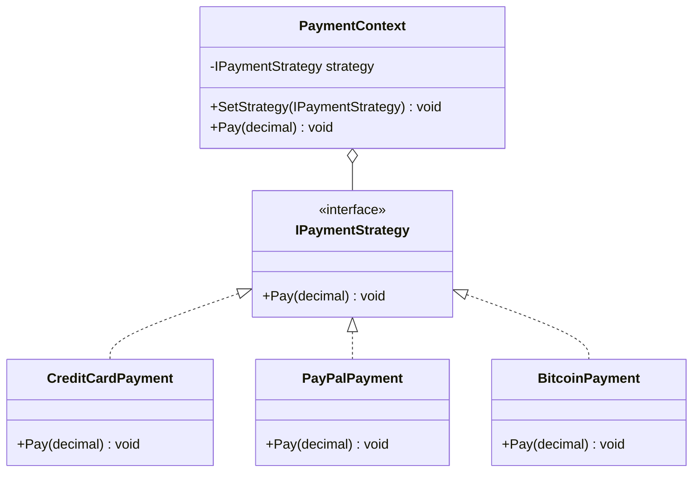
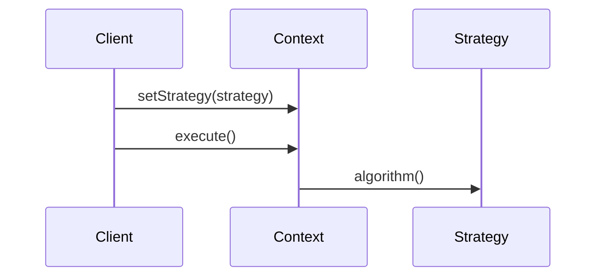

# Strategy

## Intent

Define a family of algorithms, encapsulate each one, and make them interchangeable. Strategy lets the algorithm vary independently from clients that use it.

## Problem

An e-commerce system supports multiple payment methods: credit card, PayPal, and Bitcoin. Embedding payment logic directly into the checkout class forces changes to that class whenever a new payment method is added and violates the open/closed principle.

## UML Class Diagram



## Sequence Diagram



## Participants

| Participant | Role |
|---|---|
| **PaymentContext** | Maintains a reference to a strategy and delegates payment to it. |
| **IPaymentStrategy** | Common interface for all payment algorithms. |
| **CreditCardPayment** | Processes payment via credit card. |
| **PayPalPayment** | Processes payment via PayPal. |
| **BitcoinPayment** | Processes payment via Bitcoin. |

## How It Works

1. The client selects a payment strategy and passes it to the `PaymentContext`.
2. When `Pay()` is called, the context delegates to the current strategy.
3. The strategy can be swapped at runtime without modifying the context.

## Applicability

- Many related classes differ only in their behavior.
- You need different variants of an algorithm.
- A class defines many behaviors via conditional statements that can be moved into strategy classes.

## Example Code

### C\#

```csharp
public interface IPaymentStrategy
{
    void Pay(decimal amount);
}

public class CreditCardPayment : IPaymentStrategy
{
    public void Pay(decimal amount) =>
        Console.WriteLine($"Paid {amount:C} via Credit Card.");
}

public class PayPalPayment : IPaymentStrategy
{
    public void Pay(decimal amount) =>
        Console.WriteLine($"Paid {amount:C} via PayPal.");
}

public class BitcoinPayment : IPaymentStrategy
{
    public void Pay(decimal amount) =>
        Console.WriteLine($"Paid {amount:C} via Bitcoin.");
}

public class PaymentContext
{
    private IPaymentStrategy _strategy;

    public void SetStrategy(IPaymentStrategy strategy) => _strategy = strategy;
    public void Pay(decimal amount) => _strategy.Pay(amount);
}

// Usage
var context = new PaymentContext();
context.SetStrategy(new CreditCardPayment());
context.Pay(99.99m);

context.SetStrategy(new PayPalPayment());
context.Pay(49.50m);

context.SetStrategy(new BitcoinPayment());
context.Pay(150.00m);
```

### Delphi

```pascal
type
  IPaymentStrategy = interface
    procedure Pay(AAmount: Currency);
  end;

  TCreditCardPayment = class(TInterfacedObject, IPaymentStrategy)
  public
    procedure Pay(AAmount: Currency);
  end;

  TPayPalPayment = class(TInterfacedObject, IPaymentStrategy)
  public
    procedure Pay(AAmount: Currency);
  end;

  TBitcoinPayment = class(TInterfacedObject, IPaymentStrategy)
  public
    procedure Pay(AAmount: Currency);
  end;

  TPaymentContext = class
  private
    FStrategy: IPaymentStrategy;
  public
    procedure SetStrategy(AStrategy: IPaymentStrategy);
    procedure Pay(AAmount: Currency);
  end;

procedure TCreditCardPayment.Pay(AAmount: Currency);
begin
  WriteLn(Format('Paid %m via Credit Card.', [AAmount]));
end;

procedure TPayPalPayment.Pay(AAmount: Currency);
begin
  WriteLn(Format('Paid %m via PayPal.', [AAmount]));
end;

procedure TBitcoinPayment.Pay(AAmount: Currency);
begin
  WriteLn(Format('Paid %m via Bitcoin.', [AAmount]));
end;

procedure TPaymentContext.SetStrategy(AStrategy: IPaymentStrategy);
begin
  FStrategy := AStrategy;
end;

procedure TPaymentContext.Pay(AAmount: Currency);
begin
  FStrategy.Pay(AAmount);
end;

// Usage
var
  Context: TPaymentContext;
begin
  Context := TPaymentContext.Create;
  Context.SetStrategy(TCreditCardPayment.Create);
  Context.Pay(99.99);

  Context.SetStrategy(TPayPalPayment.Create);
  Context.Pay(49.50);

  Context.SetStrategy(TBitcoinPayment.Create);
  Context.Pay(150.00);
end;
```

### C++

```cpp
#include <iostream>
#include <memory>

class IPaymentStrategy {
public:
    virtual ~IPaymentStrategy() = default;
    virtual void Pay(double amount) = 0;
};

class CreditCardPayment : public IPaymentStrategy {
public:
    void Pay(double amount) override {
        std::cout << "Paid $" << amount << " via Credit Card.\n";
    }
};

class PayPalPayment : public IPaymentStrategy {
public:
    void Pay(double amount) override {
        std::cout << "Paid $" << amount << " via PayPal.\n";
    }
};

class BitcoinPayment : public IPaymentStrategy {
public:
    void Pay(double amount) override {
        std::cout << "Paid $" << amount << " via Bitcoin.\n";
    }
};

class PaymentContext {
    std::unique_ptr<IPaymentStrategy> strategy_;
public:
    void SetStrategy(std::unique_ptr<IPaymentStrategy> s) {
        strategy_ = std::move(s);
    }
    void Pay(double amount) { strategy_->Pay(amount); }
};

int main() {
    PaymentContext context;
    context.SetStrategy(std::make_unique<CreditCardPayment>());
    context.Pay(99.99);

    context.SetStrategy(std::make_unique<PayPalPayment>());
    context.Pay(49.50);

    context.SetStrategy(std::make_unique<BitcoinPayment>());
    context.Pay(150.00);
    return 0;
}
```

### Runnable Examples

| Language | Source |
|----------|--------|
| C# | [`Strategy.cs`]({{ site.github.repository_url }}/blob/main/examples/csharp/Patterns/Strategy.cs) |
| C++ | [`strategy.cpp`]({{ site.github.repository_url }}/blob/main/examples/cpp/strategy.cpp) |
| Delphi | [`strategy.pas`]({{ site.github.repository_url }}/blob/main/examples/delphi/strategy.pas) |

## Related Patterns

- [**Flyweight**]() — Strategy objects can be shared as Flyweights if they carry no state.
- [**State**]() — State can be seen as an extension of Strategy where transitions between strategies happen automatically.
- [**Template Method**]() — Template Method uses inheritance to vary part of an algorithm; Strategy uses delegation to vary the entire algorithm.
