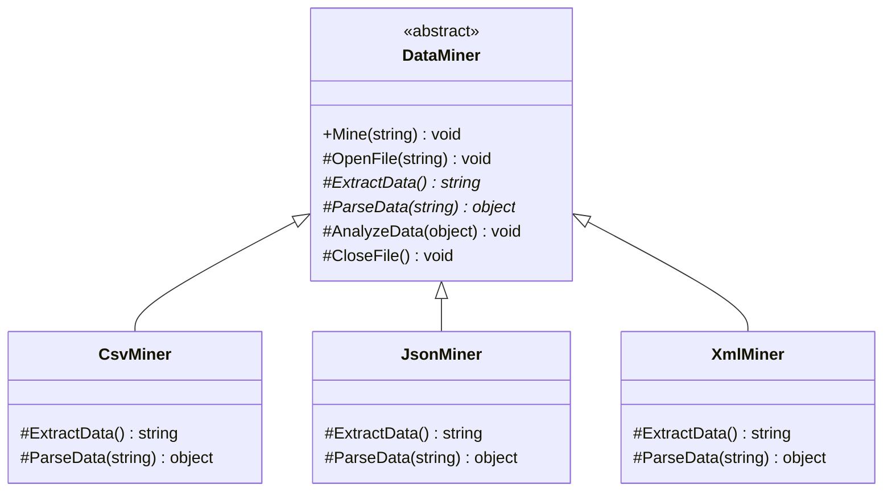
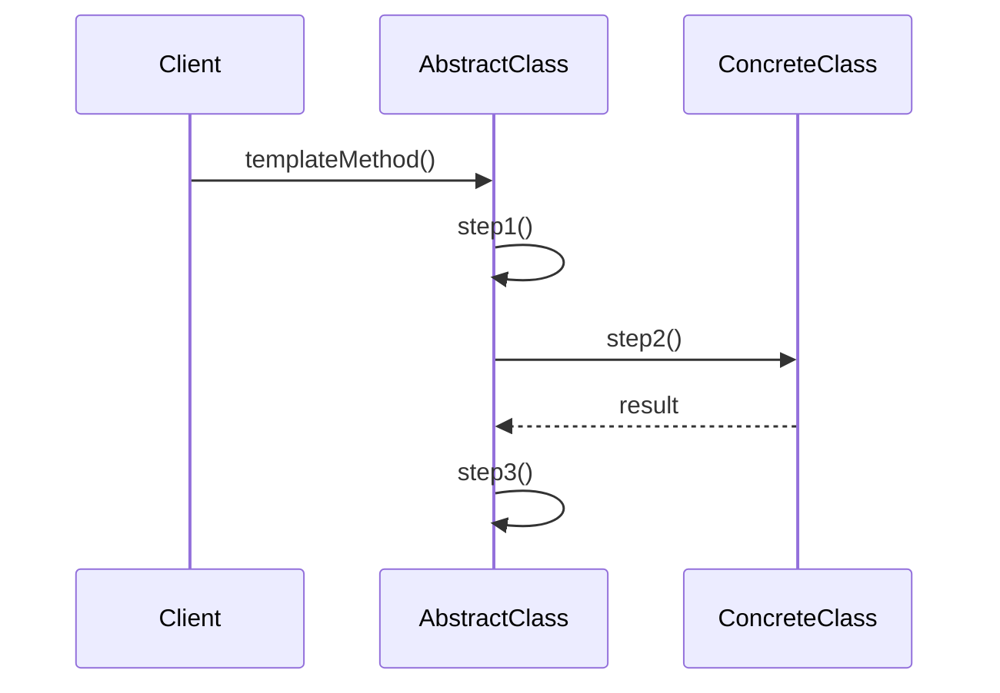

# Template Method

## Intent

Define the skeleton of an algorithm in an operation, deferring some steps to subclasses. Template Method lets subclasses redefine certain steps of an algorithm without changing the algorithm's structure.

## Problem

A data mining application needs to parse files in CSV, JSON, and XML formats. The overall pipeline is the same (open file, extract data, parse data, analyze data, close file), but the extraction and parsing steps differ per format. Duplicating the pipeline in each parser leads to code duplication and inconsistency.

## UML Class Diagram



## Sequence Diagram



## Participants

| Participant | Role |
|---|---|
| **DataMiner** | Abstract class defining the template method `Mine()` and default/hook steps. |
| **CsvMiner** | Implements extraction and parsing for CSV files. |
| **JsonMiner** | Implements extraction and parsing for JSON files. |
| **XmlMiner** | Implements extraction and parsing for XML files. |

## How It Works

1. The `DataMiner` base class defines `Mine()` which calls steps in a fixed order: open, extract, parse, analyze, close.
2. `ExtractData()` and `ParseData()` are abstract and must be implemented by subclasses.
3. `OpenFile()`, `AnalyzeData()`, and `CloseFile()` have default implementations that subclasses may optionally override (hook methods).

## Applicability

- You want to let clients extend only particular steps of an algorithm, not the whole algorithm or its structure.
- You have several classes that contain nearly identical algorithms with minor differences.

## Example Code

### C\#

```csharp
public abstract class DataMiner
{
    // Template method
    public void Mine(string path)
    {
        OpenFile(path);
        var rawData = ExtractData();
        var data = ParseData(rawData);
        AnalyzeData(data);
        CloseFile();
    }

    protected virtual void OpenFile(string path) =>
        Console.WriteLine($"Opening {path}");

    protected abstract string ExtractData();
    protected abstract string[] ParseData(string rawData);

    protected virtual void AnalyzeData(string[] data) =>
        Console.WriteLine($"Analyzing {data.Length} records.");

    protected virtual void CloseFile() =>
        Console.WriteLine("Closing file.");
}

public class CsvMiner : DataMiner
{
    protected override string ExtractData()
    {
        Console.WriteLine("Extracting CSV data...");
        return "name,age\nAlice,30\nBob,25";
    }

    protected override string[] ParseData(string rawData)
    {
        Console.WriteLine("Parsing CSV rows...");
        return rawData.Split('\n');
    }
}

public class JsonMiner : DataMiner
{
    protected override string ExtractData()
    {
        Console.WriteLine("Extracting JSON data...");
        return "[{\"name\":\"Alice\"},{\"name\":\"Bob\"}]";
    }

    protected override string[] ParseData(string rawData)
    {
        Console.WriteLine("Parsing JSON elements...");
        return new[] { "Alice", "Bob" };
    }
}

public class XmlMiner : DataMiner
{
    protected override string ExtractData()
    {
        Console.WriteLine("Extracting XML data...");
        return "<people><person>Alice</person></people>";
    }

    protected override string[] ParseData(string rawData)
    {
        Console.WriteLine("Parsing XML nodes...");
        return new[] { "Alice" };
    }
}

// Usage
DataMiner miner = new CsvMiner();
miner.Mine("data.csv");
```

### Delphi

```pascal
type
  TDataMiner = class
  public
    procedure Mine(const APath: string);
  protected
    procedure OpenFile(const APath: string); virtual;
    function ExtractData: string; virtual; abstract;
    function ParseData(const ARawData: string): TArray<string>; virtual; abstract;
    procedure AnalyzeData(const AData: TArray<string>); virtual;
    procedure CloseFile; virtual;
  end;

  TCsvMiner = class(TDataMiner)
  protected
    function ExtractData: string; override;
    function ParseData(const ARawData: string): TArray<string>; override;
  end;

  TJsonMiner = class(TDataMiner)
  protected
    function ExtractData: string; override;
    function ParseData(const ARawData: string): TArray<string>; override;
  end;

  TXmlMiner = class(TDataMiner)
  protected
    function ExtractData: string; override;
    function ParseData(const ARawData: string): TArray<string>; override;
  end;

procedure TDataMiner.Mine(const APath: string);
var
  RawData: string;
  Data: TArray<string>;
begin
  OpenFile(APath);
  RawData := ExtractData;
  Data := ParseData(RawData);
  AnalyzeData(Data);
  CloseFile;
end;

procedure TDataMiner.OpenFile(const APath: string);
begin
  WriteLn('Opening ' + APath);
end;

procedure TDataMiner.AnalyzeData(const AData: TArray<string>);
begin
  WriteLn(Format('Analyzing %d records.', [Length(AData)]));
end;

procedure TDataMiner.CloseFile;
begin
  WriteLn('Closing file.');
end;

function TCsvMiner.ExtractData: string;
begin
  WriteLn('Extracting CSV data...');
  Result := 'name,age'#10'Alice,30'#10'Bob,25';
end;

function TCsvMiner.ParseData(const ARawData: string): TArray<string>;
begin
  WriteLn('Parsing CSV rows...');
  Result := ARawData.Split([#10]);
end;

function TJsonMiner.ExtractData: string;
begin
  WriteLn('Extracting JSON data...');
  Result := '[{"name":"Alice"},{"name":"Bob"}]';
end;

function TJsonMiner.ParseData(const ARawData: string): TArray<string>;
begin
  WriteLn('Parsing JSON elements...');
  Result := TArray<string>.Create('Alice', 'Bob');
end;

function TXmlMiner.ExtractData: string;
begin
  WriteLn('Extracting XML data...');
  Result := '<people><person>Alice</person></people>';
end;

function TXmlMiner.ParseData(const ARawData: string): TArray<string>;
begin
  WriteLn('Parsing XML nodes...');
  Result := TArray<string>.Create('Alice');
end;

// Usage
var
  Miner: TDataMiner;
begin
  Miner := TCsvMiner.Create;
  Miner.Mine('data.csv');
end;
```

### C++

```cpp
#include <iostream>
#include <string>
#include <vector>

class DataMiner {
public:
    virtual ~DataMiner() = default;

    void Mine(const std::string& path) {
        OpenFile(path);
        auto raw = ExtractData();
        auto data = ParseData(raw);
        AnalyzeData(data);
        CloseFile();
    }

protected:
    virtual void OpenFile(const std::string& path) {
        std::cout << "Opening " << path << "\n";
    }
    virtual std::string ExtractData() = 0;
    virtual std::vector<std::string> ParseData(const std::string& raw) = 0;
    virtual void AnalyzeData(const std::vector<std::string>& data) {
        std::cout << "Analyzing " << data.size() << " records.\n";
    }
    virtual void CloseFile() { std::cout << "Closing file.\n"; }
};

class CsvMiner : public DataMiner {
protected:
    std::string ExtractData() override {
        std::cout << "Extracting CSV data...\n";
        return "name,age\nAlice,30\nBob,25";
    }
    std::vector<std::string> ParseData(const std::string&) override {
        std::cout << "Parsing CSV rows...\n";
        return {"name,age", "Alice,30", "Bob,25"};
    }
};

class JsonMiner : public DataMiner {
protected:
    std::string ExtractData() override {
        std::cout << "Extracting JSON data...\n";
        return R"([{"name":"Alice"},{"name":"Bob"}])";
    }
    std::vector<std::string> ParseData(const std::string&) override {
        std::cout << "Parsing JSON elements...\n";
        return {"Alice", "Bob"};
    }
};

class XmlMiner : public DataMiner {
protected:
    std::string ExtractData() override {
        std::cout << "Extracting XML data...\n";
        return "<people><person>Alice</person></people>";
    }
    std::vector<std::string> ParseData(const std::string&) override {
        std::cout << "Parsing XML nodes...\n";
        return {"Alice"};
    }
};

int main() {
    CsvMiner miner;
    miner.Mine("data.csv");
    return 0;
}
```

### Runnable Examples

| Language | Source |
|----------|--------|
| C# | [`TemplateMethod.cs`]({{ site.github.repository_url }}/blob/main/examples/csharp/Patterns/TemplateMethod.cs) |
| C++ | [`template-method.cpp`]({{ site.github.repository_url }}/blob/main/examples/cpp/template-method.cpp) |
| Delphi | [`template_method.pas`]({{ site.github.repository_url }}/blob/main/examples/delphi/template_method.pas) |

## Related Patterns

- [**Factory Method**]() — Factory Method is often called by template methods to create objects.
- [**Strategy**]() — Template Method uses inheritance to vary parts of an algorithm; Strategy uses delegation to vary the entire algorithm.
