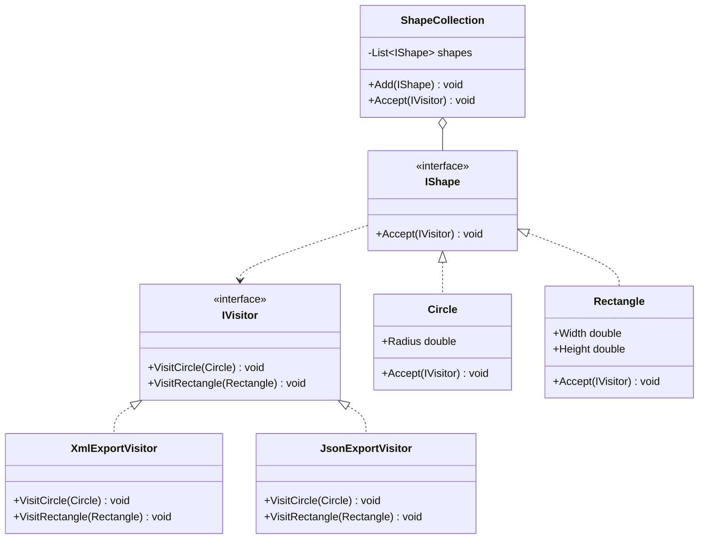
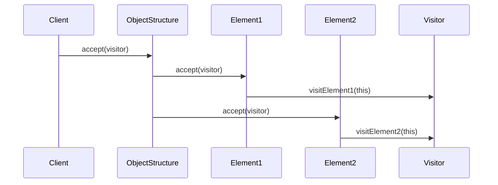

# Visitor

## Intent

Represent an operation to be performed on the elements of an object structure. Visitor lets you define a new operation without changing the classes of the elements on which it operates.

## Problem

A graphics application has shapes (Circle, Rectangle) that need to be exported to multiple formats (XML, JSON). Adding an export method to each shape for every format scatters unrelated logic across shape classes and requires modifying them whenever a new format is introduced.

## Real-World Analogy

{: .note }
> Think of a home inspector visiting houses. The inspector doesn't change the house — they just examine it and produce a report. Different inspectors (electrical, plumbing, structural) visit the same house but look at different things. If you need a new type of inspection, you hire a new inspector — you don't renovate the house. The visitor adds new operations to existing structures without modifying them.

## When You Need It

- You're building an AST (abstract syntax tree) for a programming language and need to add operations like type-checking, optimization, and code generation — each is a visitor that walks the tree without modifying node classes
- You're creating an export system where the same document structure can be exported to XML, JSON, or PDF — each format is a visitor
- You're building a reporting tool that traverses a complex object structure (orders, items, discounts) to calculate totals, generate invoices, or produce analytics — each report type is a separate visitor

## UML Class Diagram



## Sequence Diagram



## Participants

| Participant | Role |
|---|---|
| **IVisitor** | Declares visit methods for each concrete element type. |
| **XmlExportVisitor** | Exports shapes to XML format. |
| **JsonExportVisitor** | Exports shapes to JSON format. |
| **IShape** | Element interface declaring `Accept(IVisitor)`. |
| **Circle** | Concrete element with a radius. |
| **Rectangle** | Concrete element with width and height. |
| **ShapeCollection** | Object structure that iterates over shapes and accepts a visitor. |

## How It Works

1. Each shape implements `Accept()` by calling the appropriate visit method on the visitor, passing itself (`visitor.VisitCircle(this)`).
2. The visitor implements format-specific logic for each shape type.
3. To add a new export format, create a new visitor class without modifying any shape class.

## Applicability

- An object structure contains many classes with differing interfaces and you want to perform operations that depend on their concrete classes.
- You need to perform many distinct, unrelated operations on objects in a structure and want to avoid polluting their classes.
- The element class hierarchy is stable but you frequently need to add new operations.

## Trade-offs

**Pros:**
- Makes it easy to add new operations without modifying element classes
- Groups related behavior together in the visitor class
- Can accumulate state as it visits elements (useful for reporting)

**Cons:**
- Adding a new element class requires updating every visitor
- Breaks encapsulation — visitors often need access to element internals
- Can be overkill when the element hierarchy changes frequently

## Example Code

### C\#


```csharp
public interface IVisitor
{
    void VisitCircle(Circle circle);
    void VisitRectangle(Rectangle rectangle);
}

public interface IShape
{
    void Accept(IVisitor visitor);
}

public class Circle : IShape
{
    public double Radius { get; }
    public Circle(double radius) => Radius = radius;
    public void Accept(IVisitor visitor) => visitor.VisitCircle(this);
}

public class Rectangle : IShape
{
    public double Width { get; }
    public double Height { get; }
    public Rectangle(double w, double h) { Width = w; Height = h; }
    public void Accept(IVisitor visitor) => visitor.VisitRectangle(this);
}

public class XmlExportVisitor : IVisitor
{
    public void VisitCircle(Circle c) =>
        Console.WriteLine($"<circle radius=\"{c.Radius}\"/>");
    public void VisitRectangle(Rectangle r) =>
        Console.WriteLine($"<rect width=\"{r.Width}\" height=\"{r.Height}\"/>");
}

public class JsonExportVisitor : IVisitor
{
    public void VisitCircle(Circle c) =>
        Console.WriteLine($"{{\"type\":\"circle\",\"radius\":{c.Radius}}}");
    public void VisitRectangle(Rectangle r) =>
        Console.WriteLine($"{{\"type\":\"rect\",\"w\":{r.Width},\"h\":{r.Height}}}");
}

// Usage
var shapes = new List<IShape> { new Circle(5), new Rectangle(3, 4) };
var xmlVisitor = new XmlExportVisitor();
var jsonVisitor = new JsonExportVisitor();

foreach (var shape in shapes)
    shape.Accept(xmlVisitor);

foreach (var shape in shapes)
    shape.Accept(jsonVisitor);
```


### Delphi

```pascal
type
  TCircle = class;
  TRectangle = class;

  IVisitor = interface
    procedure VisitCircle(ACircle: TCircle);
    procedure VisitRectangle(ARect: TRectangle);
  end;

  IShape = interface
    procedure Accept(AVisitor: IVisitor);
  end;

  TCircle = class(TInterfacedObject, IShape)
  public
    Radius: Double;
    constructor Create(ARadius: Double);
    procedure Accept(AVisitor: IVisitor);
  end;

  TRectangle = class(TInterfacedObject, IShape)
  public
    Width, Height: Double;
    constructor Create(AWidth, AHeight: Double);
    procedure Accept(AVisitor: IVisitor);
  end;

  TXmlExportVisitor = class(TInterfacedObject, IVisitor)
  public
    procedure VisitCircle(ACircle: TCircle);
    procedure VisitRectangle(ARect: TRectangle);
  end;

  TJsonExportVisitor = class(TInterfacedObject, IVisitor)
  public
    procedure VisitCircle(ACircle: TCircle);
    procedure VisitRectangle(ARect: TRectangle);
  end;

constructor TCircle.Create(ARadius: Double);
begin
  Radius := ARadius;
end;

procedure TCircle.Accept(AVisitor: IVisitor);
begin
  AVisitor.VisitCircle(Self);
end;

constructor TRectangle.Create(AWidth, AHeight: Double);
begin
  Width := AWidth;
  Height := AHeight;
end;

procedure TRectangle.Accept(AVisitor: IVisitor);
begin
  AVisitor.VisitRectangle(Self);
end;

procedure TXmlExportVisitor.VisitCircle(ACircle: TCircle);
begin
  WriteLn(Format('<circle radius="%.0f"/>', [ACircle.Radius]));
end;

procedure TXmlExportVisitor.VisitRectangle(ARect: TRectangle);
begin
  WriteLn(Format('<rect width="%.0f" height="%.0f"/>', [ARect.Width, ARect.Height]));
end;

procedure TJsonExportVisitor.VisitCircle(ACircle: TCircle);
begin
  WriteLn(Format('{"type":"circle","radius":%.0f}', [ACircle.Radius]));
end;

procedure TJsonExportVisitor.VisitRectangle(ARect: TRectangle);
begin
  WriteLn(Format('{"type":"rect","w":%.0f,"h":%.0f}', [ARect.Width, ARect.Height]));
end;

// Usage
var
  Shapes: TList<IShape>;
  Shape: IShape;
  XmlVis, JsonVis: IVisitor;
begin
  Shapes := TList<IShape>.Create;
  Shapes.Add(TCircle.Create(5));
  Shapes.Add(TRectangle.Create(3, 4));

  XmlVis := TXmlExportVisitor.Create;
  JsonVis := TJsonExportVisitor.Create;

  for Shape in Shapes do
    Shape.Accept(XmlVis);

  for Shape in Shapes do
    Shape.Accept(JsonVis);
end;
```

### C++

```cpp
#include <iostream>
#include <memory>
#include <vector>

class Circle;
class Rectangle;

class IVisitor {
public:
    virtual ~IVisitor() = default;
    virtual void VisitCircle(const Circle& c) = 0;
    virtual void VisitRectangle(const Rectangle& r) = 0;
};

class IShape {
public:
    virtual ~IShape() = default;
    virtual void Accept(IVisitor& visitor) = 0;
};

class Circle : public IShape {
public:
    double radius;
    explicit Circle(double r) : radius(r) {}
    void Accept(IVisitor& v) override { v.VisitCircle(*this); }
};

class Rectangle : public IShape {
public:
    double width, height;
    Rectangle(double w, double h) : width(w), height(h) {}
    void Accept(IVisitor& v) override { v.VisitRectangle(*this); }
};

class XmlExportVisitor : public IVisitor {
public:
    void VisitCircle(const Circle& c) override {
        std::cout << "<circle radius=\"" << c.radius << "\"/>\n";
    }
    void VisitRectangle(const Rectangle& r) override {
        std::cout << "<rect width=\"" << r.width
                  << "\" height=\"" << r.height << "\"/>\n";
    }
};

class JsonExportVisitor : public IVisitor {
public:
    void VisitCircle(const Circle& c) override {
        std::cout << "{\"type\":\"circle\",\"radius\":" << c.radius << "}\n";
    }
    void VisitRectangle(const Rectangle& r) override {
        std::cout << "{\"type\":\"rect\",\"w\":" << r.width
                  << ",\"h\":" << r.height << "}\n";
    }
};

int main() {
    std::vector<std::unique_ptr<IShape>> shapes;
    shapes.push_back(std::make_unique<Circle>(5));
    shapes.push_back(std::make_unique<Rectangle>(3, 4));

    XmlExportVisitor xml;
    JsonExportVisitor json;

    for (auto& s : shapes) s->Accept(xml);
    for (auto& s : shapes) s->Accept(json);
    return 0;
}
```

### Runnable Examples

| Language | Source |
|----------|--------|
| C# | [`Visitor.cs`]({{ site.github.repository_url }}/blob/main/examples/csharp/Patterns/Visitor.cs) |
| C++ | [`visitor.cpp`]({{ site.github.repository_url }}/blob/main/examples/cpp/visitor.cpp) |
| Delphi | [`visitor.pas`]({{ site.github.repository_url }}/blob/main/examples/delphi/visitor.pas) |

## Related Patterns

- [**Composite**]() — Visitor can be used to apply an operation over a Composite tree.
- [**Iterator**]() — Visitor is often used together with Iterator to traverse a complex structure and apply operations to each element.
