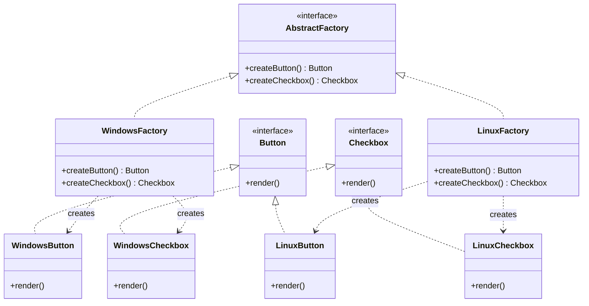
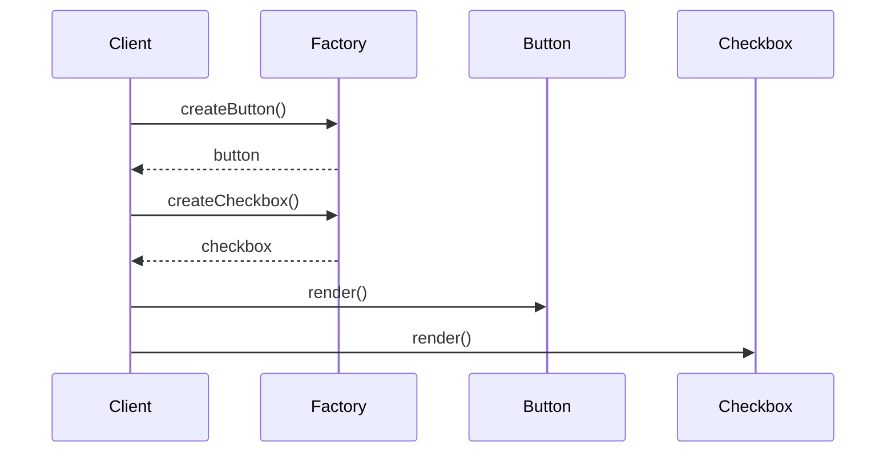

# Abstract Factory

## Intent

Provide an interface for creating families of related or dependent objects without specifying their concrete classes.

## Problem

You need to create sets of related objects (e.g., UI widgets for different platforms) that must be used together. Creating them individually leads to inconsistent combinations and tight coupling to concrete classes.

## Real-World Analogy

{: .note }
> Imagine a furniture store that sells matching sets — a "Modern" collection and a "Victorian" collection. When you pick "Modern," you get a modern chair, modern sofa, and modern table that all look great together. You never mix a Victorian chair with a modern table. The store catalog is the abstract factory — it guarantees you get a matching family of furniture, no matter which style you choose.

## When You Need It

- You're building a cross-platform app that needs Windows-style buttons and dialogs on Windows, and macOS-style ones on Mac — and they must never mix
- You're creating a theming system where "dark mode" and "light mode" each produce a consistent set of colors, icons, and fonts
- You're building a database layer that must work with PostgreSQL or MySQL, and each needs its own matching set of connection, command, and reader objects

## UML Class Diagram



## Sequence Diagram



## Participants

| Participant | Role |
|-------------|------|
| AbstractFactory | Declares creation methods for each abstract product type |
| ConcreteFactory | Implements creation methods to produce concrete products for one family |
| AbstractProduct | Declares an interface for a type of product object |
| ConcreteProduct | Implements the abstract product interface for a specific variant |

## How It Works

1. The **AbstractFactory** declares a set of methods for creating each type of product.
2. Each **ConcreteFactory** corresponds to a specific product family and creates only products of that family.
3. Client code works with factories and products through their abstract interfaces.
4. The factory ensures that created products are compatible with each other.

## Applicability

**Use when:**
- A system should be independent of how its products are created and composed
- A system should be configured with one of multiple families of products
- Related product objects are designed to be used together and you need to enforce this constraint

**Don't use when:**
- You only have one product family
- Products don't need to be used together as a family

## Trade-offs

**Pros:**
- Guarantees that products from the same family are compatible with each other
- Isolates concrete classes — client never sees implementation details
- Makes swapping entire product families easy (e.g., switching themes or platforms)

**Cons:**
- Adding a new product type requires changing the abstract factory interface and all concrete factories
- Can result in many classes for even moderately sized product families
- Complex to set up when you only have one product family

## Example Code

### C#

```csharp
public interface IButton { void Render(); }
public interface ICheckbox { void Render(); }

public interface IGUIFactory
{
    IButton CreateButton();
    ICheckbox CreateCheckbox();
}

public class WindowsButton : IButton
{
    public void Render() => Console.WriteLine("Windows button");
}
public class WindowsCheckbox : ICheckbox
{
    public void Render() => Console.WriteLine("Windows checkbox");
}
public class WindowsFactory : IGUIFactory
{
    public IButton CreateButton() => new WindowsButton();
    public ICheckbox CreateCheckbox() => new WindowsCheckbox();
}

public class LinuxButton : IButton
{
    public void Render() => Console.WriteLine("Linux button");
}
public class LinuxCheckbox : ICheckbox
{
    public void Render() => Console.WriteLine("Linux checkbox");
}
public class LinuxFactory : IGUIFactory
{
    public IButton CreateButton() => new LinuxButton();
    public ICheckbox CreateCheckbox() => new LinuxCheckbox();
}
```

### Delphi

```pascal
type
  IButton = interface
    procedure Render;
  end;

  ICheckbox = interface
    procedure Render;
  end;

  IGUIFactory = interface
    function CreateButton: IButton;
    function CreateCheckbox: ICheckbox;
  end;

  TWindowsButton = class(TInterfacedObject, IButton)
    procedure Render;
  end;

  TWindowsCheckbox = class(TInterfacedObject, ICheckbox)
    procedure Render;
  end;

  TWindowsFactory = class(TInterfacedObject, IGUIFactory)
    function CreateButton: IButton;
    function CreateCheckbox: ICheckbox;
  end;

  TLinuxButton = class(TInterfacedObject, IButton)
    procedure Render;
  end;

  TLinuxCheckbox = class(TInterfacedObject, ICheckbox)
    procedure Render;
  end;

  TLinuxFactory = class(TInterfacedObject, IGUIFactory)
    function CreateButton: IButton;
    function CreateCheckbox: ICheckbox;
  end;

procedure TWindowsButton.Render; begin WriteLn('Windows button'); end;
procedure TWindowsCheckbox.Render; begin WriteLn('Windows checkbox'); end;
function TWindowsFactory.CreateButton: IButton; begin Result := TWindowsButton.Create; end;
function TWindowsFactory.CreateCheckbox: ICheckbox; begin Result := TWindowsCheckbox.Create; end;

procedure TLinuxButton.Render; begin WriteLn('Linux button'); end;
procedure TLinuxCheckbox.Render; begin WriteLn('Linux checkbox'); end;
function TLinuxFactory.CreateButton: IButton; begin Result := TLinuxButton.Create; end;
function TLinuxFactory.CreateCheckbox: ICheckbox; begin Result := TLinuxCheckbox.Create; end;
```

### C++

```cpp
#include <iostream>
#include <memory>

class IButton {
public:
    virtual ~IButton() = default;
    virtual void render() const = 0;
};

class ICheckbox {
public:
    virtual ~ICheckbox() = default;
    virtual void render() const = 0;
};

class IGUIFactory {
public:
    virtual ~IGUIFactory() = default;
    virtual std::unique_ptr<IButton> createButton() const = 0;
    virtual std::unique_ptr<ICheckbox> createCheckbox() const = 0;
};

class WindowsButton : public IButton {
public:
    void render() const override { std::cout << "Windows button\n"; }
};
class WindowsCheckbox : public ICheckbox {
public:
    void render() const override { std::cout << "Windows checkbox\n"; }
};
class WindowsFactory : public IGUIFactory {
public:
    std::unique_ptr<IButton> createButton() const override {
        return std::make_unique<WindowsButton>();
    }
    std::unique_ptr<ICheckbox> createCheckbox() const override {
        return std::make_unique<WindowsCheckbox>();
    }
};

class LinuxButton : public IButton {
public:
    void render() const override { std::cout << "Linux button\n"; }
};
class LinuxCheckbox : public ICheckbox {
public:
    void render() const override { std::cout << "Linux checkbox\n"; }
};
class LinuxFactory : public IGUIFactory {
public:
    std::unique_ptr<IButton> createButton() const override {
        return std::make_unique<LinuxButton>();
    }
    std::unique_ptr<ICheckbox> createCheckbox() const override {
        return std::make_unique<LinuxCheckbox>();
    }
};
```

### Runnable Examples

| Language | Source |
|----------|--------|
| C# | [`AbstractFactory.cs`]({{ site.github.repository_url }}/blob/main/examples/csharp/Patterns/AbstractFactory.cs) |
| C++ | [`abstract-factory.cpp`]({{ site.github.repository_url }}/blob/main/examples/cpp/abstract-factory.cpp) |
| Delphi | [`abstract_factory.pas`]({{ site.github.repository_url }}/blob/main/examples/delphi/abstract_factory.pas) |

## Related Patterns

- [Factory Method]() — Abstract Factory classes are often implemented with factory methods
- [Prototype]() — can be used instead when the system needs to be independent of product creation
- [Singleton]() — a concrete factory is often a singleton
