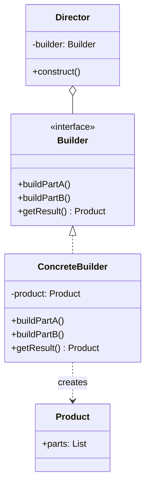
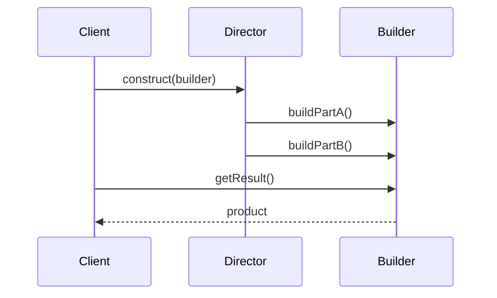

# Builder

## Intent

Separate the construction of a complex object from its representation so that the same construction process can create different representations.

## Problem

You need to create complex objects step by step. The construction process must allow different representations of the object being constructed, without forcing the client to know the details of each step.

## UML Class Diagram



## Sequence Diagram



## Participants

| Participant | Role |
|-------------|------|
| Builder | Specifies an abstract interface for creating parts of a Product |
| ConcreteBuilder | Constructs and assembles parts of the product by implementing the Builder interface |
| Director | Constructs an object using the Builder interface |
| Product | Represents the complex object under construction |

## How It Works

1. The **Director** knows the construction steps and their order.
2. The **Builder** interface defines all possible construction steps.
3. **ConcreteBuilders** implement those steps for a specific product variant.
4. The client creates a builder, passes it to the director, and retrieves the result from the builder.

## Applicability

**Use when:**
- The algorithm for creating a complex object should be independent of the parts and how they're assembled
- The construction process must allow different representations of the constructed object
- You want to construct objects step-by-step, potentially deferring or skipping some steps

**Don't use when:**
- The product is simple with few parts
- Only one representation is needed

## Example Code

### C#

```csharp
public class House
{
    public int Walls { get; set; }
    public bool HasRoof { get; set; }
    public bool HasGarage { get; set; }

    public override string ToString() =>
        $"House: {Walls} walls, roof={HasRoof}, garage={HasGarage}";
}

public interface IHouseBuilder
{
    void BuildWalls(int count);
    void BuildRoof();
    void BuildGarage();
    House GetResult();
}

public class ConcreteHouseBuilder : IHouseBuilder
{
    private House _house = new();

    public void BuildWalls(int count) => _house.Walls = count;
    public void BuildRoof() => _house.HasRoof = true;
    public void BuildGarage() => _house.HasGarage = true;
    public House GetResult() => _house;
}

public class Director
{
    public void ConstructSimpleHouse(IHouseBuilder builder)
    {
        builder.BuildWalls(4);
        builder.BuildRoof();
    }

    public void ConstructFancyHouse(IHouseBuilder builder)
    {
        builder.BuildWalls(6);
        builder.BuildRoof();
        builder.BuildGarage();
    }
}
```

### Delphi

```pascal
type
  THouse = class
    Walls: Integer;
    HasRoof: Boolean;
    HasGarage: Boolean;
    function ToString: string; override;
  end;

  IHouseBuilder = interface
    procedure BuildWalls(Count: Integer);
    procedure BuildRoof;
    procedure BuildGarage;
    function GetResult: THouse;
  end;

  TConcreteHouseBuilder = class(TInterfacedObject, IHouseBuilder)
  private
    FHouse: THouse;
  public
    constructor Create;
    procedure BuildWalls(Count: Integer);
    procedure BuildRoof;
    procedure BuildGarage;
    function GetResult: THouse;
  end;

  TDirector = class
    procedure ConstructSimpleHouse(Builder: IHouseBuilder);
    procedure ConstructFancyHouse(Builder: IHouseBuilder);
  end;

function THouse.ToString: string;
begin
  Result := Format('House: %d walls, roof=%s, garage=%s',
    [Walls, BoolToStr(HasRoof, True), BoolToStr(HasGarage, True)]);
end;

constructor TConcreteHouseBuilder.Create;
begin
  FHouse := THouse.Create;
end;

procedure TConcreteHouseBuilder.BuildWalls(Count: Integer);
begin FHouse.Walls := Count; end;

procedure TConcreteHouseBuilder.BuildRoof;
begin FHouse.HasRoof := True; end;

procedure TConcreteHouseBuilder.BuildGarage;
begin FHouse.HasGarage := True; end;

function TConcreteHouseBuilder.GetResult: THouse;
begin Result := FHouse; end;

procedure TDirector.ConstructSimpleHouse(Builder: IHouseBuilder);
begin
  Builder.BuildWalls(4);
  Builder.BuildRoof;
end;

procedure TDirector.ConstructFancyHouse(Builder: IHouseBuilder);
begin
  Builder.BuildWalls(6);
  Builder.BuildRoof;
  Builder.BuildGarage;
end;
```

### C++

```cpp
#include <iostream>
#include <string>
#include <memory>

struct House {
    int walls = 0;
    bool hasRoof = false;
    bool hasGarage = false;

    void show() const {
        std::cout << "House: " << walls << " walls, roof="
                  << hasRoof << ", garage=" << hasGarage << "\n";
    }
};

class IHouseBuilder {
public:
    virtual ~IHouseBuilder() = default;
    virtual void buildWalls(int count) = 0;
    virtual void buildRoof() = 0;
    virtual void buildGarage() = 0;
    virtual std::unique_ptr<House> getResult() = 0;
};

class ConcreteHouseBuilder : public IHouseBuilder {
    std::unique_ptr<House> house_ = std::make_unique<House>();
public:
    void buildWalls(int count) override { house_->walls = count; }
    void buildRoof() override { house_->hasRoof = true; }
    void buildGarage() override { house_->hasGarage = true; }
    std::unique_ptr<House> getResult() override { return std::move(house_); }
};

class Director {
public:
    void constructSimpleHouse(IHouseBuilder& builder) {
        builder.buildWalls(4);
        builder.buildRoof();
    }
    void constructFancyHouse(IHouseBuilder& builder) {
        builder.buildWalls(6);
        builder.buildRoof();
        builder.buildGarage();
    }
};
```

## Related Patterns

- [Abstract Factory]() — Builder focuses on step-by-step construction; Abstract Factory emphasizes families of products
- [Composite]() — Builders often build Composites
