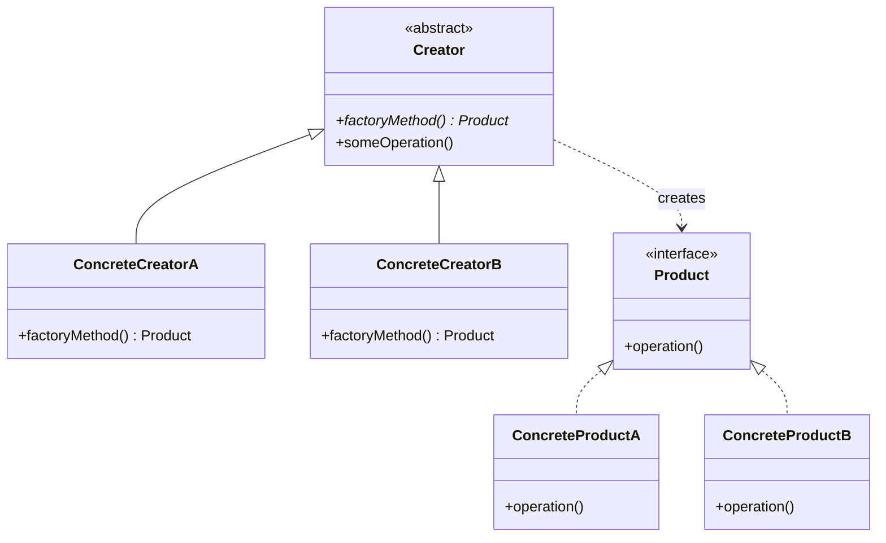
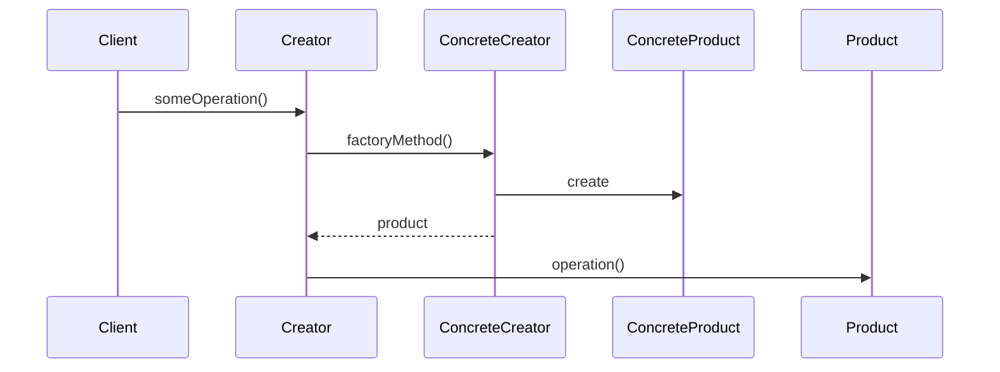

# Factory Method

## Intent

Define an interface for creating an object, but let subclasses decide which class to instantiate. Factory Method lets a class defer instantiation to subclasses.

## Problem

A framework needs to standardize the architectural model for a range of applications, but allow for individual applications to define their own domain objects and provide for their instantiation. You want to create objects without specifying the exact class, or you need to delegate the creation logic to subclasses.

## Real-World Analogy

{: .note }
> Think of a logistics company that ships packages. The headquarters decides *that* packages need to be delivered, but each regional office decides *how* — one uses trucks, another uses ships, another uses drones. The headquarters doesn't care about the vehicle; it just says "deliver this." Each regional office is a "factory" that creates the right transport for its region.

## When You Need It

- You're building a notification system and need to send alerts via email, SMS, or push — but the sending logic should be decided by each notification channel, not hardcoded in one place
- You're writing a game where levels create different enemies, but you want to add new enemy types without changing the level code
- You're building a document editor that needs to create different file formats (PDF, Word, HTML) through the same "export" interface

## UML Class Diagram



## Sequence Diagram



## Participants

| Participant | Role |
|-------------|------|
| Product | Defines the interface of objects the factory method creates |
| ConcreteProduct | Implements the Product interface |
| Creator | Declares the factory method, which returns a Product object |
| ConcreteCreator | Overrides the factory method to return a ConcreteProduct instance |

## How It Works

1. The **Creator** declares an abstract factory method that returns a `Product`.
2. The **Creator** may also define a default implementation of the factory method.
3. **ConcreteCreator** subclasses override the factory method to produce specific products.
4. Client code calls the factory method on the Creator, receiving a Product without knowing its concrete class.

## Applicability

**Use when:**
- A class can't anticipate the class of objects it must create
- A class wants its subclasses to specify the objects it creates
- You want to localize the knowledge of which class gets created

**Don't use when:**
- Object creation is simple and unlikely to change
- There's only one type of product — a simple constructor suffices

## Trade-offs

**Pros:**
- Promotes loose coupling — client code works with interfaces, not concrete classes
- Easy to extend with new product types without modifying existing code
- Follows the Open/Closed Principle — open for extension, closed for modification

**Cons:**
- Increases the number of subclasses — each new product requires a new creator subclass
- Can be over-engineering for simple object creation where a constructor would suffice
- Adds indirection that can make the code harder to follow for simple cases

## Example Code

### C#

```csharp
// Product interface
public interface ITransport
{
    void Deliver();
}

// Concrete products
public class Truck : ITransport
{
    public void Deliver() => Console.WriteLine("Delivering by land in a truck.");
}

public class Ship : ITransport
{
    public void Deliver() => Console.WriteLine("Delivering by sea in a ship.");
}

// Creator
public abstract class Logistics
{
    public abstract ITransport CreateTransport();

    public void PlanDelivery()
    {
        var transport = CreateTransport();
        transport.Deliver();
    }
}

// Concrete creators
public class RoadLogistics : Logistics
{
    public override ITransport CreateTransport() => new Truck();
}

public class SeaLogistics : Logistics
{
    public override ITransport CreateTransport() => new Ship();
}
```

### Delphi

```pascal
type
  ITransport = interface
    procedure Deliver;
  end;

  TTruck = class(TInterfacedObject, ITransport)
    procedure Deliver;
  end;

  TShip = class(TInterfacedObject, ITransport)
    procedure Deliver;
  end;

  TLogistics = class abstract
    function CreateTransport: ITransport; virtual; abstract;
    procedure PlanDelivery;
  end;

  TRoadLogistics = class(TLogistics)
    function CreateTransport: ITransport; override;
  end;

  TSeaLogistics = class(TLogistics)
    function CreateTransport: ITransport; override;
  end;

procedure TTruck.Deliver;
begin
  WriteLn('Delivering by land in a truck.');
end;

procedure TShip.Deliver;
begin
  WriteLn('Delivering by sea in a ship.');
end;

procedure TLogistics.PlanDelivery;
var
  Transport: ITransport;
begin
  Transport := CreateTransport;
  Transport.Deliver;
end;

function TRoadLogistics.CreateTransport: ITransport;
begin
  Result := TTruck.Create;
end;

function TSeaLogistics.CreateTransport: ITransport;
begin
  Result := TShip.Create;
end;
```

### C++

```cpp
#include <iostream>
#include <memory>

// Product interface
class ITransport {
public:
    virtual ~ITransport() = default;
    virtual void deliver() const = 0;
};

class Truck : public ITransport {
public:
    void deliver() const override {
        std::cout << "Delivering by land in a truck." << std::endl;
    }
};

class Ship : public ITransport {
public:
    void deliver() const override {
        std::cout << "Delivering by sea in a ship." << std::endl;
    }
};

// Creator
class Logistics {
public:
    virtual ~Logistics() = default;
    virtual std::unique_ptr<ITransport> createTransport() const = 0;

    void planDelivery() const {
        auto transport = createTransport();
        transport->deliver();
    }
};

class RoadLogistics : public Logistics {
public:
    std::unique_ptr<ITransport> createTransport() const override {
        return std::make_unique<Truck>();
    }
};

class SeaLogistics : public Logistics {
public:
    std::unique_ptr<ITransport> createTransport() const override {
        return std::make_unique<Ship>();
    }
};
```

### Runnable Examples

| Language | Source |
|----------|--------|
| C# | [`FactoryMethod.cs`]({{ site.github.repository_url }}/blob/main/examples/csharp/Patterns/FactoryMethod.cs) |
| C++ | [`factory-method.cpp`]({{ site.github.repository_url }}/blob/main/examples/cpp/factory-method.cpp) |
| Delphi | [`factory_method.pas`]({{ site.github.repository_url }}/blob/main/examples/delphi/factory_method.pas) |

## Related Patterns

- [Abstract Factory]() — often implemented with factory methods
- [Template Method]() — factory methods are often called within template methods
- [Prototype]() — doesn't require subclassing but needs an initialization operation
