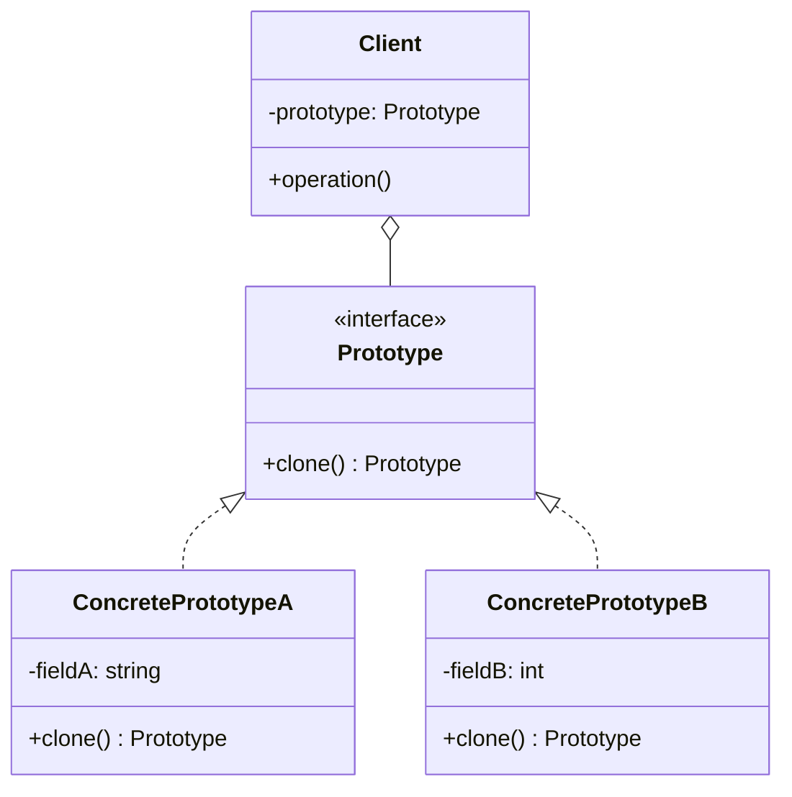
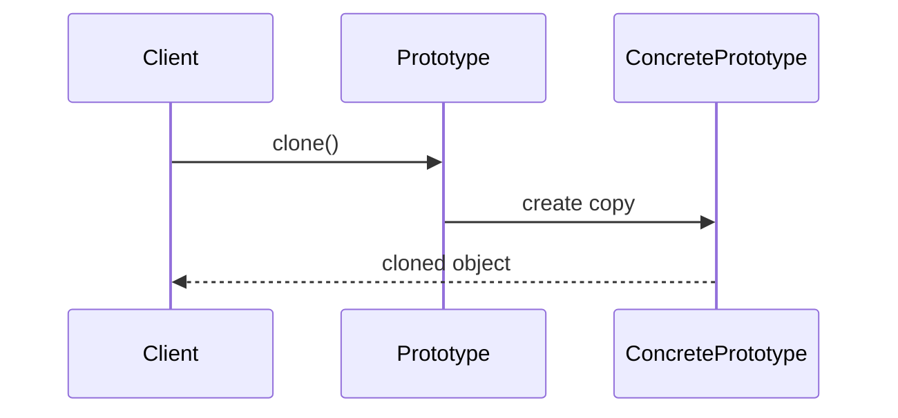

# Prototype

## Intent

Specify the kinds of objects to create using a prototypical instance, and create new objects by copying this prototype.

## Problem

You need to create objects that are similar to existing ones, but creating them from scratch is expensive or complex. You want to avoid a proliferation of subclasses just to configure different initial states.

## UML Class Diagram



## Sequence Diagram



## Participants

| Participant | Role |
|-------------|------|
| Prototype | Declares an interface for cloning itself |
| ConcretePrototype | Implements the cloning operation |
| Client | Creates a new object by asking a prototype to clone itself |

## How It Works

1. The **Prototype** interface declares a `clone()` method.
2. **ConcretePrototype** implements `clone()` by copying its own fields into a new instance.
3. The **Client** requests a clone from the prototype instead of calling a constructor.
4. The clone is a new, independent object with the same state as the original.

## Applicability

**Use when:**
- A system should be independent of how its products are created, composed, and represented
- Classes to instantiate are specified at runtime (e.g., dynamic loading)
- You want to avoid building a class hierarchy of factories that parallels the class hierarchy of products

**Don't use when:**
- Objects are simple and cheap to create from scratch
- Deep cloning is complex and error-prone for your domain

## Example Code

### C#

```csharp
public interface IShape
{
    IShape Clone();
    void Draw();
}

public class Circle : IShape
{
    public int Radius { get; set; }
    public string Color { get; set; }

    public Circle(int radius, string color)
    {
        Radius = radius;
        Color = color;
    }

    public IShape Clone() => new Circle(Radius, Color);
    public void Draw() => Console.WriteLine($"Circle: radius={Radius}, color={Color}");
}

public class Rectangle : IShape
{
    public int Width { get; set; }
    public int Height { get; set; }

    public Rectangle(int width, int height)
    {
        Width = width;
        Height = height;
    }

    public IShape Clone() => new Rectangle(Width, Height);
    public void Draw() => Console.WriteLine($"Rectangle: {Width}x{Height}");
}
```

### Delphi

```pascal
type
  IShape = interface
    function Clone: IShape;
    procedure Draw;
  end;

  TCircle = class(TInterfacedObject, IShape)
  private
    FRadius: Integer;
    FColor: string;
  public
    constructor Create(ARadius: Integer; const AColor: string);
    function Clone: IShape;
    procedure Draw;
  end;

  TRectangle = class(TInterfacedObject, IShape)
  private
    FWidth, FHeight: Integer;
  public
    constructor Create(AWidth, AHeight: Integer);
    function Clone: IShape;
    procedure Draw;
  end;

constructor TCircle.Create(ARadius: Integer; const AColor: string);
begin
  FRadius := ARadius;
  FColor := AColor;
end;

function TCircle.Clone: IShape;
begin Result := TCircle.Create(FRadius, FColor); end;

procedure TCircle.Draw;
begin WriteLn(Format('Circle: radius=%d, color=%s', [FRadius, FColor])); end;

constructor TRectangle.Create(AWidth, AHeight: Integer);
begin
  FWidth := AWidth;
  FHeight := AHeight;
end;

function TRectangle.Clone: IShape;
begin Result := TRectangle.Create(FWidth, FHeight); end;

procedure TRectangle.Draw;
begin WriteLn(Format('Rectangle: %dx%d', [FWidth, FHeight])); end;
```

### C++

```cpp
#include <iostream>
#include <memory>
#include <string>

class IShape {
public:
    virtual ~IShape() = default;
    virtual std::unique_ptr<IShape> clone() const = 0;
    virtual void draw() const = 0;
};

class Circle : public IShape {
    int radius_;
    std::string color_;
public:
    Circle(int radius, std::string color)
        : radius_(radius), color_(std::move(color)) {}

    std::unique_ptr<IShape> clone() const override {
        return std::make_unique<Circle>(radius_, color_);
    }
    void draw() const override {
        std::cout << "Circle: radius=" << radius_
                  << ", color=" << color_ << "\n";
    }
};

class Rectangle : public IShape {
    int width_, height_;
public:
    Rectangle(int w, int h) : width_(w), height_(h) {}

    std::unique_ptr<IShape> clone() const override {
        return std::make_unique<Rectangle>(width_, height_);
    }
    void draw() const override {
        std::cout << "Rectangle: " << width_ << "x" << height_ << "\n";
    }
};
```

## Related Patterns

- [Abstract Factory]() — can use Prototype to create products
- [Composite]() — designs that make heavy use of Composite often benefit from Prototype
- [Decorator]() — can benefit from Prototype when you need to clone decorated objects
