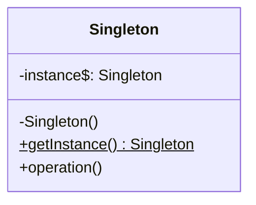
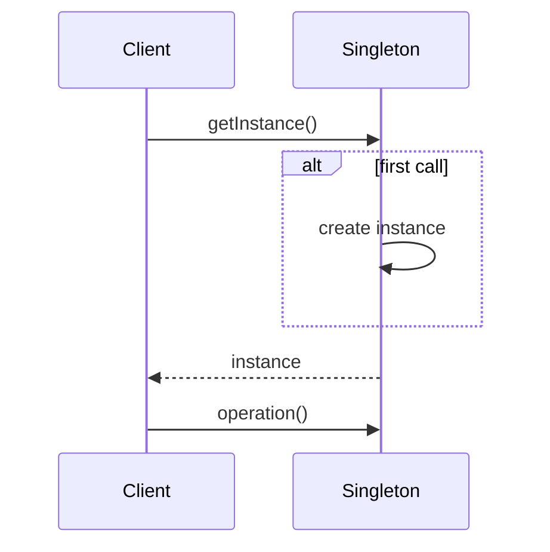

# Singleton

## Intent

Ensure a class has only one instance, and provide a global point of access to it.

## Problem

Some classes should have exactly one instance — a database connection pool, a logger, or a configuration manager. You need to guarantee that no additional instances can be created and provide easy access to that single instance.

## Real-World Analogy

{: .note }
> Think of a country's government — there's only one president at a time. No matter who asks "who's the president?", everyone gets the same answer. You can't just create a second president on your own. The position is globally accessible and guaranteed to be unique. That's a Singleton — one instance, one global access point.

## When You Need It

- You need a single shared database connection pool that every part of your application uses, and creating multiple pools would waste resources or cause conflicts
- You're building a logging service that writes to one file — multiple logger instances would corrupt the file with interleaved writes
- You need a configuration manager that loads settings once at startup and provides them everywhere, and reloading or duplicating it would cause inconsistencies

## UML Class Diagram



## Sequence Diagram



## Participants

| Participant | Role |
|-------------|------|
| Singleton | Defines a static `getInstance()` method that returns the unique instance. The constructor is private to prevent external instantiation. |

## How It Works

1. The **Singleton** class hides its constructor (private or protected).
2. A static method `getInstance()` checks if an instance already exists.
3. If not, it creates one; if so, it returns the existing instance.
4. All clients access the same instance through `getInstance()`.

## Applicability

**Use when:**
- There must be exactly one instance of a class, accessible from a well-known access point
- The sole instance should be extensible by subclassing, and clients should be able to use an extended instance without modifying their code

**Don't use when:**
- You need multiple instances later — Singleton makes this change difficult
- It introduces hidden global state that makes testing harder

{: .warning }
> Singleton is often considered an anti-pattern in modern software design because it introduces global state and makes unit testing difficult. Consider dependency injection as an alternative.

## Example Code

### C#

```csharp
public sealed class AppConfig
{
    private static readonly Lazy<AppConfig> _instance =
        new(() => new AppConfig());

    private AppConfig()
    {
        ConnectionString = "Server=localhost;Database=app";
    }

    public static AppConfig Instance => _instance.Value;

    public string ConnectionString { get; }

    public void ShowConfig() =>
        Console.WriteLine($"Config: {ConnectionString}");
}

// Usage: AppConfig.Instance.ShowConfig();
```

### Delphi

```pascal
type
  TAppConfig = class
  private
    class var FInstance: TAppConfig;
    FConnectionString: string;
    constructor CreatePrivate;
  public
    class function GetInstance: TAppConfig;
    procedure ShowConfig;
    property ConnectionString: string read FConnectionString;
  end;

constructor TAppConfig.CreatePrivate;
begin
  inherited Create;
  FConnectionString := 'Server=localhost;Database=app';
end;

class function TAppConfig.GetInstance: TAppConfig;
begin
  if FInstance = nil then
    FInstance := TAppConfig.CreatePrivate;
  Result := FInstance;
end;

procedure TAppConfig.ShowConfig;
begin
  WriteLn('Config: ' + FConnectionString);
end;

// Usage: TAppConfig.GetInstance.ShowConfig;
```

### C++

```cpp
#include <iostream>
#include <string>
#include <mutex>

class AppConfig {
    std::string connectionString_;

    AppConfig() : connectionString_("Server=localhost;Database=app") {}

public:
    AppConfig(const AppConfig&) = delete;
    AppConfig& operator=(const AppConfig&) = delete;

    static AppConfig& getInstance() {
        static AppConfig instance;
        return instance;
    }

    void showConfig() const {
        std::cout << "Config: " << connectionString_ << "\n";
    }
};

// Usage: AppConfig::getInstance().showConfig();
```

### Runnable Examples

| Language | Source |
|----------|--------|
| C# | [`Singleton.cs`]({{ site.github.repository_url }}/blob/main/examples/csharp/Patterns/Singleton.cs) |
| C++ | [`singleton.cpp`]({{ site.github.repository_url }}/blob/main/examples/cpp/singleton.cpp) |
| Delphi | [`singleton.pas`]({{ site.github.repository_url }}/blob/main/examples/delphi/singleton.pas) |

## Related Patterns

- [Abstract Factory]() — a concrete factory is often a singleton
- [Builder]() — Builder can be combined with Singleton for one-time construction
- [Prototype]() — an alternative to Singleton when you need derived variants
