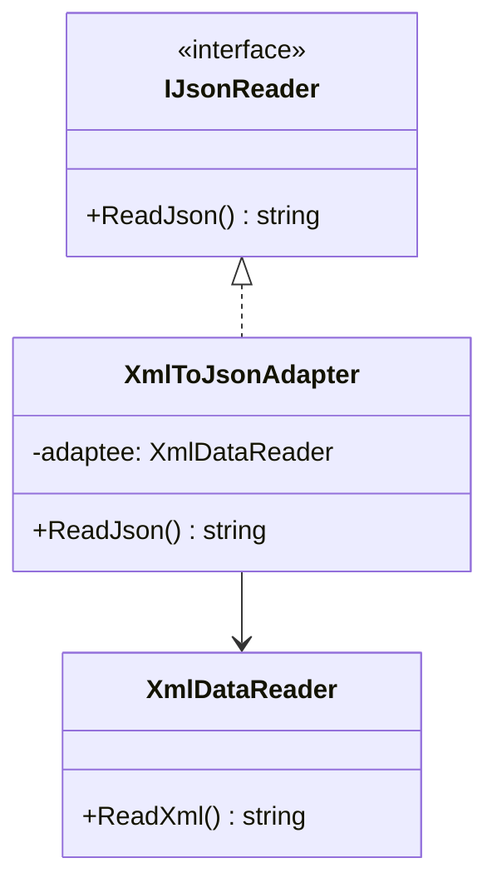
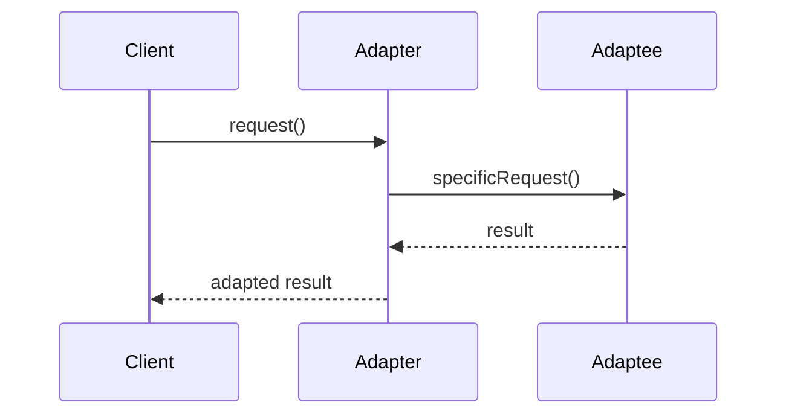

# Adapter

## Intent

Convert the interface of a class into another interface that clients expect. Adapter lets classes work together that could not otherwise because of incompatible interfaces.

## Problem

You have a legacy XML data reader, but your application expects all data sources to provide JSON output. You cannot modify the legacy class, and you need a way to make it conform to the expected JSON interface without changing existing code on either side.

## Real-World Analogy

{: .note }
> When you travel abroad, your laptop charger doesn't fit the wall outlet. You buy a power adapter — it doesn't change what your charger does or how the outlet works, it just makes them compatible. The adapter sits between two things that can't talk to each other and translates so they work together.

## When You Need It

- You're integrating a third-party payment library whose API returns XML, but your app expects JSON — you need a wrapper to translate between them
- You're replacing an old analytics service with a new one, but hundreds of files call the old API — an adapter lets the old calls work with the new service without rewriting everything
- You're connecting to a legacy database that uses stored procedures, but your ORM expects standard CRUD operations

## UML Class Diagram



## Sequence Diagram



## Participants

| Participant | Role |
|---|---|
| `IJsonReader` | **Target** -- defines the interface the client expects. |
| `XmlDataReader` | **Adaptee** -- the existing class with an incompatible interface. |
| `XmlToJsonAdapter` | **Adapter** -- adapts the Adaptee to the Target interface. |

## How It Works

1. The client calls `ReadJson()` on the Target interface.
2. The Adapter receives the call, delegates to the Adaptee's `ReadXml()` method, and converts the XML result into JSON format.
3. The client receives JSON without knowing an XML source is behind it.

## Applicability

- You want to use an existing class whose interface does not match the one you need.
- You want to create a reusable class that cooperates with unrelated or unforeseen classes.
- You need to use several existing subclasses but it is impractical to adapt their interface by subclassing each one.

## Trade-offs

**Pros:**
- Lets incompatible interfaces work together without modifying existing code
- Enables reuse of legacy or third-party classes in new systems
- Follows the Single Responsibility Principle — adaptation logic is isolated

**Cons:**
- Adds an extra layer of indirection, increasing overall complexity
- Can become a maintenance burden if the adapted interface changes frequently
- Multiple adapters for the same class can lead to confusion about which to use

## Example Code

### C#

```csharp
public interface IJsonReader
{
    string ReadJson();
}

public class XmlDataReader
{
    public string ReadXml()
    {
        return "<data><item>Hello</item></data>";
    }
}

public class XmlToJsonAdapter : IJsonReader
{
    private readonly XmlDataReader _adaptee;

    public XmlToJsonAdapter(XmlDataReader adaptee)
    {
        _adaptee = adaptee;
    }

    public string ReadJson()
    {
        string xml = _adaptee.ReadXml();
        // Simplified conversion
        return "{ \"item\": \"Hello\" }";
    }
}
```

### Delphi

```pascal
type
  IJsonReader = interface
    function ReadJson: string;
  end;

  TXmlDataReader = class
    function ReadXml: string;
  end;

  TXmlToJsonAdapter = class(TInterfacedObject, IJsonReader)
  private
    FAdaptee: TXmlDataReader;
  public
    constructor Create(AAdaptee: TXmlDataReader);
    function ReadJson: string;
  end;

function TXmlDataReader.ReadXml: string;
begin
  Result := '<data><item>Hello</item></data>';
end;

constructor TXmlToJsonAdapter.Create(AAdaptee: TXmlDataReader);
begin
  FAdaptee := AAdaptee;
end;

function TXmlToJsonAdapter.ReadJson: string;
begin
  FAdaptee.ReadXml;
  Result := '{ "item": "Hello" }';
end;
```

### C++

```cpp
#include <string>

class IJsonReader {
public:
    virtual ~IJsonReader() = default;
    virtual std::string ReadJson() = 0;
};

class XmlDataReader {
public:
    std::string ReadXml() {
        return "<data><item>Hello</item></data>";
    }
};

class XmlToJsonAdapter : public IJsonReader {
    XmlDataReader& adaptee_;
public:
    XmlToJsonAdapter(XmlDataReader& adaptee) : adaptee_(adaptee) {}

    std::string ReadJson() override {
        adaptee_.ReadXml();
        return R"({ "item": "Hello" })";
    }
};
```

### Runnable Examples

| Language | Source |
|----------|--------|
| C# | [`Adapter.cs`]({{ site.github.repository_url }}/blob/main/examples/csharp/Patterns/Adapter.cs) |
| C++ | [`adapter.cpp`]({{ site.github.repository_url }}/blob/main/examples/cpp/adapter.cpp) |
| Delphi | [`adapter.pas`]({{ site.github.repository_url }}/blob/main/examples/delphi/adapter.pas) |

## Related Patterns

- [Bridge]() -- has a similar structure but a different intent; Bridge separates abstraction from implementation, while Adapter makes incompatible interfaces work together.
- [Decorator]() -- enhances an object without changing its interface, whereas Adapter changes the interface.
- [Proxy]() -- provides a surrogate with the same interface, while Adapter provides a different interface.
