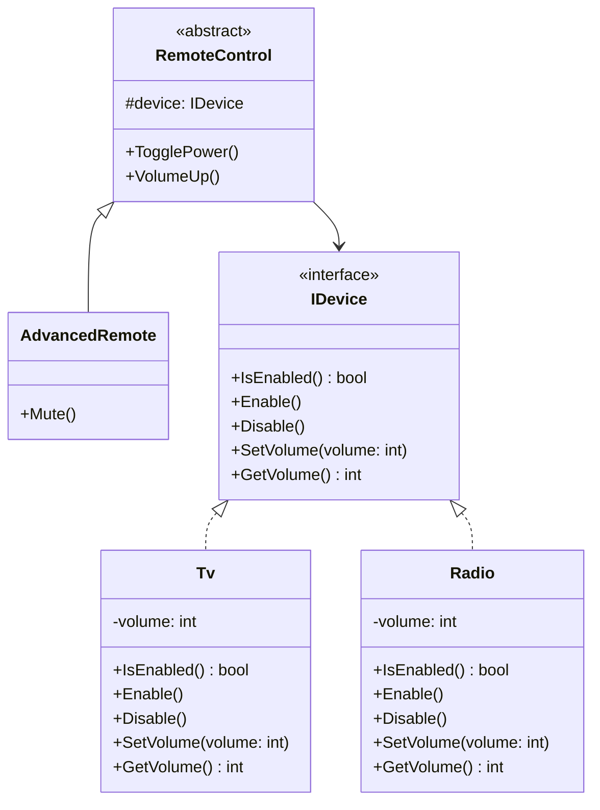
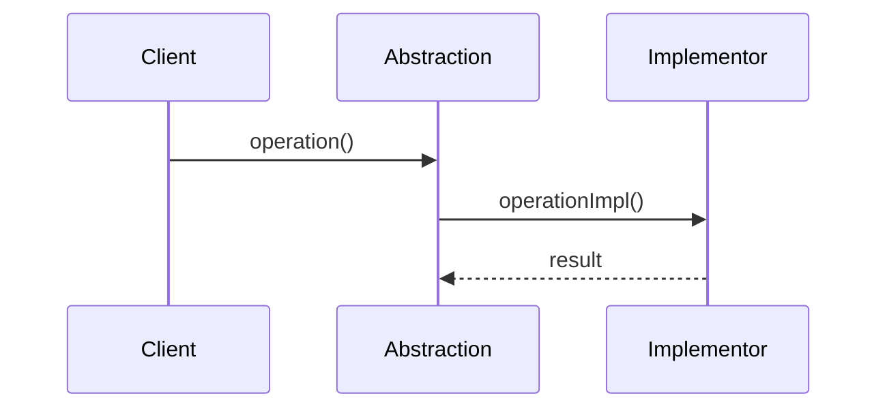

# Bridge

## Intent

Decouple an abstraction from its implementation so that the two can vary independently.

## Problem

You are building a universal remote control system that must work with different device types (TV, radio). If you subclass every combination of remote and device, the class hierarchy explodes. You need a way to vary remotes and devices independently.

## Real-World Analogy

{: .note }
> Think of a TV remote control and the TV itself. The remote (abstraction) works the same way regardless of the TV brand — you press volume up, channel down, power. You can swap the TV (Samsung, LG, Sony) without changing the remote, and you can upgrade to a fancy universal remote without replacing your TV. The remote and TV vary independently — that's the bridge.

## When You Need It

- You're building a messaging system that needs to send via email, SMS, or Slack — and you also have different message types (alert, report, newsletter) — Bridge keeps these two dimensions from exploding into dozens of classes
- You're creating a drawing app that supports multiple rendering engines (OpenGL, DirectX, SVG) for the same shapes — you want to add new shapes without writing renderer-specific code for each one
- You need to support multiple database drivers (PostgreSQL, MySQL, SQLite) with different query builders (simple, advanced) without creating every combination as a separate class

## UML Class Diagram



## Sequence Diagram



## Participants

| Participant | Role |
|---|---|
| `RemoteControl` | **Abstraction** -- defines the control interface and holds a reference to the Implementor. |
| `AdvancedRemote` | **RefinedAbstraction** -- extends the Abstraction with additional operations. |
| `IDevice` | **Implementor** -- defines the interface for implementation classes. |
| `Tv`, `Radio` | **ConcreteImplementor** -- implement the device interface. |

## How It Works

1. The `RemoteControl` abstraction holds a reference to an `IDevice` implementor.
2. Operations like `TogglePower()` and `VolumeUp()` delegate to the device interface.
3. `AdvancedRemote` adds new features (e.g., `Mute`) on top of the base abstraction.
4. New remotes or new devices can be added independently without modifying existing code.

## Applicability

- You want to avoid a permanent binding between an abstraction and its implementation.
- Both the abstraction and its implementation should be extensible through subclassing.
- Changes in the implementation should have no impact on clients.

## Trade-offs

**Pros:**
- Abstraction and implementation can evolve independently
- Avoids a combinatorial explosion of classes when two dimensions vary
- New abstractions and implementations can be added without changing existing code

**Cons:**
- Adds complexity with extra layers of indirection
- Can be over-engineering when there's only one implementation
- Requires careful upfront design to identify the right abstraction boundaries

## Example Code

### C#

```csharp
public interface IDevice
{
    bool IsEnabled();
    void Enable();
    void Disable();
    int GetVolume();
    void SetVolume(int volume);
}

public class Tv : IDevice
{
    private bool _on;
    private int _volume;

    public bool IsEnabled() => _on;
    public void Enable() => _on = true;
    public void Disable() => _on = false;
    public int GetVolume() => _volume;
    public void SetVolume(int volume) => _volume = volume;
}

public class RemoteControl
{
    protected IDevice Device;

    public RemoteControl(IDevice device) => Device = device;

    public void TogglePower()
    {
        if (Device.IsEnabled()) Device.Disable();
        else Device.Enable();
    }

    public void VolumeUp() => Device.SetVolume(Device.GetVolume() + 1);
}

public class AdvancedRemote : RemoteControl
{
    public AdvancedRemote(IDevice device) : base(device) {}
    public void Mute() => Device.SetVolume(0);
}
```

### Delphi

```pascal
type
  IDevice = interface
    function IsEnabled: Boolean;
    procedure Enable;
    procedure Disable;
    function GetVolume: Integer;
    procedure SetVolume(Volume: Integer);
  end;

  TTv = class(TInterfacedObject, IDevice)
  private
    FOn: Boolean;
    FVolume: Integer;
  public
    function IsEnabled: Boolean;
    procedure Enable;
    procedure Disable;
    function GetVolume: Integer;
    procedure SetVolume(Volume: Integer);
  end;

  TRemoteControl = class
  protected
    FDevice: IDevice;
  public
    constructor Create(ADevice: IDevice);
    procedure TogglePower;
    procedure VolumeUp;
  end;

  TAdvancedRemote = class(TRemoteControl)
  public
    procedure Mute;
  end;

function TTv.IsEnabled: Boolean; begin Result := FOn; end;
procedure TTv.Enable; begin FOn := True; end;
procedure TTv.Disable; begin FOn := False; end;
function TTv.GetVolume: Integer; begin Result := FVolume; end;
procedure TTv.SetVolume(Volume: Integer); begin FVolume := Volume; end;

constructor TRemoteControl.Create(ADevice: IDevice);
begin
  FDevice := ADevice;
end;

procedure TRemoteControl.TogglePower;
begin
  if FDevice.IsEnabled then FDevice.Disable
  else FDevice.Enable;
end;

procedure TRemoteControl.VolumeUp;
begin
  FDevice.SetVolume(FDevice.GetVolume + 1);
end;

procedure TAdvancedRemote.Mute;
begin
  FDevice.SetVolume(0);
end;
```

### C++

```cpp
#include <memory>

class IDevice {
public:
    virtual ~IDevice() = default;
    virtual bool IsEnabled() = 0;
    virtual void Enable() = 0;
    virtual void Disable() = 0;
    virtual int GetVolume() = 0;
    virtual void SetVolume(int volume) = 0;
};

class Tv : public IDevice {
    bool on_ = false;
    int volume_ = 0;
public:
    bool IsEnabled() override { return on_; }
    void Enable() override { on_ = true; }
    void Disable() override { on_ = false; }
    int GetVolume() override { return volume_; }
    void SetVolume(int volume) override { volume_ = volume; }
};

class RemoteControl {
protected:
    IDevice& device_;
public:
    RemoteControl(IDevice& device) : device_(device) {}
    virtual ~RemoteControl() = default;

    void TogglePower() {
        if (device_.IsEnabled()) device_.Disable();
        else device_.Enable();
    }

    void VolumeUp() { device_.SetVolume(device_.GetVolume() + 1); }
};

class AdvancedRemote : public RemoteControl {
public:
    AdvancedRemote(IDevice& device) : RemoteControl(device) {}
    void Mute() { device_.SetVolume(0); }
};
```

### Runnable Examples

| Language | Source |
|----------|--------|
| C# | [`Bridge.cs`]({{ site.github.repository_url }}/blob/main/examples/csharp/Patterns/Bridge.cs) |
| C++ | [`bridge.cpp`]({{ site.github.repository_url }}/blob/main/examples/cpp/bridge.cpp) |
| Delphi | [`bridge.pas`]({{ site.github.repository_url }}/blob/main/examples/delphi/bridge.pas) |

## Related Patterns

- [Abstract Factory]() -- can be used to create and configure a particular Bridge.
- [Adapter]() -- is used to make unrelated classes work together, whereas Bridge is designed up-front to let abstractions and implementations vary independently.
