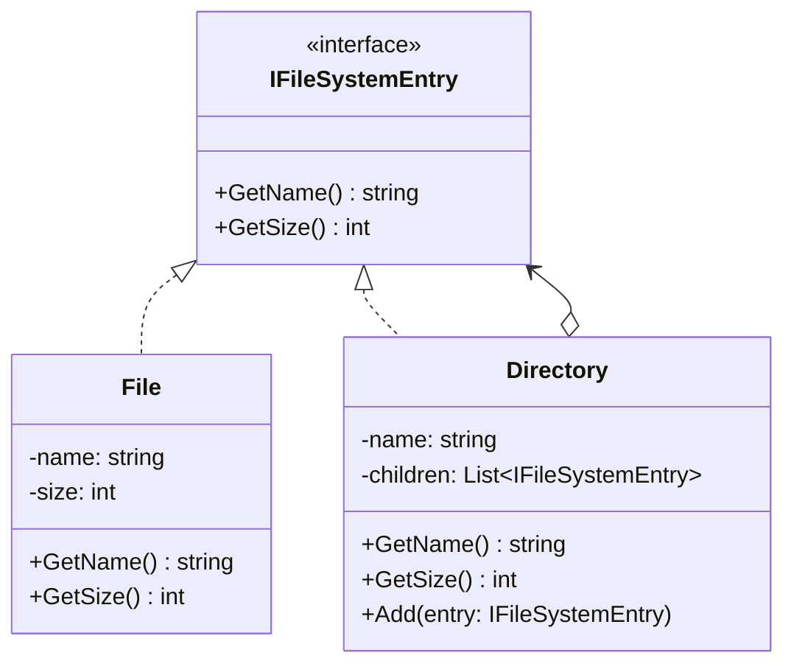
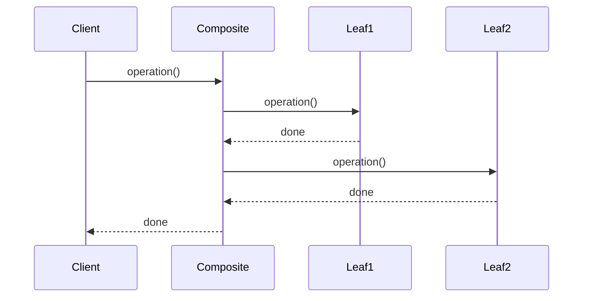

# Composite

## Intent

Compose objects into tree structures to represent part-whole hierarchies. Composite lets clients treat individual objects and compositions of objects uniformly.

## Problem

A file system contains both files and directories. Directories can contain files and other directories. You need a uniform way to calculate the total size of any node, whether it is a single file or an entire directory tree.

## Real-World Analogy

{: .note }
> Think of a company's org chart. A department contains teams, teams contain people, and some departments contain sub-departments. When the CEO says "calculate headcount," each level adds up its contents — a person reports 1, a team sums its people, a department sums its teams. You treat a single employee and an entire department the same way: just ask for the count.

## When You Need It

- You're building a file manager where folders contain files and other folders — and you want operations like "get size" or "delete" to work the same way on a single file or an entire folder tree
- You're creating a UI framework where panels contain buttons, labels, and other panels — and rendering should recursively draw everything inside
- You're building a menu system where menu items can be simple actions or sub-menus containing more items, and you want to display them all uniformly

## UML Class Diagram



## Sequence Diagram



## Participants

| Participant | Role |
|---|---|
| `IFileSystemEntry` | **Component** -- declares the interface for objects in the composition. |
| `File` | **Leaf** -- represents a leaf object with no children. |
| `Directory` | **Composite** -- stores child components and implements child-related operations. |

## How It Works

1. Both `File` and `Directory` implement `IFileSystemEntry`.
2. `File.GetSize()` returns its own size.
3. `Directory.GetSize()` iterates over its children and sums their sizes recursively.
4. Clients call `GetSize()` on any entry without knowing whether it is a file or directory.

## Applicability

- You want to represent part-whole hierarchies of objects.
- You want clients to treat individual objects and compositions uniformly.

## Example Code

### C#

```csharp
public interface IFileSystemEntry
{
    string GetName();
    int GetSize();
}

public class File : IFileSystemEntry
{
    private readonly string _name;
    private readonly int _size;

    public File(string name, int size) { _name = name; _size = size; }
    public string GetName() => _name;
    public int GetSize() => _size;
}

public class Directory : IFileSystemEntry
{
    private readonly string _name;
    private readonly List<IFileSystemEntry> _children = new();

    public Directory(string name) => _name = name;
    public string GetName() => _name;
    public void Add(IFileSystemEntry entry) => _children.Add(entry);

    public int GetSize()
    {
        int total = 0;
        foreach (var child in _children) total += child.GetSize();
        return total;
    }
}
```

### Delphi

```pascal
type
  IFileSystemEntry = interface
    function GetName: string;
    function GetSize: Integer;
  end;

  TFile = class(TInterfacedObject, IFileSystemEntry)
  private
    FName: string;
    FSize: Integer;
  public
    constructor Create(const AName: string; ASize: Integer);
    function GetName: string;
    function GetSize: Integer;
  end;

  TDirectory = class(TInterfacedObject, IFileSystemEntry)
  private
    FName: string;
    FChildren: TList<IFileSystemEntry>;
  public
    constructor Create(const AName: string);
    destructor Destroy; override;
    procedure Add(Entry: IFileSystemEntry);
    function GetName: string;
    function GetSize: Integer;
  end;

constructor TFile.Create(const AName: string; ASize: Integer);
begin
  FName := AName;
  FSize := ASize;
end;

function TFile.GetName: string; begin Result := FName; end;
function TFile.GetSize: Integer; begin Result := FSize; end;

constructor TDirectory.Create(const AName: string);
begin
  FName := AName;
  FChildren := TList<IFileSystemEntry>.Create;
end;

destructor TDirectory.Destroy;
begin
  FChildren.Free;
  inherited;
end;

procedure TDirectory.Add(Entry: IFileSystemEntry);
begin
  FChildren.Add(Entry);
end;

function TDirectory.GetName: string; begin Result := FName; end;

function TDirectory.GetSize: Integer;
var
  Entry: IFileSystemEntry;
begin
  Result := 0;
  for Entry in FChildren do
    Result := Result + Entry.GetSize;
end;
```

### C++

```cpp
#include <string>
#include <vector>
#include <memory>

class IFileSystemEntry {
public:
    virtual ~IFileSystemEntry() = default;
    virtual std::string GetName() = 0;
    virtual int GetSize() = 0;
};

class File : public IFileSystemEntry {
    std::string name_;
    int size_;
public:
    File(std::string name, int size) : name_(std::move(name)), size_(size) {}
    std::string GetName() override { return name_; }
    int GetSize() override { return size_; }
};

class Directory : public IFileSystemEntry {
    std::string name_;
    std::vector<std::shared_ptr<IFileSystemEntry>> children_;
public:
    Directory(std::string name) : name_(std::move(name)) {}
    std::string GetName() override { return name_; }

    void Add(std::shared_ptr<IFileSystemEntry> entry) {
        children_.push_back(std::move(entry));
    }

    int GetSize() override {
        int total = 0;
        for (auto& child : children_) total += child->GetSize();
        return total;
    }
};
```

### Runnable Examples

| Language | Source |
|----------|--------|
| C# | [`Composite.cs`]({{ site.github.repository_url }}/blob/main/examples/csharp/Patterns/Composite.cs) |
| C++ | [`composite.cpp`]({{ site.github.repository_url }}/blob/main/examples/cpp/composite.cpp) |
| Delphi | [`composite.pas`]({{ site.github.repository_url }}/blob/main/examples/delphi/composite.pas) |

## Related Patterns

- [Chain of Responsibility]() -- can be used with Composite to let requests propagate up the tree.
- [Decorator]() -- is often used with Composite; both rely on recursive composition.
- [Flyweight]() -- can be used to share leaf nodes in a Composite.
- [Iterator]() -- can traverse Composite structures.
- [Visitor]() -- can apply operations across a Composite structure.
