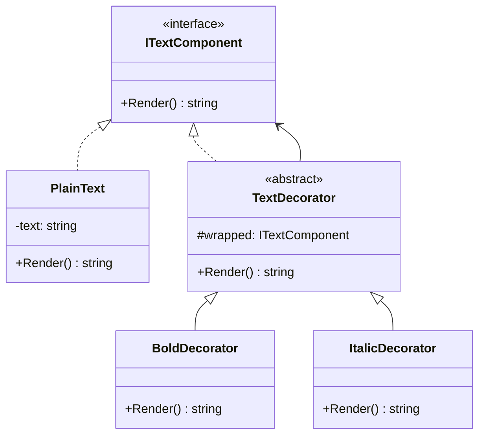
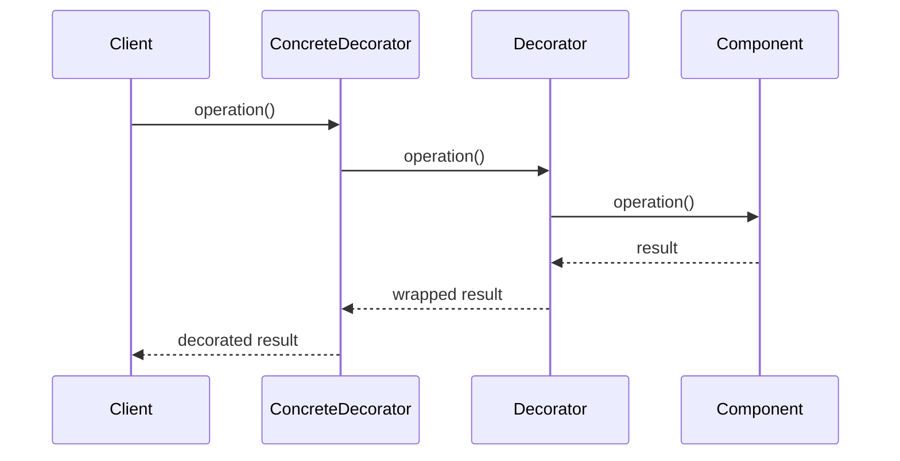

# Decorator

## Intent

Attach additional responsibilities to an object dynamically. Decorators provide a flexible alternative to subclassing for extending functionality.

## Problem

You have a plain text component and want to optionally apply bold or italic formatting. Using subclasses for every combination (bold, italic, bold-italic) leads to a class explosion. You need a way to compose formatting behaviors at runtime.

## Real-World Analogy

{: .note }
> Think of ordering coffee. You start with a plain espresso, then add milk (latte), then add vanilla syrup, then add whipped cream. Each addition wraps the previous drink and adds something to it — but it's still "a coffee" at every step. You can stack toppings in any order, and the price is the sum of all layers. Each topping is a decorator.

## When You Need It

- You're building a stream processing pipeline where data can be compressed, encrypted, and buffered — and users should be able to combine these in any order at runtime
- You're adding logging, caching, or retry logic to API calls without modifying the original service class — just wrap it with decorators
- You're creating a text rendering system where text can be bold, italic, underlined, or any combination — and you don't want a class for every possible combination

## UML Class Diagram



## Sequence Diagram



## Participants

| Participant | Role |
|---|---|
| `ITextComponent` | **Component** -- defines the interface for objects that can have responsibilities added. |
| `PlainText` | **ConcreteComponent** -- the object to which additional responsibilities can be attached. |
| `TextDecorator` | **Decorator** -- maintains a reference to a Component and conforms to its interface. |
| `BoldDecorator`, `ItalicDecorator` | **ConcreteDecorator** -- add responsibilities to the component. |

## How It Works

1. `PlainText` returns raw text from `Render()`.
2. `BoldDecorator` wraps a component, calls its `Render()`, and surrounds the result with bold tags.
3. `ItalicDecorator` does the same with italic tags.
4. Decorators can be stacked: wrapping a `PlainText` in `BoldDecorator` then `ItalicDecorator` produces bold-italic text.

## Applicability

- You want to add responsibilities to individual objects dynamically and transparently.
- You want to avoid a class explosion from subclassing every combination of features.
- Extension by subclassing is impractical.

## Trade-offs

**Pros:**
- More flexible than static inheritance — behaviors can be added and removed at runtime
- Avoids a class explosion from every possible combination of features
- Each decorator has a single responsibility, keeping classes small and focused

**Cons:**
- Many small decorator classes can make the codebase harder to navigate
- Deeply nested decorators are hard to debug — the call stack gets long
- Order of wrapping matters and can introduce subtle bugs

## Example Code

### C#

```csharp
public interface ITextComponent
{
    string Render();
}

public class PlainText : ITextComponent
{
    private readonly string _text;
    public PlainText(string text) => _text = text;
    public string Render() => _text;
}

public abstract class TextDecorator : ITextComponent
{
    protected readonly ITextComponent Wrapped;
    protected TextDecorator(ITextComponent wrapped) => Wrapped = wrapped;
    public abstract string Render();
}

public class BoldDecorator : TextDecorator
{
    public BoldDecorator(ITextComponent wrapped) : base(wrapped) {}
    public override string Render() => $"<b>{Wrapped.Render()}</b>";
}

public class ItalicDecorator : TextDecorator
{
    public ItalicDecorator(ITextComponent wrapped) : base(wrapped) {}
    public override string Render() => $"<i>{Wrapped.Render()}</i>";
}
```

### Delphi

```pascal
type
  ITextComponent = interface
    function Render: string;
  end;

  TPlainText = class(TInterfacedObject, ITextComponent)
  private
    FText: string;
  public
    constructor Create(const AText: string);
    function Render: string;
  end;

  TTextDecorator = class(TInterfacedObject, ITextComponent)
  protected
    FWrapped: ITextComponent;
  public
    constructor Create(AWrapped: ITextComponent);
    function Render: string; virtual; abstract;
  end;

  TBoldDecorator = class(TTextDecorator)
  public
    function Render: string; override;
  end;

  TItalicDecorator = class(TTextDecorator)
  public
    function Render: string; override;
  end;

constructor TPlainText.Create(const AText: string);
begin
  FText := AText;
end;

function TPlainText.Render: string;
begin
  Result := FText;
end;

constructor TTextDecorator.Create(AWrapped: ITextComponent);
begin
  FWrapped := AWrapped;
end;

function TBoldDecorator.Render: string;
begin
  Result := '<b>' + FWrapped.Render + '</b>';
end;

function TItalicDecorator.Render: string;
begin
  Result := '<i>' + FWrapped.Render + '</i>';
end;
```

### C++

```cpp
#include <string>
#include <memory>

class ITextComponent {
public:
    virtual ~ITextComponent() = default;
    virtual std::string Render() = 0;
};

class PlainText : public ITextComponent {
    std::string text_;
public:
    PlainText(std::string text) : text_(std::move(text)) {}
    std::string Render() override { return text_; }
};

class TextDecorator : public ITextComponent {
protected:
    std::shared_ptr<ITextComponent> wrapped_;
public:
    TextDecorator(std::shared_ptr<ITextComponent> wrapped)
        : wrapped_(std::move(wrapped)) {}
};

class BoldDecorator : public TextDecorator {
public:
    using TextDecorator::TextDecorator;
    std::string Render() override {
        return "<b>" + wrapped_->Render() + "</b>";
    }
};

class ItalicDecorator : public TextDecorator {
public:
    using TextDecorator::TextDecorator;
    std::string Render() override {
        return "<i>" + wrapped_->Render() + "</i>";
    }
};
```

### Runnable Examples

| Language | Source |
|----------|--------|
| C# | [`Decorator.cs`]({{ site.github.repository_url }}/blob/main/examples/csharp/Patterns/Decorator.cs) |
| C++ | [`decorator.cpp`]({{ site.github.repository_url }}/blob/main/examples/cpp/decorator.cpp) |
| Delphi | [`decorator.pas`]({{ site.github.repository_url }}/blob/main/examples/delphi/decorator.pas) |

## Related Patterns

- [Adapter]() -- changes an object's interface, while Decorator enhances it without changing the interface.
- [Composite]() -- Decorator can be viewed as a degenerate Composite with only one child.
- [Strategy]() -- Decorator changes the skin of an object, while Strategy changes its guts.
