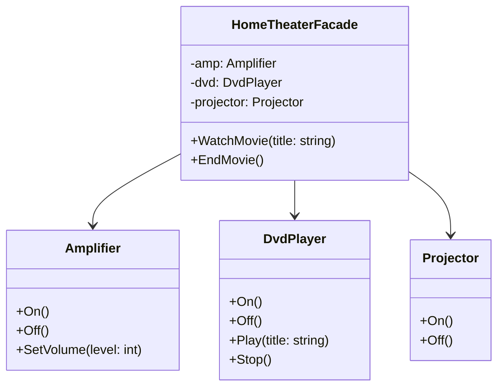
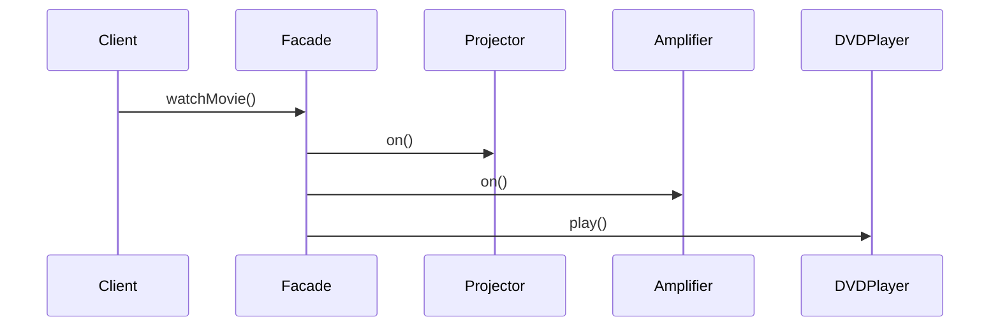

# Facade

## Intent

Provide a unified interface to a set of interfaces in a subsystem. Facade defines a higher-level interface that makes the subsystem easier to use.

## Problem

A home theater system involves multiple components -- an amplifier, a DVD player, and a projector. Starting a movie requires turning on each device, configuring settings, and coordinating them in the right order. You need a simple one-method interface to orchestrate the entire process.

## Real-World Analogy

{: .note }
> Think of starting your car. You just turn the key (or press a button). Behind the scenes, the engine ignites, fuel pumps activate, electronics initialize, the dashboard lights up. You don't manually do each step — the ignition is a facade that hides a complex startup sequence behind one simple action.

## When You Need It

- You're wrapping a complex third-party library (like a video encoding SDK with dozens of classes) behind a simple `convertVideo(input, output, format)` method for your team to use
- You're building an e-commerce checkout that coordinates inventory, payment, shipping, and email confirmation — the controller just calls `checkout.process(order)` instead of orchestrating four services
- You're creating a simple API for a complex subsystem so that new team members can use it without reading 50 pages of documentation

## UML Class Diagram



## Sequence Diagram



## Participants

| Participant | Role |
|---|---|
| `HomeTheaterFacade` | **Facade** -- provides a simplified interface to the subsystem. |
| `Amplifier`, `DvdPlayer`, `Projector` | **Subsystem classes** -- implement subsystem functionality and handle work assigned by the Facade. |

## How It Works

1. The client calls `WatchMovie()` on the Facade.
2. The Facade turns on the projector, amplifier, and DVD player in the correct order.
3. The Facade sets the amplifier volume and starts playback.
4. `EndMovie()` reverses the process, shutting everything down.

## Applicability

- You want to provide a simple interface to a complex subsystem.
- There are many dependencies between clients and the implementation classes of an abstraction.
- You want to layer your subsystems.

## Trade-offs

**Pros:**
- Simplifies a complex subsystem behind a clean, easy-to-use interface
- Reduces dependencies between client code and subsystem classes
- Makes the subsystem easier to use for new team members

**Cons:**
- The facade can become a "god object" if it grows to cover too many subsystem features
- Hides subsystem details that power users may need to access directly
- Can become a bottleneck if all requests must go through it

## Example Code

### C#

```csharp
public class Amplifier
{
    public void On() => Console.WriteLine("Amplifier on");
    public void Off() => Console.WriteLine("Amplifier off");
    public void SetVolume(int level) => Console.WriteLine($"Volume set to {level}");
}

public class DvdPlayer
{
    public void On() => Console.WriteLine("DVD player on");
    public void Off() => Console.WriteLine("DVD player off");
    public void Play(string title) => Console.WriteLine($"Playing '{title}'");
    public void Stop() => Console.WriteLine("DVD stopped");
}

public class Projector
{
    public void On() => Console.WriteLine("Projector on");
    public void Off() => Console.WriteLine("Projector off");
}

public class HomeTheaterFacade
{
    private readonly Amplifier _amp;
    private readonly DvdPlayer _dvd;
    private readonly Projector _projector;

    public HomeTheaterFacade(Amplifier amp, DvdPlayer dvd, Projector projector)
    {
        _amp = amp; _dvd = dvd; _projector = projector;
    }

    public void WatchMovie(string title)
    {
        _projector.On();
        _amp.On();
        _amp.SetVolume(10);
        _dvd.On();
        _dvd.Play(title);
    }

    public void EndMovie()
    {
        _dvd.Stop();
        _dvd.Off();
        _amp.Off();
        _projector.Off();
    }
}
```

### Delphi

```pascal
type
  TAmplifier = class
    procedure TurnOn;
    procedure TurnOff;
    procedure SetVolume(Level: Integer);
  end;

  TDvdPlayer = class
    procedure TurnOn;
    procedure TurnOff;
    procedure Play(const Title: string);
    procedure Stop;
  end;

  TProjector = class
    procedure TurnOn;
    procedure TurnOff;
  end;

  THomeTheaterFacade = class
  private
    FAmp: TAmplifier;
    FDvd: TDvdPlayer;
    FProjector: TProjector;
  public
    constructor Create(AAmp: TAmplifier; ADvd: TDvdPlayer; AProjector: TProjector);
    procedure WatchMovie(const Title: string);
    procedure EndMovie;
  end;

procedure TAmplifier.TurnOn; begin WriteLn('Amplifier on'); end;
procedure TAmplifier.TurnOff; begin WriteLn('Amplifier off'); end;
procedure TAmplifier.SetVolume(Level: Integer); begin WriteLn('Volume: ', Level); end;

procedure TDvdPlayer.TurnOn; begin WriteLn('DVD on'); end;
procedure TDvdPlayer.TurnOff; begin WriteLn('DVD off'); end;
procedure TDvdPlayer.Play(const Title: string); begin WriteLn('Playing ', Title); end;
procedure TDvdPlayer.Stop; begin WriteLn('DVD stopped'); end;

procedure TProjector.TurnOn; begin WriteLn('Projector on'); end;
procedure TProjector.TurnOff; begin WriteLn('Projector off'); end;

constructor THomeTheaterFacade.Create(AAmp: TAmplifier; ADvd: TDvdPlayer; AProjector: TProjector);
begin
  FAmp := AAmp; FDvd := ADvd; FProjector := AProjector;
end;

procedure THomeTheaterFacade.WatchMovie(const Title: string);
begin
  FProjector.TurnOn;
  FAmp.TurnOn;
  FAmp.SetVolume(10);
  FDvd.TurnOn;
  FDvd.Play(Title);
end;

procedure THomeTheaterFacade.EndMovie;
begin
  FDvd.Stop;
  FDvd.TurnOff;
  FAmp.TurnOff;
  FProjector.TurnOff;
end;
```

### C++

```cpp
#include <iostream>
#include <string>

class Amplifier {
public:
    void On() { std::cout << "Amplifier on\n"; }
    void Off() { std::cout << "Amplifier off\n"; }
    void SetVolume(int level) { std::cout << "Volume: " << level << "\n"; }
};

class DvdPlayer {
public:
    void On() { std::cout << "DVD on\n"; }
    void Off() { std::cout << "DVD off\n"; }
    void Play(const std::string& title) { std::cout << "Playing " << title << "\n"; }
    void Stop() { std::cout << "DVD stopped\n"; }
};

class Projector {
public:
    void On() { std::cout << "Projector on\n"; }
    void Off() { std::cout << "Projector off\n"; }
};

class HomeTheaterFacade {
    Amplifier& amp_;
    DvdPlayer& dvd_;
    Projector& projector_;
public:
    HomeTheaterFacade(Amplifier& amp, DvdPlayer& dvd, Projector& proj)
        : amp_(amp), dvd_(dvd), projector_(proj) {}

    void WatchMovie(const std::string& title) {
        projector_.On();
        amp_.On();
        amp_.SetVolume(10);
        dvd_.On();
        dvd_.Play(title);
    }

    void EndMovie() {
        dvd_.Stop();
        dvd_.Off();
        amp_.Off();
        projector_.Off();
    }
};
```

### Runnable Examples

| Language | Source |
|----------|--------|
| C# | [`Facade.cs`]({{ site.github.repository_url }}/blob/main/examples/csharp/Patterns/Facade.cs) |
| C++ | [`facade.cpp`]({{ site.github.repository_url }}/blob/main/examples/cpp/facade.cpp) |
| Delphi | [`facade.pas`]({{ site.github.repository_url }}/blob/main/examples/delphi/facade.pas) |

## Related Patterns

- [Abstract Factory]() -- can be used with Facade to provide an interface for creating subsystem objects in a subsystem-independent way.
- [Mediator]() -- is similar in that it abstracts functionality of existing classes, but Mediator centralizes communication that does not belong in any one object.
- [Singleton]() -- Facade objects are often Singletons since only one Facade is usually needed.
