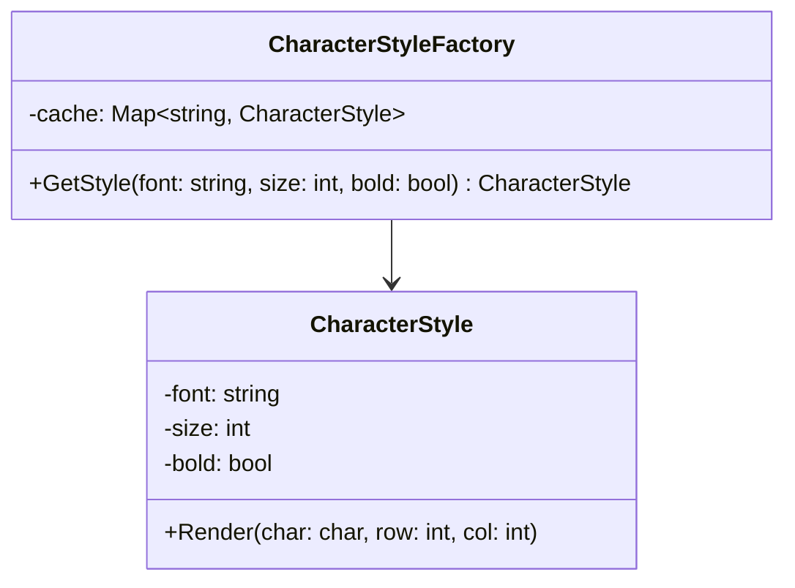
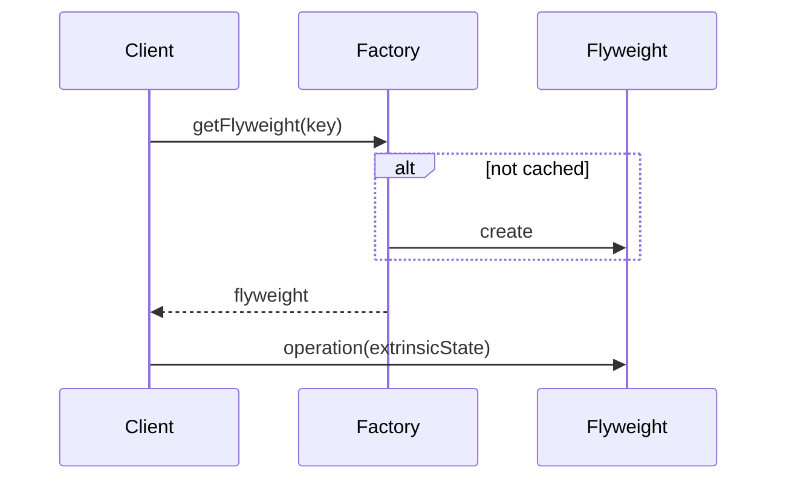

# Flyweight

## Intent

Use sharing to support large numbers of fine-grained objects efficiently.

## Problem

A text editor must render thousands of characters on screen. Each character has font and style data that is often identical across many characters. Storing a separate copy of this shared data for every character wastes memory. You need a way to share common state among many objects.

## UML Class Diagram



## Sequence Diagram



## Participants

| Participant | Role |
|---|---|
| `CharacterStyleFactory` | **FlyweightFactory** -- creates and manages flyweight objects; ensures sharing. |
| `CharacterStyle` | **Flyweight / ConcreteFlyweight** -- stores intrinsic (shared) state such as font and size. |

## How It Works

1. The factory maintains a cache keyed by the combination of font, size, and bold flag.
2. When a character needs rendering, the client requests a `CharacterStyle` from the factory.
3. If a matching style exists in the cache, it is returned. Otherwise a new one is created and cached.
4. Extrinsic state (the character value and its position) is passed to the `Render` method rather than stored in the flyweight.

## Applicability

- An application uses a large number of objects that have significant shared state.
- Object identity is not important to the application.
- Most object state can be made extrinsic.

## Example Code

### C#

```csharp
public class CharacterStyle
{
    public string Font { get; }
    public int Size { get; }
    public bool Bold { get; }

    public CharacterStyle(string font, int size, bool bold)
    {
        Font = font; Size = size; Bold = bold;
    }

    public void Render(char c, int row, int col)
    {
        Console.WriteLine($"'{c}' at ({row},{col}) [{Font} {Size}pt{(Bold ? " bold" : "")}]");
    }
}

public class CharacterStyleFactory
{
    private readonly Dictionary<string, CharacterStyle> _cache = new();

    public CharacterStyle GetStyle(string font, int size, bool bold)
    {
        string key = $"{font}_{size}_{bold}";
        if (!_cache.ContainsKey(key))
            _cache[key] = new CharacterStyle(font, size, bold);
        return _cache[key];
    }
}
```

### Delphi

```pascal
type
  TCharacterStyle = class
  private
    FFont: string;
    FSize: Integer;
    FBold: Boolean;
  public
    constructor Create(const AFont: string; ASize: Integer; ABold: Boolean);
    procedure Render(C: Char; Row, Col: Integer);
  end;

  TCharacterStyleFactory = class
  private
    FCache: TDictionary<string, TCharacterStyle>;
  public
    constructor Create;
    destructor Destroy; override;
    function GetStyle(const AFont: string; ASize: Integer; ABold: Boolean): TCharacterStyle;
  end;

constructor TCharacterStyle.Create(const AFont: string; ASize: Integer; ABold: Boolean);
begin
  FFont := AFont; FSize := ASize; FBold := ABold;
end;

procedure TCharacterStyle.Render(C: Char; Row, Col: Integer);
begin
  WriteLn(Format('''%s'' at (%d,%d) [%s %dpt]', [C, Row, Col, FFont, FSize]));
end;

constructor TCharacterStyleFactory.Create;
begin
  FCache := TDictionary<string, TCharacterStyle>.Create;
end;

destructor TCharacterStyleFactory.Destroy;
var
  Style: TCharacterStyle;
begin
  for Style in FCache.Values do
    Style.Free;
  FCache.Free;
  inherited;
end;

function TCharacterStyleFactory.GetStyle(const AFont: string; ASize: Integer; ABold: Boolean): TCharacterStyle;
var
  Key: string;
begin
  Key := Format('%s_%d_%s', [AFont, ASize, BoolToStr(ABold, True)]);
  if not FCache.TryGetValue(Key, Result) then
  begin
    Result := TCharacterStyle.Create(AFont, ASize, ABold);
    FCache.Add(Key, Result);
  end;
end;
```

### C++

```cpp
#include <string>
#include <unordered_map>
#include <memory>
#include <iostream>

class CharacterStyle {
    std::string font_;
    int size_;
    bool bold_;
public:
    CharacterStyle(std::string font, int size, bool bold)
        : font_(std::move(font)), size_(size), bold_(bold) {}

    void Render(char c, int row, int col) {
        std::cout << "'" << c << "' at (" << row << "," << col
                  << ") [" << font_ << " " << size_ << "pt"
                  << (bold_ ? " bold" : "") << "]\n";
    }
};

class CharacterStyleFactory {
    std::unordered_map<std::string, std::shared_ptr<CharacterStyle>> cache_;
public:
    std::shared_ptr<CharacterStyle> GetStyle(const std::string& font, int size, bool bold) {
        std::string key = font + "_" + std::to_string(size) + "_" + std::to_string(bold);
        auto it = cache_.find(key);
        if (it == cache_.end()) {
            auto style = std::make_shared<CharacterStyle>(font, size, bold);
            cache_[key] = style;
            return style;
        }
        return it->second;
    }
};
```

### Runnable Examples

| Language | Source |
|----------|--------|
| C# | [`Flyweight.cs`]({{ site.github.repository_url }}/blob/main/examples/csharp/Patterns/Flyweight.cs) |
| C++ | [`flyweight.cpp`]({{ site.github.repository_url }}/blob/main/examples/cpp/flyweight.cpp) |
| Delphi | [`flyweight.pas`]({{ site.github.repository_url }}/blob/main/examples/delphi/flyweight.pas) |

## Related Patterns

- [Composite]() -- Flyweight is often combined with Composite to share leaf nodes.
- [State]() -- State objects can be implemented as Flyweights when they have no instance-specific data.
- [Strategy]() -- Strategy objects can be implemented as Flyweights.
