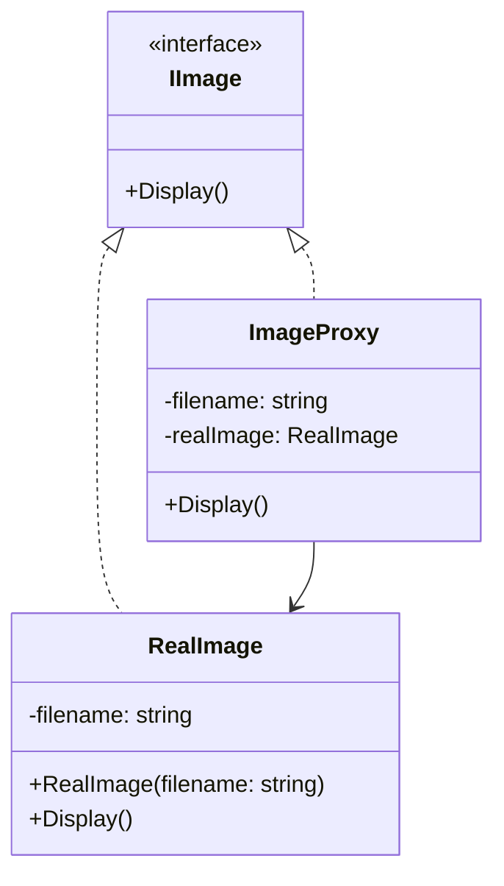
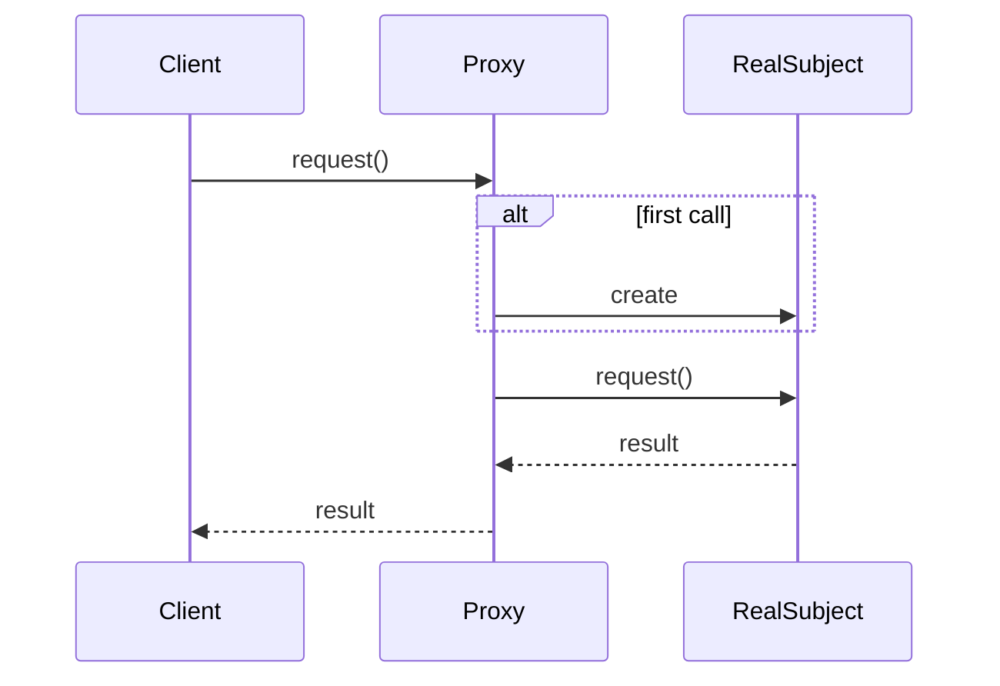

# Proxy

## Intent

Provide a surrogate or placeholder for another object to control access to it.

## Problem

Loading high-resolution images from disk is expensive. You want to display a placeholder and only load the real image data when it is actually needed for rendering. You need an object that stands in for the real image and defers loading until the first access.

## UML Class Diagram



## Sequence Diagram



## Participants

| Participant | Role |
|---|---|
| `IImage` | **Subject** -- defines the common interface for RealSubject and Proxy. |
| `RealImage` | **RealSubject** -- the real object that the proxy represents. |
| `ImageProxy` | **Proxy** -- controls access to the RealSubject, creating it on demand. |

## How It Works

1. The client creates an `ImageProxy` with a filename.
2. On the first call to `Display()`, the proxy creates the `RealImage`, which loads data from disk.
3. The proxy then delegates `Display()` to the real image.
4. Subsequent calls reuse the already-loaded real image.

## Applicability

- You need a lazy-loading placeholder for an expensive object.
- You need to control access to an object (access control, logging, caching).
- You want a local representative for a remote object.

## Example Code

### C#

```csharp
public interface IImage
{
    void Display();
}

public class RealImage : IImage
{
    private readonly string _filename;

    public RealImage(string filename)
    {
        _filename = filename;
        Console.WriteLine($"Loading image from {_filename}");
    }

    public void Display() => Console.WriteLine($"Displaying {_filename}");
}

public class ImageProxy : IImage
{
    private readonly string _filename;
    private RealImage? _realImage;

    public ImageProxy(string filename) => _filename = filename;

    public void Display()
    {
        _realImage ??= new RealImage(_filename);
        _realImage.Display();
    }
}
```

### Delphi

```pascal
type
  IImage = interface
    procedure Display;
  end;

  TRealImage = class(TInterfacedObject, IImage)
  private
    FFilename: string;
  public
    constructor Create(const AFilename: string);
    procedure Display;
  end;

  TImageProxy = class(TInterfacedObject, IImage)
  private
    FFilename: string;
    FRealImage: TRealImage;
  public
    constructor Create(const AFilename: string);
    destructor Destroy; override;
    procedure Display;
  end;

constructor TRealImage.Create(const AFilename: string);
begin
  FFilename := AFilename;
  WriteLn('Loading image from ', FFilename);
end;

procedure TRealImage.Display;
begin
  WriteLn('Displaying ', FFilename);
end;

constructor TImageProxy.Create(const AFilename: string);
begin
  FFilename := AFilename;
  FRealImage := nil;
end;

destructor TImageProxy.Destroy;
begin
  FRealImage.Free;
  inherited;
end;

procedure TImageProxy.Display;
begin
  if FRealImage = nil then
    FRealImage := TRealImage.Create(FFilename);
  FRealImage.Display;
end;
```

### C++

```cpp
#include <string>
#include <memory>
#include <iostream>

class IImage {
public:
    virtual ~IImage() = default;
    virtual void Display() = 0;
};

class RealImage : public IImage {
    std::string filename_;
public:
    RealImage(std::string filename) : filename_(std::move(filename)) {
        std::cout << "Loading image from " << filename_ << "\n";
    }

    void Display() override {
        std::cout << "Displaying " << filename_ << "\n";
    }
};

class ImageProxy : public IImage {
    std::string filename_;
    std::unique_ptr<RealImage> real_image_;
public:
    ImageProxy(std::string filename) : filename_(std::move(filename)) {}

    void Display() override {
        if (!real_image_)
            real_image_ = std::make_unique<RealImage>(filename_);
        real_image_->Display();
    }
};
```

## Related Patterns

- [Adapter]() -- provides a different interface to the object it adapts, whereas Proxy provides the same interface.
- [Decorator]() -- has a similar structure but a different purpose; Decorator adds responsibilities, while Proxy controls access.
